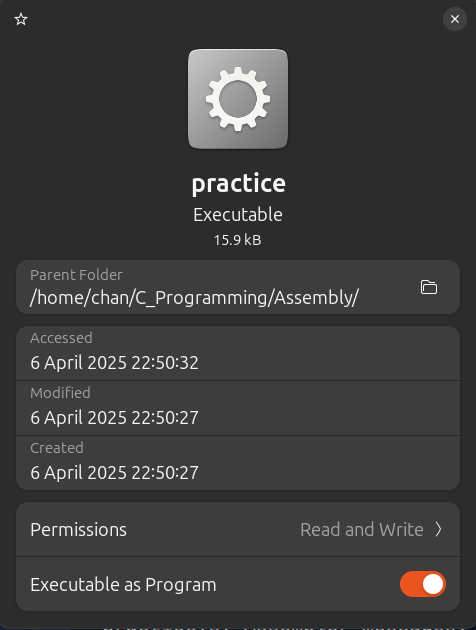

# Linking to a Shared Library

```assembly
.section .note.GNU-stack, "", @progbits
.globl main 

.section .data 
output:
    .ascii "hello\n\0"

.section .text 
main:
	enter $0, $0 

	movq stdout, %rdi 
	movq $output, %rsi 
	call fprintf 

	movq $0, %rax 

	leave 
	ret 
```

```sh
chan@CMA:~/C_Programming/Assembly$ gcc -rdynamic -no-pie practice.s -o practice
practice.s: Assembler messages:
practice.s:18: Warning: end of file not at end of a line; newline inserted
chan@CMA:~/C_Programming/Assembly$ ./practice
hello
```



- As we can see the executable size has dropped from 1 MB to 16 KB. 
- That's because the `fprintf` function brought in a lot of dependencies in the C library, which when statically linked added up to a lot of code compiled in to the final executable.
- Now that we are dynamically linking all of that stays in the C Library.
- We can see the list of dependencies by running `ldd practice`.
- This will list of the libraries and where they are loaded into memory.

```sh
chan@CMA:~/C_Programming/Assembly$ ldd practice
	linux-vdso.so.1 (0x00007ffee3977000)
	libc.so.6 => /lib/x86_64-linux-gnu/libc.so.6 (0x0000704ff3800000)
	/lib64/ld-linux-x86-64.so.2 (0x0000704ff3c03000)
```

- `/lib64/ld-linux-x86-64.so.2` (The last entry): It is called the **loader**. 
  - The loader is a program that reads our program file and loads it into memory as well as any relevant libraries.
  - This is the library that actually does the loading itself.
  - It is itself an executable.
  - The command `/lib64/ld-linux-x86-64.so.2 ./practice` will produce equivalent results as running the program directly.
  - When we run our dynamic executable, it actually starts by loading up this program and sending it our name as a parameter.
- `libc.so.6` (2nd Entry): Also known as the **soname (shared object name)**.
  - `libc.so.6 => /lib/x86_64-linux-gnu/libc.so.6 (0x0000704ff3800000)`: The arrow after the library soname indicates where on the system the library can be found. 
  - This allows the executable to know what library to link to and the dynamic link loader to know where to find it.
- `linux-vdso.so.1`: a special library called the `vDSO` library provided by the Linux kernel itself. 
  - Allows fast execution of certain kernel functions which don't require any particular privilege level to access. 
  - Calling these functions allow us to get public system information without actually invoking a system call.
  - Calling the functions from this library is not recommended unless we are building a C library ourselves.
