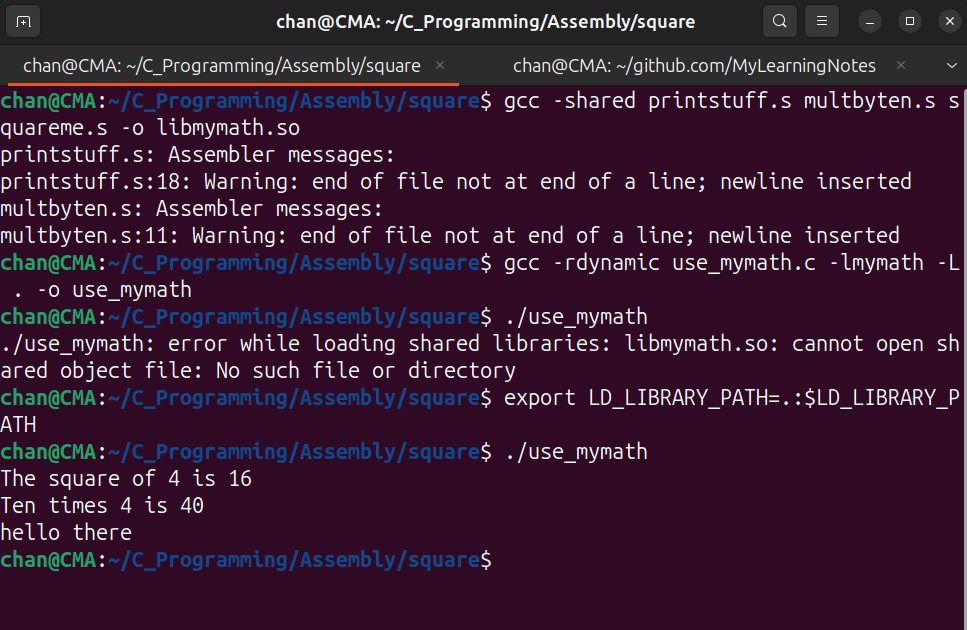

# Calling from C 

`multbyten.s`

```assembly
.section .note.GNU-stack, "", @progbits
.globl multbyten

.section .data 
ten:
    .quad 10

.section .text 
multbyten: 
    movq ten(%rip), %rax
    imulq %rdi # multiply result by n (result = n * 10)
    ret 
```

`printstuff.s`

```assembly
.section .note.GNU-stack, "", @progbits
.globl printstuff 
.section .data 
mytext: 
    .ascii "hello there\n\0"

.section .text 
printstuff: 
    enter $0, $0 

    movq stdout@GOTPCREL(%rip), %rdi 
    movq (%rdi), %rdi 

    # Load the address of the string into %rsi using pc-relative addressing
    leaq mytext(%rip), %rsi 
    call fprintf@plt # call fprintf using the PLT 

    leave 
    ret 
```

`squareme.s`

```assembly
.section .note.GNU-stack, "", @progbits
.globl squareme 

.section .text 
squareme: 
    movq %rdi, %rax 
    imulq %rdi 
    ret 
```

`use_mymath.c`

```c
#include <stdio.h>

long squareme(long);
long multbyten(long);
void printstuff();

int main()
{
    long num = 4;
    fprintf(stdout, "The square of %ld is %ld\n", num, squareme(num));
    fprintf(stdout, "Ten times %ld is %ld\n", num, multbyten(num));
    printstuff();
}
```


```sh
chan@CMA:~/C_Programming/Assembly/square$ gcc -shared printstuff.s multbyten.s squareme.s -o libmymath.so
printstuff.s: Assembler messages:
printstuff.s:18: Warning: end of file not at end of a line; newline inserted
multbyten.s: Assembler messages:
multbyten.s:11: Warning: end of file not at end of a line; newline inserted
chan@CMA:~/C_Programming/Assembly/square$ gcc -rdynamic use_mymath.c -lmymath -L . -o use_mymath
chan@CMA:~/C_Programming/Assembly/square$ ./use_mymath
./use_mymath: error while loading shared libraries: libmymath.so: cannot open shared object file: No such file or directory
chan@CMA:~/C_Programming/Assembly/square$ export LD_LIBRARY_PATH=.:$LD_LIBRARY_PATH
chan@CMA:~/C_Programming/Assembly/square$ ./use_mymath
The square of 4 is 16
Ten times 4 is 40
hello there
```


