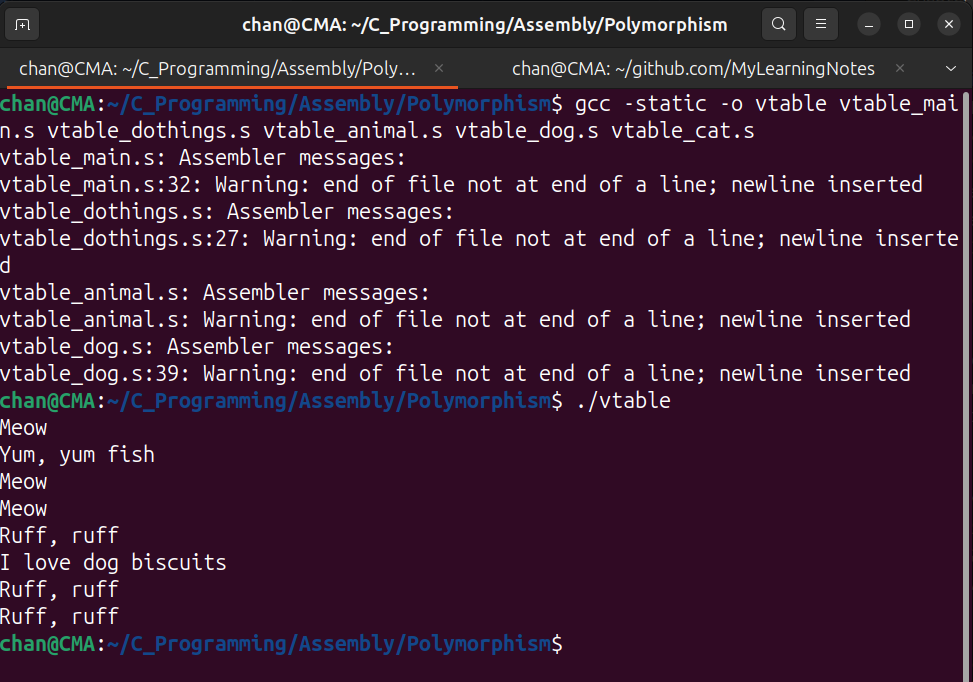

# Example #2 

## Pseudo Code Example #2

```pseudocode
interface Animal{
	function speak();
	function eat();
}

class Dog implements Animal{
	method speak(){
		stdout.fprintf("Ruff, ruff\n");
	}
	method eat(){
		stdout.fprintf("I love dog biscuits\n");
	}
	method fetch(){
		stdout.fprintf("I love to play fetch!\n");
	}
}

class Cat implements Animal{
	method speak(){
		stdout.fprintf("Meow\n");
	}
	method eat(){
		stdout.fprintf("Yum, yum fish\n");
	}
	method fetch(){
		stdout.fprintf("Ball of string, Yay!\n");
	}
}

function doThings(Animal *a){
	a.speak();
	a.eat();
	a.speak();
	a.speak();
}

function main(){
	c = Cat.new();
	d = Dog.new();
	
	doThings(c);
	doThings(d);
}
```

- In object-oriented terms, an interface is a set of methods which may be supported by one or more classes.
  - In the code, the `doThings` took any obj that supports the `Animal` interface.
  - The program calls it will a `Dog` obj one time and a `Cat` obj another time.
  - In each case, the code will do the appropriate functions for that obj. 
- By defining standard interfaces, programmers can write code which allows them to extend by adding additional classes that implement those interfaces.
- The main application code does not need to be changed because the application code merely works with the interfaces.
- Polymorphism is usually implemented by simply having a record for each interface that each class implements. 
  - This record (aka `vtable`) is simply a list of pointers to each function in the interface that the class implements.
- Then, when passing an object to a function that operates on an interface, both the pointer to the object and a pointer to the `vtable` are passed. 
- Since the interface is known ahead of time, the offsets into the `vtable` are also known, and the function simply looks
  up the function it wants to call on the `vtable`.
- This combination of two pointers, an object pointer and a `vtable` pointer, is often referred to as **a fat pointer**.

## Assembly Code Example #2

`vtable_cat.s`

```assembly
.section .note.GNU-stack, "", @progbits
## Cat class 
.globl cat_new, cat_eat, cat_speak, cat_destroy 

.extern stdout

.section .data
speak_text:
    .ascii "Meow\n\0"
eat_text:
    .ascii "Yum, yum fish\n\0"
play_text:
    .ascii "Ball of string, Yay!\n\0"

.section .text 
.equ CAT_SIZE, 64 

cat_new:
    enter $0, $0 
    movq $CAT_SIZE, %rdi 
    call malloc 
    leave 
    ret 

cat_speak:
    enter $0, $0 
    movq stdout, %rdi 
    movq $speak_text, %rsi 
    call fprintf 
    leave 
    ret 

cat_eat: 
    enter $0, $0
    movq stdout, %rdi 
    movq $eat_text, %rsi 
    call fprintf 
    leave 
    ret 

cat_destroy:
    enter $0, $0
    # %rdi already has the address 
    call free 
    leave 
    ret 
```

`vtable_dog.s`

```assembly
.section .note.GNU-stack, "", @progbits
## Dog class 
.globl dog_new, dog_eat, dog_speak, dog_destroy 
.extern stdout

.section .data 
speak_text: 
    .ascii "Ruff, ruff\n\0"
eat_text: 
    .ascii "I love dog biscuits\n\0"

.section .text 
.equ DOG_SIZE, 32
dog_new:
    enter $0, $0 
    movq $DOG_SIZE, %rdi 
    call malloc 
    leave 
    ret 

dog_speak:
    enter $0, $0 
    movq stdout, %rdi 
    movq $speak_text, %rsi 
    call fprintf 
    leave 
    ret 
dog_eat: 
    enter $0, $0 
    movq stdout, %rdi 
    movq $eat_text, %rsi 
    call fprintf 
    leave 
    ret 
dog_destroy:
    enter $0, $0
    # %rdi already has the address 
    call free
    leave 
    ret 
```

`vtable_animal.s`

- The `vtable` is just a list of functions which tell how the `Animal` interface is defined for that obj.
- One vtable is needed for each class for each interface it implements.

```assembly
.section .note.GNU-stack, "", @progbits

.globl VTABLE_ANIMAL_SPEAK_OFFSET, VTABLE_ANIMAL_EAT_OFFSET
.globl dog_vtable_animal
.globl cat_vtable_animal

.equ VTABLE_ANIMAL_SPEAK_OFFSET, 0
.equ VTABLE_ANIMAL_EAT_OFFSET, 8

.section .data
dog_vtable_animal:
    .quad dog_speak 
    .quad dog_eat 
cat_vtable_animal:
    .quad cat_speak 
    .quad cat_eat
```

`vtable_dothings.s`

```assembly
.section .note.GNU-stack, "", @progbits
.globl doThings 
.section .text 

doThings:
    .equ LCL_ANIMAL_OBJ_OFFSET, -8 
    .equ LCL_ANIMAL_VTABLE_OFFSET, -16 
    enter $16, $0 
    movq %rdi, LCL_ANIMAL_OBJ_OFFSET(%rbp) # store the animal object on the stack
    movq %rsi, LCL_ANIMAL_VTABLE_OFFSET(%rbp) # store the vtable on the stack

    # %rdi already contains the obj 
    call *VTABLE_ANIMAL_SPEAK_OFFSET(%rsi) # call the speak function

    movq LCL_ANIMAL_OBJ_OFFSET(%rbp), %rdi # load the animal object
    movq LCL_ANIMAL_VTABLE_OFFSET(%rbp), %rsi # load the vtable
    call *VTABLE_ANIMAL_EAT_OFFSET(%rsi) # call the eat function

    movq LCL_ANIMAL_OBJ_OFFSET(%rbp), %rdi # load the animal object
    movq LCL_ANIMAL_VTABLE_OFFSET(%rbp), %rsi # load the vtable
    call *VTABLE_ANIMAL_SPEAK_OFFSET(%rsi) # call the speak function

    movq LCL_ANIMAL_OBJ_OFFSET(%rbp), %rdi # load the animal object
    movq LCL_ANIMAL_VTABLE_OFFSET(%rbp), %rsi # load the vtable
    call *VTABLE_ANIMAL_SPEAK_OFFSET(%rsi) # call the speak function

    leave 
    ret 
```

**Notes regarding `vtable_dothings.s`**:

- The first param to `doThings` is an obj and the 2nd param is the `vtable`.
  - This tells the function both where the obj exists in memory (pointer to the obj) and how it is utilized (the pointer to the vtable).
- Then, all the function calls are made as indirect function calls, made as offsets into the vtable. 
- The `vtable` is stored in `%rsi`.
- If we want to call the eat function, we use the symbol `VTABLE_ANIMAL_EAT_OFFSET` to know where that function lives. 
- Therefore, `VTABLE_ANIMAL_EAT_OFFSET(%rsi)` contains the address of the function that will be
  executed. 
- We use the * with the call instruction to let the CPU know that `VTABLE_
  ANIMAL_EAT_OFFSET(%rsi)` is not where it should jump to, but rather the memory
  location that holds the address where the jump should go.

`vtable_main.s`

```assembly
.section .note.GNU-stack, "", @progbits
.globl main 
.section .text 

main:
    .equ LCL_CAT, -8 
    .equ LCL_DOG, -16 

    enter $16, $0 
    call cat_new 
    movq %rax, LCL_CAT(%rbp) # store the cat object on the stack

    # Construct a dog 
    call dog_new 
    movq %rax, LCL_DOG(%rbp) # store the dog object on the stack

    movq LCL_CAT(%rbp), %rdi # load the cat object
    movq $cat_vtable_animal, %rsi # load the vtable
    call doThings # call the doThings function with the cat object and vtable

    movq LCL_DOG(%rbp), %rdi 
    movq $dog_vtable_animal, %rsi 
    call doThings 

    # Destructors
    movq LCL_CAT(%rbp), %rdi # load the cat object
    call cat_destroy # call the destructor for the cat object

    movq LCL_DOG(%rbp), %rdi 
    call dog_destroy 

    leave 
    ret 
```


```sh
chan@CMA:~/C_Programming/Assembly/Polymorphism$ gcc -static -o vtable vtable_main.s vtable_dothings.s vtable_animal.s vtable_dog.s vtable_cat.s 
vtable_main.s: Assembler messages:
vtable_main.s:32: Warning: end of file not at end of a line; newline inserted
vtable_dothings.s: Assembler messages:
vtable_dothings.s:27: Warning: end of file not at end of a line; newline inserted
vtable_animal.s: Assembler messages:
vtable_animal.s: Warning: end of file not at end of a line; newline inserted
vtable_dog.s: Assembler messages:
vtable_dog.s:39: Warning: end of file not at end of a line; newline inserted
chan@CMA:~/C_Programming/Assembly/Polymorphism$ ./vtable
Meow
Yum, yum fish
Meow
Meow
Ruff, ruff
I love dog biscuits
Ruff, ruff
Ruff, ruff
```



1. First, `main` creates a cat and a dog object.
2. Then it calls `doThings` with the cat object and its vtable.
3. `doThings`calls:
   - `speak` once (prints "Meow")
   - `eat` once (prints "Yum, yum fish")
   - `speak` twice more (prints "Meow" twice)
4. Then `main` calls `doThings` with the dog object and its vtable.
5. `doThings` calls the same methods but now using the dog's implementations:
   - `speak` once (prints "Ruff, ruff")
   - `eat` once (prints "I love dog biscuits")
   - `speak` twice more (prints "Ruff, ruff" twice)

Overall, The code demonstrates:

- **Polymorphism**: The same function call can produce different behaviors based on the object type.
- **Virtual Method Tables**: Implemented vtables containing function pointers.
- **Dynamic Dispatch**: Methods are called indirectly through the vtable.
- **Encapsulation**: Each animal type has its own implementation of the methods.
- **Memory Management**: Each object is allocated and freed properly.
