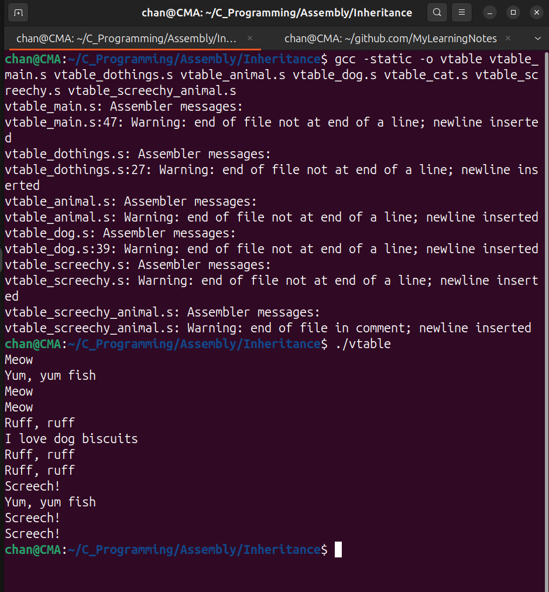

# Inheritance

- Let's say we have a cat that made a different noise than "meow", 
- In OOP, this is usually handled through inheritance.
- Inheritance allows a new class (subclass or derived class) to adopt the properties and methods of an existing class (superclass or base class).
- This mechanism promotes code reusability and hierarchical organization by enabling classes to extend or modify behaviors of their ancestors.

---

## Code Example

`vtable_screechy.s`

```assembly
.section .note.GNU-stack, "", @progbits
.globl screechy_cat_new, screechy_cat_speak, screechy_cat_destroy 

.extern stdout, malloc, free, fprintf 

.section .data 
speak_text:
    .ascii "Screech!\n\0"

.section .text 
.equ SCREECHY_CAT_SIZE, 128 

screechy_cat_new:
    enter $0, $0
    movq $SCREECHY_CAT_SIZE, %rdi 
    call malloc 
    leave 
    ret 

screechy_cat_speak: 
    enter $0, $0
    movq stdout, %rdi 
    movq $speak_text, %rsi 
    call fprintf 
    leave 
    ret 

screechy_cat_destroy:
    enter $0, $0
    # %rdi already has the address 
    call free 
    leave 
    ret
```

`vtable_screechy_animal.s`

```assembly
.section .note.GNU-stack, "", @progbits

.globl screechy_cat_vtable_animal

.section .data
screechy_cat_vtable_animal:
    .quad screechy_cat_speak # override the speak method
    .quad cat_eat # inherit the eat method from cat 
```

`vtable_animal.s`

```assembly
.section .note.GNU-stack, "", @progbits

.globl VTABLE_ANIMAL_SPEAK_OFFSET, VTABLE_ANIMAL_EAT_OFFSET
.globl dog_vtable_animal
.globl cat_vtable_animal

.equ VTABLE_ANIMAL_SPEAK_OFFSET, 0
.equ VTABLE_ANIMAL_EAT_OFFSET, 8

.section .data
dog_vtable_animal:
    .quad dog_speak 
    .quad dog_eat 
cat_vtable_animal:
    .quad cat_speak 
    .quad cat_eat
```

`vtable_cat.s`

```assembly
.section .note.GNU-stack, "", @progbits
## Cat class 
.globl cat_new, cat_eat, cat_speak, cat_destroy 

.extern stdout

.section .data
speak_text:
    .ascii "Meow\n\0"
eat_text:
    .ascii "Yum, yum fish\n\0"
play_text:
    .ascii "Ball of string, Yay!\n\0"

.section .text 
.equ CAT_SIZE, 64 

cat_new:
    enter $0, $0 
    movq $CAT_SIZE, %rdi 
    call malloc 
    leave 
    ret 

cat_speak:
    enter $0, $0 
    movq stdout, %rdi 
    movq $speak_text, %rsi 
    call fprintf 
    leave 
    ret 

cat_eat: 
    enter $0, $0
    movq stdout, %rdi 
    movq $eat_text, %rsi 
    call fprintf 
    leave 
    ret 

cat_destroy:
    enter $0, $0
    # %rdi already has the address 
    call free 
    leave 
    ret 
```

`vtable_dog.s`

```assembly
.section .note.GNU-stack, "", @progbits
## Dog class 
.globl dog_new, dog_eat, dog_speak, dog_destroy 
.extern stdout

.section .data 
speak_text: 
    .ascii "Ruff, ruff\n\0"
eat_text: 
    .ascii "I love dog biscuits\n\0"

.section .text 
.equ DOG_SIZE, 32
dog_new:
    enter $0, $0 
    movq $DOG_SIZE, %rdi 
    call malloc 
    leave 
    ret 

dog_speak:
    enter $0, $0 
    movq stdout, %rdi 
    movq $speak_text, %rsi 
    call fprintf 
    leave 
    ret 
dog_eat: 
    enter $0, $0 
    movq stdout, %rdi 
    movq $eat_text, %rsi 
    call fprintf 
    leave 
    ret 
dog_destroy:
    enter $0, $0
    # %rdi already has the address 
    call free
    leave 
    ret 
```

`vtable_dothings.s`

```assembly
.section .note.GNU-stack, "", @progbits
.globl doThings 
.section .text 

doThings:
    .equ LCL_ANIMAL_OBJ_OFFSET, -8 
    .equ LCL_ANIMAL_VTABLE_OFFSET, -16 
    enter $16, $0 
    movq %rdi, LCL_ANIMAL_OBJ_OFFSET(%rbp) # store the animal object on the stack
    movq %rsi, LCL_ANIMAL_VTABLE_OFFSET(%rbp) # store the vtable on the stack

    # %rdi already contains the obj 
    call *VTABLE_ANIMAL_SPEAK_OFFSET(%rsi) # call the speak function

    movq LCL_ANIMAL_OBJ_OFFSET(%rbp), %rdi # load the animal object
    movq LCL_ANIMAL_VTABLE_OFFSET(%rbp), %rsi # load the vtable
    call *VTABLE_ANIMAL_EAT_OFFSET(%rsi) # call the eat function

    movq LCL_ANIMAL_OBJ_OFFSET(%rbp), %rdi # load the animal object
    movq LCL_ANIMAL_VTABLE_OFFSET(%rbp), %rsi # load the vtable
    call *VTABLE_ANIMAL_SPEAK_OFFSET(%rsi) # call the speak function

    movq LCL_ANIMAL_OBJ_OFFSET(%rbp), %rdi # load the animal object
    movq LCL_ANIMAL_VTABLE_OFFSET(%rbp), %rsi # load the vtable
    call *VTABLE_ANIMAL_SPEAK_OFFSET(%rsi) # call the speak function

    leave 
    ret 
```

`vtable_main.s`

```assembly
.section .note.GNU-stack, "", @progbits
.globl main 
.section .text 

main:
    .equ LCL_CAT, -8 
    .equ LCL_DOG, -16 
    .equ LCL_SCREECHY, -24 # new local for screechy cat

    enter $32, $0 # increased stack space for new var
    call cat_new 
    movq %rax, LCL_CAT(%rbp) # store the cat object on the stack

    # Construct a dog 
    call dog_new 
    movq %rax, LCL_DOG(%rbp) # store the dog object on the stack

    # Construct a screechy cat
    call screechy_cat_new
    movq %rax, LCL_SCREECHY(%rbp) # store the screechy cat object on the stack

    # regular cat
    movq LCL_CAT(%rbp), %rdi # load the cat object
    movq $cat_vtable_animal, %rsi # load the vtable
    call doThings # call the doThings function with the cat object and vtable

    # Dog
    movq LCL_DOG(%rbp), %rdi 
    movq $dog_vtable_animal, %rsi 
    call doThings 

    # screechy cat - demonstrates inheritance
    movq LCL_SCREECHY(%rbp), %rdi # load the screechy cat object
    movq $screechy_cat_vtable_animal, %rsi # load the vtable
    call doThings 

    # Destructors
    movq LCL_CAT(%rbp), %rdi # load the cat object
    call cat_destroy # call the destructor for the cat object

    movq LCL_DOG(%rbp), %rdi 
    call dog_destroy 

    movq LCL_SCREECHY(%rbp), %rdi 
    call screechy_cat_destroy

    leave 
    ret 
```

`Output`

```sh
chan@CMA:~/C_Programming/Assembly/Inheritance$ ./vtable
Meow
Yum, yum fish
Meow
Meow
Ruff, ruff
I love dog biscuits
Ruff, ruff
Ruff, ruff
Screech!
Yum, yum fish
Screech!
Screech!
```



The screechy cat demonstrates inheritance by:

- **Overriding** the `speak` method with its own implementation (prints "Screech!")
- **Inheriting** the `eat` method from the regular cat (prints "Yum, yum fish")

The implementation uses:

1. **Virtual Method Tables (vtables)**: Each animal type has a table of function pointers.
2. **Dynamic Dispatch**: Methods are called indirectly through the vtable.
3. **Method Overriding**: The screechy cat provides its own implementation of `speak.`
4. **Method Inheritance**: The screechy cat reuses the cat's implementation of `eat.`