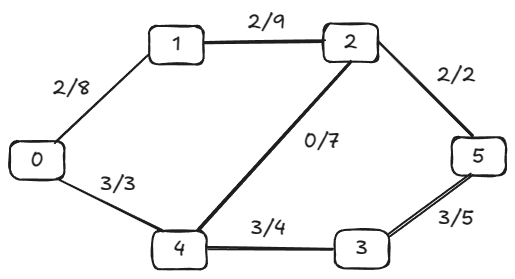
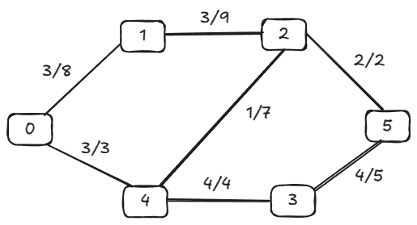

# Ford-Fulkerson Algorithm

- Ford-Fulkerson algorithm is a greedy approach *(an approach for solving a problem by selecting the best option available at the moment. It doesn't worry whether the current best result will bring the overall optimal result)* for calculating the maximum possible flow in a network or a graph.

- A term, **flow network**, is used to describe a network of vertices and edges with a source (S) and a sink (T). 
  - Each vertex, except **S** and **T**, can receive and send an equal amount of stuff through it. **S** can only send and **T** can only receive stuff.

---

## Terminologies Used

#### Augmenting Path

It is the path available in a flow network.

#### Residual Graph

It represents the flow network that has additional possible flow.

#### Residual Capacity

It is the capacity of the edge after subtracting the flow from the maximum capacity.

---

## How the algorithm works

The algorithm follows:

1. Initialize the flow in all the edges to 0.
2. While there is an augmenting path between the source and the sink, add this path to the flow.
3. Update the residual graph.

**Note: We can also consider reverse-path if required because if we do not consider them, we may never find a maximum flow.**


1. Select any arbitrary path from S to T. In this step, we have selected path `S-A-B-T`. 
2. The minimum capacity among the three edges is 2 (`B-T`). Based on this, update the `flow/capacity` for each path.


3. Select another path `S-D-C-T`. The minimum capacity among these edges is 3 (`S-D`). Update the capacities according to this.


4. Now, let's consider the reverse-path `B-D` as well. Selecting path `S-A-B-D-C-T`. The minimum residual capacity among the edges is 1 (`D-C`).

Updating the capacities.


The capacity for forward and reverse paths are considered separately.

5. Adding all the flows = 2 + 3 + 1 = 6, which is the maximum possible flow on the flow network.

**Note: if the capacity for any edge is full, then that path cannot be used.**

---

## C Implementation

#### Program Code

`hello.h`

```C
// represent colors for BFS traversal states
#define A 0
#define B 1
#define C 2


#define MAX_NODES 1000
#define O 1000000000 // represent infinity to initialize the 'increment' variable in the Ford-Fulkerson algorithm

extern int n; // num of vertices
extern int e; // num of edges
extern int capacity[MAX_NODES][MAX_NODES];
extern int flow[MAX_NODES][MAX_NODES];
extern int color[MAX_NODES]; // color array of BFS
extern int pred[MAX_NODES]; // predcessor array to store paths

int min(int x, int y);
extern int head, tail;
extern int q[MAX_NODES + 2];

void enqueue(int x);
int dequeue();
int bfs(int start, int target);
int fordFulkerson(int source, int sink);
```

`hello.c`

```c
int n;
int e;
int capacity[MAX_NODES][MAX_NODES];
int flow[MAX_NODES][MAX_NODES];
int color[MAX_NODES];
int pred[MAX_NODES];

int head, tail;
int q[MAX_NODES + 2];


/**
 * @brief Returns the minimum of two integers.
 *
 * @param x First integer.
 * @param y Second integer.
 * @return Minimum of x and y.
 */
int min(int x, int y)
{
    return x < y ? x : y;
}


/**
 * @brief Adds an element to the queue.
 *
 * @param x The element to enqueue.
 */
void enqueue(int x)
{
    if (tail >= MAX_NODES + 2)
    {
        fprintf(stderr, "Queue overflow while enqueing %d\n", x);
        exit(1);
    }
    q[tail] = x; // Add the element to the queue
    tail++; // increment the tail index
    color[x] = B; // Mark the vertex as visited
}

/**
 * @brief Removes and returns the front element from the queue.
 *
 * @return The dequeued element.
 */
int dequeue()
{
    if (head >= tail)
    {
        fprintf(stderr, "Queue underflow while dequeing.\n");
        exit(1);
    }
    int x = q[head]; // retrieve the front element
    head++; // increment the head index
    color[x] = C; // mark the vertex as fully explored
    return x; // return the dequeued element
}

/**
 * @brief Performs Breadth-First Search to find an augmenting path.
 *
 * @param start The source vertex.
 * @param target The sink vertex.
 * @return 1 if a path exists, 0 otherwise.
 */
int bfs(int start, int target)
{
    int u, v;
    
    // Initialize all vertices as unvisited 
    for (u = 0; u < n; u++)
    {
        color[u] = A;
    }
    
    // Initialize the queue
    head = tail = 0;
    enqueue(start); // enqueue the src vertex
    pred[start] = -1; // src has no predecessor
    
    // Traverse the graph using BFS
    while (head != tail)
    {
        u = dequeue(); // dequeue the next vertex
        
        // Iterate thru all adjacent vertices
        for (v = 0; v < n; v++)
        {
            // if the vertex is unvisited and the residual capacity is positive
            if (color[v] == A && capacity[u][v] - flow[u][v] > 0)
            {
                // enqueue the vertex
                enqueue(v);
                
                // set predecessor for path reconstruction
                pred[v] = u;
            }
        }
    }
    
    // check if the sink was reached
    return color[target] == C;
}

/**
 * @brief Implements the Ford-Fulkerson algorithm to find the maximum flow.
 *
 * @param source The source vertex.
 * @param sink The sink vertex.
 * @return The maximum flow from source to sink.
 */
int fordFulkerson(int source, int sink)
{
    int i, j, u;
    int max_flow = 0; // Initialize maximum flow to 0
    
    // Initialize all flows to 0
    for (i = 0; i < n; i++)
    {
        for (j = 0; j < n; j++)
        {
            flow[i][j] = 0;
        }
    }

    // Continue finding augmenting paths while they exist
    // Updating the residual values of edges
    while (bfs(source, sink))
    {
        int increment = O;  // Initialize to a large number 'O' (alphabet O)(infinity)
        
        // Determine the minimum residual capacity along the path found by BFS
        for (u = n - 1; pred[u] >= 0; u = pred[u])
        {
            // Update increment if a smaller residual is found
            increment = min(increment, capacity[pred[u]][u] - flow[pred[u]][u]);
        }
        
        // Update the flows along the path
        for (u = n - 1; pred[u] >= 0; u = pred[u])
        {
            flow[pred[u]][u] += increment; // Add flow in the forward direction
            flow[u][pred[u]] -= increment; // Subtract flow in the reverse direction
        }
        // Add the increment to the total maximum flow
        max_flow += increment;
    }

    return max_flow; // Return the computed maximum flow
}
```

`main.c`

```c
int main()
{
    // Initialize the number of vertices and edges
    n = 6; // Number of vertices
    e = 7; // Number of edges

    // Initialize the capacity matrix to 0 for all vertex pairs
    for (int i = 0; i < n; i++)
    {
        for (int j = 0; j < n; j++)
        {
            capacity[i][j] = 0;
        }
    }

    // Define the capacities of the edges in the graph
    // Each capacity[i][j] represents the capacity from vertex i to vertex j
    capacity[0][1] = 8; // Edge from vertex 0 to vertex 1 with capacity 8
    capacity[0][4] = 3; // Edge from vertex 0 to vertex 4 with capacity 3
    capacity[1][2] = 9; // Edge from vertex 1 to vertex 2 with capacity 9
    capacity[2][4] = 7; // Edge from vertex 2 to vertex 4 with capacity 7
    capacity[2][5] = 2; // Edge from vertex 2 to vertex 5 with capacity 2
    capacity[3][5] = 5; // Edge from vertex 3 to vertex 5 with capacity 5
    capacity[4][2] = 7; // Edge from vertex 4 to vertex 2 with capacity 7
    capacity[4][3] = 4; // Edge from vertex 4 to vertex 3 with capacity 4

    int s = 0, t = 5; // Define source (vertex 0) and sink (vertex 5)

    // Call the fordFulkerson function to compute the maximum flow from source to sink
    printf("Max Flow: %d\n", fordFulkerson(s, t));
    
    return 0;
}
```


#### Program Output

```shell
chan@CMA:~/C_Programming/test$ ./final
Max Flow: 6
```

###### **Step-by-Step Flow Calculation**

**Initial Setup:**

- **Flow Matrix (`flow[][]`):** Initialized to **0** for all edges.
- **Max Flow (`max_flow`):** Starts at **0**.

**Num of Vertices (n = 6) && Num of Edges (e = 7)**:


**Augmenting Path 1:** `0 → 1 → 2 → 5`

- **Residual Capacities:**
  - `0 → 1`: 8
  - `1 → 2`: 9
  - `2 → 5`: 2
- **Bottleneck (Minimum Capacity):** **2**
- **Flow Update:**
  - `flow[0][1] += 2` → `flow[0][1] = 2`
  - `flow[1][2] += 2` → `flow[1][2] = 2`
  - `flow[2][5] += 2` → `flow[2][5] = 2`
- **Total Max Flow:** `0 + 2 = 2`

**Augmenting Path 2:** `0 → 4 → 3 → 5`

- **Residual Capacities:**
  - `0 → 4`: 3
  - `4 → 3`: 4
  - `3 → 5`: 5
- **Bottleneck (Minimum Capacity):** **3**
- **Flow Update:**
  - `flow[0][4] += 3` → `flow[0][4] = 3`
  - `flow[4][3] += 3` → `flow[4][3] = 3`
  - `flow[3][5] += 3` → `flow[3][5] = 3`
- **Total Max Flow:** `2 + 3 = 5`



[ford-fulkerson-2.png](Img/ford-fulkerson-2.png.png)

**Augmenting Path 3:** `0 → 1 → 2 → 4 → 3 → 5`

- **Residual Capacities:**
  - `0 → 1`: 8 - 2 = 6
  - `1 → 2`: 9 - 2 = 7
  - `2 → 4`: 7
  - `4 → 3`: 4 - 3 = 1
  - `3 → 5`: 5 - 3 = 2
- **Bottleneck (Minimum Capacity):** **1**
- **Flow Update:**
  - `flow[0][1] += 1` → `flow[0][1] = 3`
  - `flow[1][2] += 1` → `flow[1][2] = 3`
  - `flow[2][4] += 1` → `flow[2][4] = 1`
  - `flow[4][3] += 1` → `flow[4][3] = 4`
  - `flow[3][5] += 1` → `flow[3][5] = 4`
- **Total Max Flow:** `5 + 1 = 6`



**Final Check:**

After these iterations, attempting to find another augmenting path:

- **No Additional Paths Available:**
  - Residual Capacities:
    - `0 → 1`: 8 - 3 = 5
    - `0 → 4`: 3 - 3 = 0
    - `1 → 2`: 9 - 3 = 6
    - `2 → 5`: 2 - 2 = 0
    - `4 → 3`: 4 - 4 = 0
    - `3 → 5`: 5 - 4 = 1
- **Result:**
  No further augmenting paths can increase the flow without exceeding capacities.
- **Final Max Flow:** **6**

---

## C Implementation (DFS-Based)

#### Program Code

`hello.h`

```c
#define V 6

// A DFS based func to find an augmenting path
// Returns true if there is a path from source 's' to sink 't' in the residual graph
// Also fills parent[] to store the path
bool dfs(int rGraph[V][V], int s, int t, bool visited[], int parent[]);

// Implementation of Ford-Fulkerson algorithm for max flow
int fordFulkerson(int graph[V][V], int s, int t);
```

**Graph Representation:**

- The graph is defined as a 2D array (`graph[V][V]`) where each cell `[u][v]` represents the capacity of the edge from vertex `u` to `v`. If there's no edge, the capacity is `0`.

**Residual Graph:**

- A residual graph (`residualGraph`) is created as a copy of the original graph. This graph will be updated as flows are sent along paths.

**DFS for Finding Augmenting Path:**

- The `dfs` function searches for an augmenting path from source to sink in the residual graph. It marks visited nodes and uses the `parent` array to store the path found.

**Ford-Fulkerson Algorithm Steps:**

- Repeatedly find an augmenting path using DFS.
- Once a path is found, determine the minimum capacity along that path (`pathFlow`).
- Update the residual capacities along the path: decrease forward edge capacities and increase reverse edge capacities.
- Add the path flow to the total `maxFlow`.
- Continue this process until no more augmenting paths can be found.

`hello.c`

```c
/**
 * @brief Performs a Depth-First Search (DFS) to find an augmenting path.
 *
 * @param rGraph The residual graph.
 * @param s The src vertex.
 * @param t The sink vertex.
 * @param visited Array to keep track of visited vertices.
 * @param parent Array to store the augmenting path.
 * @return true if an augmenting path is found; otherwise, false.
 */
bool dfs(int rGraph[V][V], int s, int t, bool visited[], int parent[])
{
    // mark the source node as visited
    visited[s] = true;
    if (s == t)
    {
        return true; // reached sink
    }

    // Iterate through all vertices to find adjacent vertices with available capacity.
    for (int v = 0; v < V; v++)
    {
        // if there's available capacity and v is not visited yet.
        if (!visited[v] && rGraph[s][v] > 0)
        {
            // set the predecessor for path reconstruction
            parent[v] = s;
            
            // recursively attempt to find a path from this vertex to the sink.
            if (dfs(rGraph, v, t, visited, parent))
            {
                return true;
            }
        }
    }
    
    // No augmenting path found from this vertex.
    return false;
}

/**
 * @brief Implements the Ford-Fulkerson algorithm to compute the maximum flow.
 *
 * @param graph The original graph represented as an adjacency matrix.
 * @param s The source vertex.
 * @param t The sink vertex.
 * @return The maximum flow from source to sink.
 */
int fordFulkerson(int graph[V][V], int s, int t)
{
    int u, v;

    // Create a residual graph and fill with initial capacities.
    int rGraph[V][V];
    for (u = 0; u < V; u++)
    {
        for (v = 0; v < V; v++)
        {
            rGraph[u][v] = graph[u][v];
        }
    }

    int maxFlow = 0;
    int parent[V]; // array to store path

    // Augment the flow while there is a path from src to sink.
    while (true)
    {
        // Mark all nodes as not visited for this iteration
        bool visited[V];
        memset(visited, 0, sizeof(visited));
        memset(parent, -1, sizeof(parent));

        // if no augmenting path found, break
        if (!dfs(rGraph, s, t, visited, parent))
        {
            break;
        }

        // find min residual capacity of the augmenting path found.
        int pathFlow = INT_MAX;
        for (v = t; v != s; v = parent[v])
        {
            u = parent[v];
            if (rGraph[u][v] < pathFlow)
            {
                pathFlow = rGraph[u][v];
            }
        }

        // Update residual capacities of the edges and reverse edges along the path
        for (v = t; v != s; v = parent[v])
        {
            u = parent[v];
            rGraph[u][v] -= pathFlow; // Reduce capacity in the forward direction.
            rGraph[v][u] += pathFlow; // Increase capacity in the reverse direction.
        }

        // Add path flow to overall flow
        maxFlow += pathFlow;
    }

    return maxFlow;
}
```

`main.c`

```c
int main()
{
    int graph[V][V] = {
        {0, 16, 13, 0, 0, 0},
        {0, 0, 10, 12, 0, 0},
        {0, 4, 0, 0, 14, 0},
        {0, 0, 9, 0, 0, 20},
        {0, 0, 0, 7, 0, 4},
        {0, 0, 0, 0, 0, 0}};

    int s = 0;
    int t = 5;

    printf("The maximum possible flow is %d\n", fordFulkerson(graph, s, t));
    return 0;
}
```

#### Program Step-by-Step Execution

|      | 0    | 1    | 2    | 3    | 4    | 5    |
| ---- | ---- | ---- | ---- | ---- | ---- | ---- |
| 0    | 0    | 16   | 13   | 0    | 0    | 0    |
| 1    | 0    | 0    | 10   | 12   | 0    | 0    |
| 2    | 0    | 4    | 0    | 0    | 14   | 0    |
| 3    | 0    | 0    | 9    | 0    | 0    | 20   |
| 4    | 0    | 0    | 0    | 7    | 0    | 4    |
| 5    | 0    | 0    | 0    | 0    | 0    | 0    |

Vertices: 0 (Source), 1, 2, 3, 4, 5 (Sink)

Edges and Capacities:
- 0 → 1: 16
- 0 → 2: 13
- 1 → 2: 10
- 1 → 3: 12
- 2 → 1: 4
- 2 → 4: 14
- 3 → 2: 9
- 3 → 5: 20
- 4 → 3: 7
- 4 → 5: 4

**Initial Graph Flow:**


**Iteration 1:**

- **Find Augmenting Path:** `0 → 1 → 3 → 5`

  **Path Details:**

  - `0 → 1`: Capacity = 16
  - `1 → 3`: Capacity = 12
  - `3 → 5`: Capacity = 20

  **Bottleneck Capacity:** `min(16, 12, 20) = 12`

- **Update Residual Capacities:**

```css
rGraph[0][1] -= 12 => 16 - 12 = 4
rGraph[1][3] -= 12 => 12 - 12 = 0
rGraph[3][5] -= 12 => 20 - 12 = 8

// Reverse flows
rGraph[1][0] += 12 => 0 + 12 = 12
rGraph[3][1] += 12 => 0 + 12 = 12
rGraph[5][3] += 12 => 0 + 12 = 12
```

- **Update Max Flow:**

```css
maxFlow += 12 => 0 + 12 = 12
```

**Flow Graph After Iteration 1:**


**Iteration 2:**

- **Find Augmenting Path:** `0 → 2 → 4 → 5`

  **Path Details:**

  - `0 → 2`: Capacity = 13
  - `2 → 4`: Capacity = 14
  - `4 → 5`: Capacity = 4

  **Bottleneck Capacity:** `min(13, 14, 4) = 4`

- **Update Residual Capacities:**

```css
rGraph[0][2] -= 4 => 13 - 4 = 9
rGraph[2][4] -= 4 => 14 - 4 = 10
rGraph[4][5] -= 4 => 4 - 4 = 0

// Reverse flows
rGraph[2][0] += 4 => 0 + 4 = 4
rGraph[4][2] += 4 => 0 + 4 = 4
rGraph[5][4] += 4 => 0 + 4 = 4
```

- **Update Max Flow**:

```css
maxFlow += 4 => 12 + 4 = 16
```

**Flow Graph After Iteration 2:**


**Iteration 3:**

- **Find Augmenting Path:** `0 → 1 → 2 → 4 → 3 → 5`

  **Path Details:**

  - `0 → 1`: Capacity = 4
  - `1 → 2`: Capacity = 10
  - `2 → 4`: Capacity = 10
  - `4 → 3`: Capacity = 7
  - `3 → 5`: Capacity = 8

  **Bottleneck Capacity:** `min(4, 10, 10, 7, 8) = 4`

- **Update Residual Capacities:**

```css
rGraph[0][1] -= 4 => 4 - 4 = 0
rGraph[1][2] -= 4 => 10 - 4 = 6
rGraph[2][4] -= 4 => 10 - 4 = 6
rGraph[4][3] -= 4 => 7 - 4 = 3
rGraph[3][5] -= 4 => 8 - 4 = 4

// Reverse flows
rGraph[1][0] += 4 => 12 + 4 = 16
rGraph[2][1] += 4 => 0 + 4 = 4
rGraph[4][2] += 4 => 4 + 4 = 8
rGraph[3][4] += 4 => 0 + 4 = 4
rGraph[5][3] += 4 => 12 + 4 = 16
```

- **Update Max Flow**:

```css
maxFlow += 4 => 16 + 4 = 20
```

**Flow Graph After Iteration 3:**


**Iteration 4:**

- **Find Augmenting Path:** `0 → 2 → 1 → 3 → 5`

  **Path Details:**

  - `0 → 2`: Capacity = 9
  - `2 → 1`: Capacity = 4
  - `1 → 3`: Capacity = 0 (No available capacity)

  **Issue:** No capacity in `1 → 3`. Dead end.

- **Alternative Path:** `0 → 2 → 4 → 3 → 5`

  **Path Details:**

  - `0 → 2`: Capacity = 9
  - `2 → 4`: Capacity = 6
  - `4 → 3`: Capacity = 3
  - `3 → 5`: Capacity = 4

  **Bottleneck Capacity:** `min(9, 6, 3, 4) = 3`

- **Update Residual Capacities:**

```css
rGraph[0][2] -= 3 => 9 - 3 = 6
rGraph[2][4] -= 3 => 6 - 3 = 3
rGraph[4][3] -= 3 => 3 - 3 = 0
rGraph[3][5] -= 3 => 4 - 3 = 1

// Reverse flows
rGraph[2][0] += 3 => 4 + 3 = 7
rGraph[4][2] += 3 => 8 + 3 = 11
rGraph[3][4] += 3 => 4 + 3 = 7
rGraph[5][3] += 3 => 16 + 3 = 19
```

- **Update Max Flow:**

```css
maxFlow += 3 => 20 + 3 = 23
```

**Flow Graph After Iteration 4:**


**Iteration 5:**

- **Find Augmenting Path:** `0 → 2 → 1 → 2 → 4 → 3 → 5`

  **Path Details:**

  - `0 → 2`: Capacity = 6
  - `2 → 1`: Capacity = 4
  - `1 → 2`: Capacity = 6
  - `2 → 4`: Capacity = 3
  - `4 → 3`: Capacity = 0 (No available capacity)

  **Issue:** No capacity in `4 → 3`. Dead end.

- **Alternative Paths:**
  No further augmenting paths available from source to sink with available capacity.

- **Termination:**
  No augmenting paths found. Algorithm terminates.

- **Final Max Flow:** **23**

**Final Flow Graph Structure**


#### Program Output

```shell
chan@CMA:~/C_Programming/test$ make valgrind
valgrind --leak-check=full --show-leak-kinds=all --track-origins=yes ./final
==14960== Memcheck, a memory error detector
==14960== Copyright (C) 2002-2022, and GNU GPL'd, by Julian Seward et al.
==14960== Using Valgrind-3.22.0 and LibVEX; rerun with -h for copyright info
==14960== Command: ./final
==14960== 
The maximum possible flow is 23
==14960== 
==14960== HEAP SUMMARY:
==14960==     in use at exit: 0 bytes in 0 blocks
==14960==   total heap usage: 1 allocs, 1 frees, 1,024 bytes allocated
==14960== 
==14960== All heap blocks were freed -- no leaks are possible
==14960== 
==14960== For lists of detected and suppressed errors, rerun with: -s
==14960== ERROR SUMMARY: 0 errors from 0 contexts (suppressed: 0 from 0)
```

