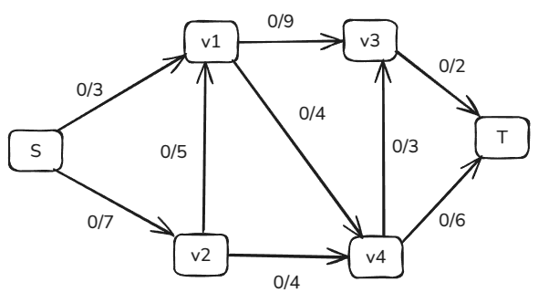

# The Maximum Flow Problem

- The Maximum Flow problem is about finding the maximum flow through a directed graph, from one place in the graph to another.
- More specificially, the flow comes from a source vertex `s` (source = no incoming but outgoing edges only) and ends up in a sink vertex `t` (sink = no outgoing edges but only incoming edges).
- Each edge in the graph is defined with a flow and a capacity, where the capacity is the maximum flow that edge can have.

#### Terminology and Concepts

- A **flow network** if often what we call a directed graph with a flow flowing through it.
- The **capacity** of an edge tells us how much flow is allowed to flow through that edge.
- Each edge also has a flow value that tells how much the current flow is in that edge.
- The edge in the image above `v1` -> `v2`, going from vertex v1 to vertex v2, has its flow and capacity described as `0/5`, which means the flow is `0` and the capacity is `5`.
- So the flow in this edge can be increased up to 5, but not more.
- In its simplest form, flow network has one **source vertex** `s` where the flow comes out, and one **sink vertex** `t` where the flow goes in. The other vertices just have flow passing through them.
- For all vertices except `s` and `t`, there is a **conversation of flow**, which means that the same amount of flow that goes into a vertex, must also come out of it.
- The maximum flow is found by algorithms such as **Ford-Fulkerson**, or **Edmonds-Karp**, by sending more and more flow through the edges in the flow network until the capacity of the edges are such that no more flow can be sent through. Such a path where more flow can be sent through is called an **augmented path**.
- The Ford-Fulkerson and Edmonds-Karp algorithms are implemented using something called a **residual network**.
- The **residual network** is set up with the **residual capacities** on each edge, where the residual capacity of an edge is the capacity on that edge, minus the flow.
- So when flow is increased in an edge, the residual capacity is decreased with the same amount.
- For each edge in the residual network, there is also a **reversed edge** that points in the opposite direction of the original edge.
- The residual capacity of a reversed edge is the flow of the original edge.
- Reversed edges are important for sending flow back on an edge as part of the maximum flow algorithms.

---

### **Objective**

Find the **maximum flow** from the source `s` to the sink `t`, which is the greatest amount of "stuff" (e.g., data, water, traffic) that can be sent from `s` to `t` without violating the capacity constraints on any edge.

---

### **Finding the Maximum Flow: Algorithms**

Several algorithms solve the maximum flow problem. The most common include:

#### 1. **Ford-Fulkerson Method**

- **Idea**: Iteratively find augmenting paths in the residual network and increase the flow along these paths until no more augmenting paths exist.

- **Process**:

  1. Start with an initial flow of 0.

  2. While there exists an augmenting path from  `s` to  `t`

      in the residual network:

     - Determine the minimum residual capacity (bottleneck) along the path.
     - Increase the flow along that path by the bottleneck value.
     - Update the residual capacities.

  3. When no more augmenting paths exist, the current flow is maximum.

- **Note**: The efficiency of Ford-Fulkerson depends on how the augmenting paths are chosen. If capacities are irrational numbers, the algorithm may not terminate.

#### 2. **Edmonds-Karp Algorithm**

- A specific implementation of Ford-Fulkerson.
- **Strategy**: Always choose the shortest augmenting path (in terms of number of edges) using breadth-first search (BFS).
- **Advantage**: Guarantees termination and runs in polynomial time O(VE2).

#### 3. **Dinic's Algorithm**

- Introduces the concept of **level graphs** and **blocking flows**.
- Uses BFS to construct a level graph and then finds all blocking flows in that graph using depth-first search (DFS).
- More efficient than Edmonds-Karp in many cases, running in O(EV2) or better for special graphs.

---

### **Properties of Maximum Flow**

- **Max-Flow Min-Cut Theorem**: In a flow network, the maximum amount of flow passing from `s` to `t` is equal to the minimum capacity that, when removed, would disconnect `t` from `s`. This minimum set of edges is called a **minimum cut**.
- **Uniqueness**: While the value of the maximum flow is unique, the actual flow distribution might not be unique.

---

### **Applications**

- **Network Routing**: Determining how to send data through a network without exceeding link capacities.
- **Bipartite Matching**: Finding the maximum number of matching pairs in a bipartite graph.
- **Resource Allocation**: Allocating resources or scheduling tasks within capacity limits.
- **Image Segmentation**: Using graph cuts for separating objects in images.