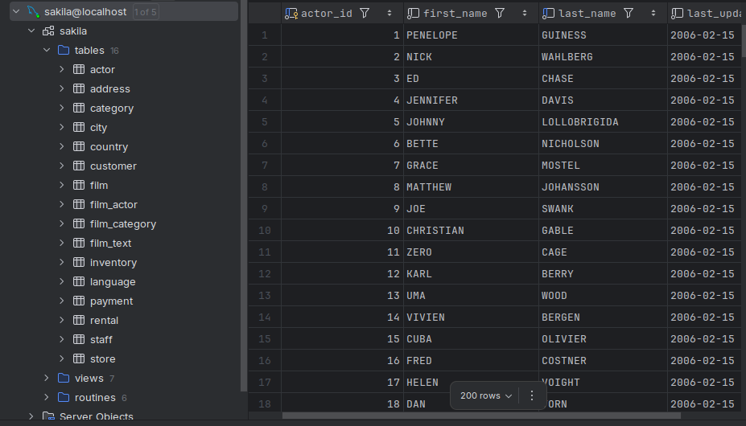

# Setting up MySQL in DataGrip

1. **Open DataGrip**

2. Go to `Database` pane → click `+` → **Data Source** → **MySQL**

3. Enter connection info:

4. - **Host**: `localhost`
   
   - **Port**: `3306`
   
   - **User**: `root`
   
   - **Password**: (what we used when setting up MySQL)
   
   - **Database**: `sakila`
   
     - If the database is not found and it is still in `Downloads` folder on Ubuntu, 
   
     - We should unzip the file and then `cd` to that folder, in which we should find `sakila-data.sql` and `sakila-schema.sql`.
   
     - If so we can proceed to running the SQL scripts:
   
       ```bash
       # Replace <your_user> with the MySQL user you’ve already configured in DataGrip
       mysql -u <your_user> -p < sakila-schema.sql
       mysql -u <your_user> -p < sakila-data.sql
       ```
   
     - We should be prompted with the password. This will create the `sakila` database, all tables and populate them.
   
     - We can verify by:
   
       ```bash
       mysql -u <your_user> -p -e "SHOW DATABASES LIKE 'sakila'; SHOW TABLES IN sakila;"
       ```
   
       
   
5. Click **Test Connection**

6. Once connected successfully, we can browse the tables, run queries, etc.

This is what we should see if everything's done right.



## Changing or Resetting MySQL root password on Ubuntu

```bash
-- inside mysql> prompt
ALTER USER 'root'@'localhost'
  IDENTIFIED WITH mysql_native_password
  BY 'YourNewPassword';
FLUSH PRIVILEGES;
EXIT;
```

- Now we can do:

```bash
mysql -u root -p
# enter OurNewPassword
```

