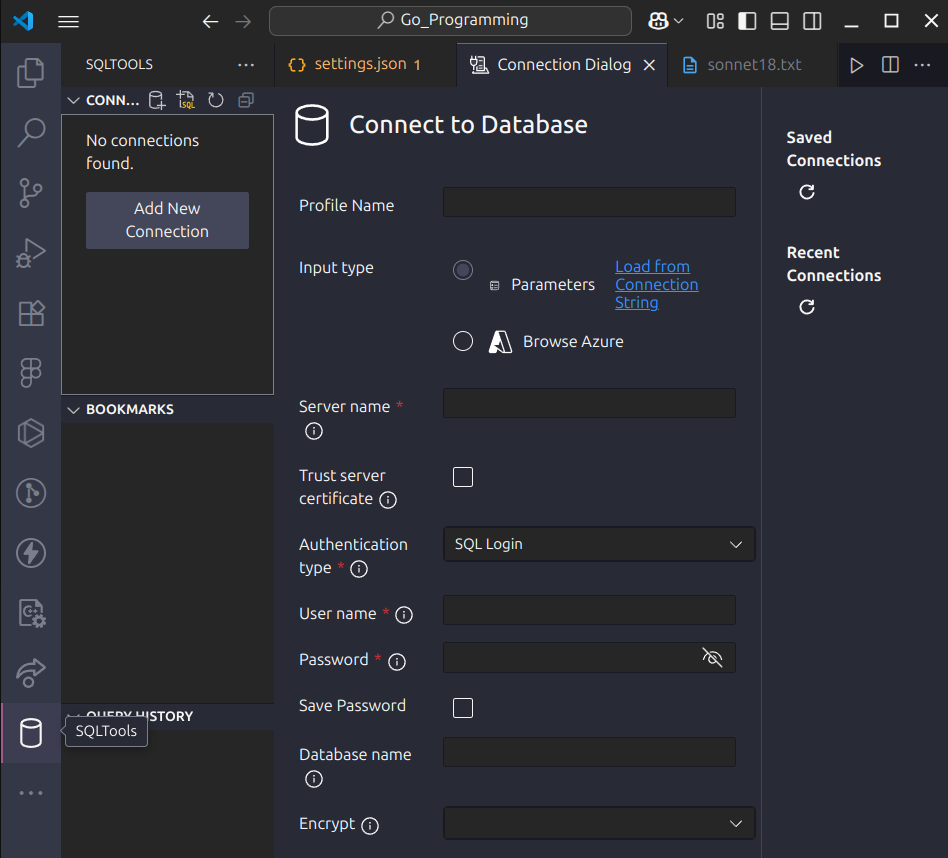
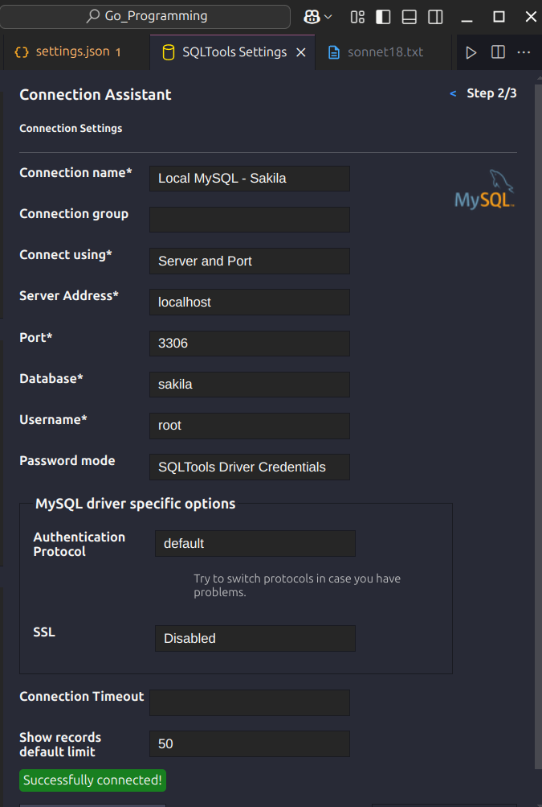

# Setting up MySQL in VS Code

## Connecting Sakila in VS Code

### Method #1: Via the SQLTools extension

1. Install these from the Extensions pane:

   - **SQLTools**
   - **SQLTools MySQL/MariaDB** driver

2. Add a connection (in our settings.json or via the UI):

   ```js
   // in settings.json
   "sqltools.connections": [
     {
       "name": "Local MySQL – Sakila",
       "driver": "MySQL",
       "server": "localhost",
       "port": 3306,
       "database": "sakila",
       "username": "<your_user>",
       "password": "<your_password>"
     }
   ]
   ```

3. Open the **SQLTools** tree (side bar), expand **Local MySQL – Sakila**, then right-click on a table to **Preview Data** or **Run Query**.



4. Click "Add new connection", choose **MySQL**, and fill in:




---

## Method #2: Via the official MySQL extension

1. Install **MySQL** (by Oracle) from the Extensions pane.
2. In the **MySQL** explorer view, click **Add Connection** → fill in:

- **Connection name**: Sakila
- **Server**: localhost
- **Port**: 3306
- **Username/Password**: as above
- **Database**: sakila

Click **Connect**—once connected we can browse tables under **sakila** and run queries.
