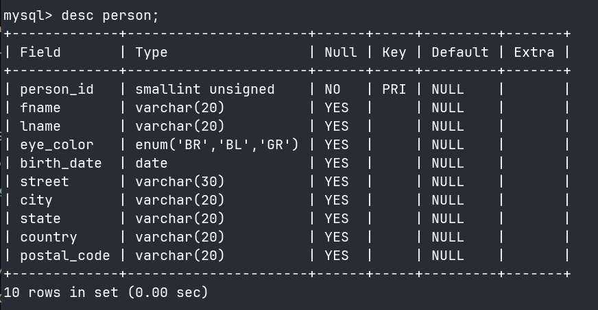

# Table Creation

- **Normalization**: the process of ensuring that there are no duplicate (other than foreign keys) or compound columns in our database design.

## Building SQL Schema Statements

- When defining our table, we need to tell the database server what column or columns will serve as the primary key for the table.

  - We do this by creating a `constraint` on the table.
  - In our table below, it is created on the `person_id` column and given the name `pk_person`.

- Another type of constraint called a **check constraint** constrains the allowable values for a particular column.

  - ```bash
    eye_color CHAR(2) CHECK (eye_color IN ('BR','BL','GR'));
    ```

- MySQL provide another character data type called `enum` that merges the check constraint into the data type definition.

```bash
mysql> CREATE TABLE person
    -> (person_id SMALLINT UNSIGNED,
    -> fname VARCHAR(20),
    -> lname VARCHAR(20),
    -> eye_color ENUM('BR','BL','GR'),
    -> birth_date DATE,
    -> street VARCHAR(30),
    -> city VARCHAR(20),
    -> state VARCHAR(20),
    -> country VARCHAR(20),
    -> postal_code VARCHAR(20),
    -> CONSTRAINT pk_person PRIMARY KEY (person_id)
    -> );
Query OK, 0 rows affected (0.63 sec)
```

- `Query OK, 0 rows affected` tells that the statement has no syntax errors.

Or if we want to keep our DDL in `Local MySQL - Sakila.session.sql` in VS Code, we can add:

```sql
USE sakila;

CREATE TABLE IF NOT EXISTS Person (
  person_id   SMALLINT AUTO_INCREMENT PRIMARY KEY,
  fname VARCHAR(20) NOT NULL,
  age  INT NOT NULL
);
```

- We can use the `describe` command (or `desc` for short) to look at the table definition.

```bash
mysql> desc person;
+-------------+----------------------+------+-----+---------+-------+
| Field       | Type                 | Null | Key | Default | Extra |
+-------------+----------------------+------+-----+---------+-------+
| person_id   | smallint unsigned    | NO   | PRI | NULL    |       |
| fname       | varchar(20)          | YES  |     | NULL    |       |
| lname       | varchar(20)          | YES  |     | NULL    |       |
| eye_color   | enum('BR','BL','GR') | YES  |     | NULL    |       |
| birth_date  | date                 | YES  |     | NULL    |       |
| street      | varchar(30)          | YES  |     | NULL    |       |
| city        | varchar(20)          | YES  |     | NULL    |       |
| state       | varchar(20)          | YES  |     | NULL    |       |
| country     | varchar(20)          | YES  |     | NULL    |       |
| postal_code | varchar(20)          | YES  |     | NULL    |       |
+-------------+----------------------+------+-----+---------+-------+
10 rows in set (0.00 sec)
```




- Column 3 shows whether a particular column can be omitted when data is inserted into the table.
- Column 5 shows whether a particular column will be populated with a default value if you omit the column when inserting data into the table.
  - Null is used for various cases where a value cannot be supplied such as:
    - Not applicable
    - Unknown
    - Empty set
    - We can specify which columns are allowed to be null (the default) and which columns are not allowed to be null (adding the keywords `not null` after the type definition).
- The Column 6 (Extra) shows any other pertinent information that might apply to a column.

Next, we will create the `favorite_food` table:

- Since a person can have more than one favorite food, it takes more than just the `person_id` column to guarantee uniqueness in the table.
  - Thus, this table has a two-column primary key.

```bash
mysql> CREATE TABLE favorite_food
    -> (person_id SMALLINT UNSIGNED,
    -> food VARCHAR(20),
    -> CONSTRAINT pk_favorite_food PRIMARY KEY (person_id, food),
    -> CONSTRAINT fk_fav_food_person_id FOREIGN KEY (person_id)
    -> REFERENCES person (person_id)
    -> );
Query OK, 0 rows affected (0.52 sec)
```

- This table also contains a **foreign key constraint** which
  - constrains the values of the `person_id` column in the `favorite_food` table to include only values found in the `person` table.
- If we forget too create the foreign key constraint, we can add it later via the `alter table` statement.

```bash
mysql> desc favorite_food;
+-----------+-------------------+------+-----+---------+-------+
| Field     | Type              | Null | Key | Default | Extra |
+-----------+-------------------+------+-----+---------+-------+
| person_id | smallint unsigned | NO   | PRI | NULL    |       |
| food      | varchar(20)       | NO   | PRI | NULL    |       |
+-----------+-------------------+------+-----+---------+-------+
2 rows in set (0.00 sec)
```

---

