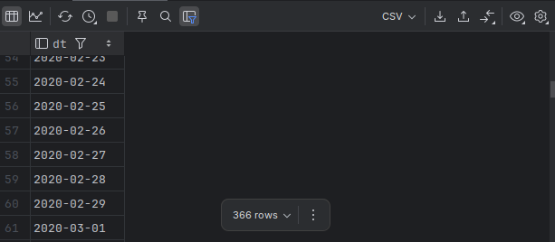

# Cross Join

- If **A** has *m* rows and **B** has *n* rows, the result will have *m × n* rows.
- Every row of **A** is combined with every row of **B**.
- No filtering or matching, purely all possible pairings.

---

## Example - 1

```bash
mysql> CREATE TEMPORARY TABLE colors (color_name VARCHAR(10));
Query OK, 0 rows affected (0.00 sec)

mysql> CREATE TEMPORARY TABLE shapes (shape_name VARCHAR(10));
Query OK, 0 rows affected (0.00 sec)

mysql> INSERT INTO colors VALUES ('Red'), ('Blue');
Query OK, 2 rows affected (0.00 sec)
Records: 2  Duplicates: 0  Warnings: 0

mysql> INSERT INTO shapes VALUES ('Circle'), ('Square');
Query OK, 2 rows affected (0.00 sec)
Records: 2  Duplicates: 0  Warnings: 0
```

```bash
mysql> SELECT * FROM colors;
+------------+
| color_name |
+------------+
| Red        |
| Blue       |
+------------+
2 rows in set (0.00 sec)

mysql> SELECT * FROM shapes;
+------------+
| shape_name |
+------------+
| Circle     |
| Square     |
+------------+
2 rows in set (0.00 sec)
```

**CROSS JOIN**

```bash
mysql> SELECT c.color_name, s.shape_name
    -> FROM colors c
    -> CROSS JOIN shapes s;
+------------+------------+
| color_name | shape_name |
+------------+------------+
| Blue       | Circle     |
| Red        | Circle     |
| Blue       | Square     |
| Red        | Square     |
+------------+------------+
4 rows in set (0.00 sec)
```

---

## Example Using Sakila 

- We'd get 10 random pairings out of the full 16000 combinations.

```bash
mysql> SELECT f.title AS film_title, c.name AS category_name
    -> FROM film f
    -> CROSS JOIN category c
    -> LIMIT 10;
+------------------+---------------+
| film_title       | category_name |
+------------------+---------------+
| ACADEMY DINOSAUR | Travel        |
| ACADEMY DINOSAUR | Sports        |
| ACADEMY DINOSAUR | Sci-Fi        |
| ACADEMY DINOSAUR | New           |
| ACADEMY DINOSAUR | Music         |
| ACADEMY DINOSAUR | Horror        |
| ACADEMY DINOSAUR | Games         |
| ACADEMY DINOSAUR | Foreign       |
| ACADEMY DINOSAUR | Family        |
| ACADEMY DINOSAUR | Drama         |
+------------------+---------------+
10 rows in set (0.04 sec)
```

---

## Example - 3

- Generating a table with 366 rows (2020 is a leap year) with a single column containing a number between 0 and 366 and then add that number of days to January 1, 2020.

```sql
sakila> SELECT ones.num + tens.num + hundreds.num
        FROM
        (
        SELECT 0 num UNION ALL
        SELECT 1 num UNION ALL
        SELECT 2 num UNION ALL
        SELECT 3 num UNION ALL
        SELECT 4 num UNION ALL
        SELECT 5 num UNION ALL
        SELECT 6 num UNION ALL
        SELECT 7 num UNION ALL
        SELECT 8 num UNION ALL
        SELECT 9 num
        ) ones
        CROSS JOIN
        (
            SELECT 0 num UNION ALL
            SELECT 10 num UNION ALL
            SELECT 20 num UNION ALL
            SELECT 30 num UNION ALL
            SELECT 40 num UNION ALL
            SELECT 50 num UNION ALL
            SELECT 60 num UNION ALL
            SELECT 70 num UNION ALL
            SELECT 80 num UNION ALL
            SELECT 90 num
        ) tens
        CROSS JOIN
        (
            SELECT 0 num UNION ALL
            SELECT 100 num UNION ALL
            SELECT 200 num UNION ALL
            SELECT 300 num
        ) hundreds
[2025-07-10 20:34:22] 400 rows retrieved starting from 1 in 302 ms (execution: 8 ms, fetching: 294 ms)
```

- If we take the Cartesian product of the three sets {0,1,2,3,4,5,6,7,8,9}, {0, 10, 20, 30, 40, 50, 60, 70, 80, 90}, and {0, 100, 200, 300} = 10 * 10 * 4 = 400. 
- WE got a 400-row result set containing all numbers between 0 and 399.
- While this is more than 366 rows needed to generate the set of days in 2020, it's easy enough to get rid of the excess rows.
- In the next query, `date_add()` is used to add each number in the result set to January 1, 2020. Then a filter condition to throw away any dates that venture into 2021.

```mysql
SELECT DATE_ADD('2020-01-01',
       INTERVAL (ones.num + tens.num + hundreds.num) DAY) dt
FROM
(
SELECT 0 num UNION ALL
SELECT 1 num UNION ALL
SELECT 2 num UNION ALL
SELECT 3 num UNION ALL
SELECT 4 num UNION ALL
SELECT 5 num UNION ALL
SELECT 6 num UNION ALL
SELECT 7 num UNION ALL
SELECT 8 num UNION ALL
SELECT 9 num
) ones
CROSS JOIN
(
    SELECT 0 num UNION ALL
    SELECT 10 num UNION ALL
    SELECT 20 num UNION ALL
    SELECT 30 num UNION ALL
    SELECT 40 num UNION ALL
    SELECT 50 num UNION ALL
    SELECT 60 num UNION ALL
    SELECT 70 num UNION ALL
    SELECT 80 num UNION ALL
    SELECT 90 num
) tens
CROSS JOIN
(
    SELECT 0 num UNION ALL
    SELECT 100 num UNION ALL
    SELECT 200 num UNION ALL
    SELECT 300 num
) hundreds
WHERE DATE_ADD('2020-01-01',
      INTERVAL (ones.num + tens.num + hundreds.num)DAY) < '2021-01-01'
ORDER BY 1;
```

**Output**



- The result set automatically includes the extra leap day (Feb 29) without our intervention, since the database server figures it out when it adds 59 days to January 1, 2020.

#### Using this query on Sakila Database

- Generating a report that shows every day in 2020 along with the number of film rentals on that day, including days when no films are rented.
  - **`COUNT(r.rental_id)`** counts only non-NULL IDs, so days with no rentals yield **0**.
  - `GROUP BY days.dt` produces one output row per date.
  - `ORDER BY days.dt` lists them in calendar order.

```mysql
USE sakila;

SELECT days.dt, COUNT(r.rental_id) num_rentals
FROM rental r
RIGHT OUTER JOIN
    (SELECT DATE_ADD('2005-01-01',
            INTERVAL (ones.num + tens.num + hundreds.num)DAY) dt
    FROM
        (
            SELECT 0 num UNION ALL
            SELECT 1 num UNION ALL
            SELECT 2 num UNION ALL
            SELECT 3 num UNION ALL
            SELECT 4 num UNION ALL
            SELECT 5 num UNION ALL
            SELECT 6 num UNION ALL
            SELECT 7 num UNION ALL
            SELECT 8 num UNION ALL
            SELECT 9 num
        ) ones
            CROSS JOIN
        (
            SELECT 0 num UNION ALL
            SELECT 10 num UNION ALL
            SELECT 20 num UNION ALL
            SELECT 30 num UNION ALL
            SELECT 40 num UNION ALL
            SELECT 50 num UNION ALL
            SELECT 60 num UNION ALL
            SELECT 70 num UNION ALL
            SELECT 80 num UNION ALL
            SELECT 90 num
        ) tens
            CROSS JOIN
        (
            SELECT 0 num UNION ALL
            SELECT 100 num UNION ALL
            SELECT 200 num UNION ALL
            SELECT 300 num
        ) hundreds
    WHERE DATE_ADD('2005-01-01',
        INTERVAL (ones.num + tens.num + hundreds.num)DAY) < '2006-01-01'
    ) days
    -- 2) Join rentals onto that calendar by matching on the date part only
ON days.dt = date(r.rental_date)
GROUP BY days.dt
ORDER BY 1;
[2025-07-10 21:28:21] 365 rows retrieved starting from 1 in 347 ms (execution: 15 ms, fetching: 332 ms)
```

