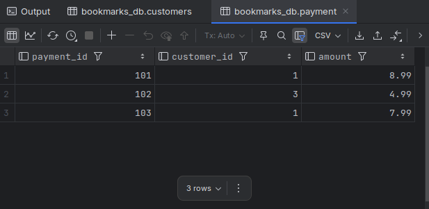

# Exercises

10-1. Using the following table definitions and data, write a query that returns each customer name along with their total payments:

```css
			Customer:
Customer_id  	Name
-----------  	---------------
	1			John Smith
	2			Kathy Jones
	3			Greg Oliver

			Payment:
Payment_id	Customer_id	Amount
----------	-----------	--------
	101			1		8.99
	102			3		4.99
	103			1		7.99
```

Include all customers, even if no payment records exist for that customer.

**Ans**:

```mysql
USE bookmarks_db;

CREATE TEMPORARY TABLE customers (
    customer_id INT PRIMARY KEY,
    name VARCHAR(100)
);

INSERT INTO customers (customer_id, name)
VALUES
    (1, 'John Smith'),
    (2, 'Kathy Jones'),
    (3, 'Greg Oliver');

CREATE TEMPORARY TABLE payment(
    payment_id INT PRIMARY KEY,
    customer_id INT,
    amount DECIMAL(10, 2)
);

INSERT INTO payment (payment_id, customer_id, amount)
VALUES
    (101, 1, 8.99),
    (102, 3, 4.99),
    (103, 1, 7.99);

SELECT * FROM customers;
SELECT * FROM payment;
```




```mysql
SELECT c.name, sum(p.amount)
FROM customers c
LEFT JOIN payment p
ON c.customer_id = p.customer_id
GROUP BY c.name;
```


---

10-2. Reformulate your query from Exercise 10-1 to use the other outer join type (e.g., if you used a left outer join in Exercise 10-1, use a right outer join this time) such that the results are identical to Exercise 10-1.

**Ans:**

```mysql
SELECT c.name, sum(p.amount)
FROM payment p
RIGHT JOIN customers c
ON p.customer_id = c.customer_id
GROUP BY c.name;
```


---

10-3. Devise a query that will generate the set {1, 2, 3, ..., 99, 100}. (Hint: use a cross join with at least two `from` clause subqueries.)

**Ans:**

```mysql
USE sakila;

SELECT ones.num + tens.num AS result
FROM
    (
        SELECT 0 num UNION ALL
        SELECT 1 num UNION ALL
        SELECT 2 num UNION ALL
        SELECT 3 num UNION ALL
        SELECT 4 num UNION ALL
        SELECT 5 num UNION ALL
        SELECT 6 num UNION ALL
        SELECT 7 num UNION ALL
        SELECT 8 num UNION ALL
        SELECT 9 num
    ) ones
CROSS JOIN
    (
        SELECT 0 num UNION ALL
        SELECT 10 num UNION ALL
        SELECT 20 num UNION ALL
        SELECT 30 num UNION ALL
        SELECT 40 num UNION ALL
        SELECT 50 num UNION ALL
        SELECT 60 num UNION ALL
        SELECT 70 num UNION ALL
        SELECT 80 num UNION ALL
        SELECT 90 num
    ) tens
ORDER BY result;
[2025-07-10 22:22:02] 100 rows retrieved starting from 1 in 190 ms (execution: 3 ms, fetching: 187 ms)
```

