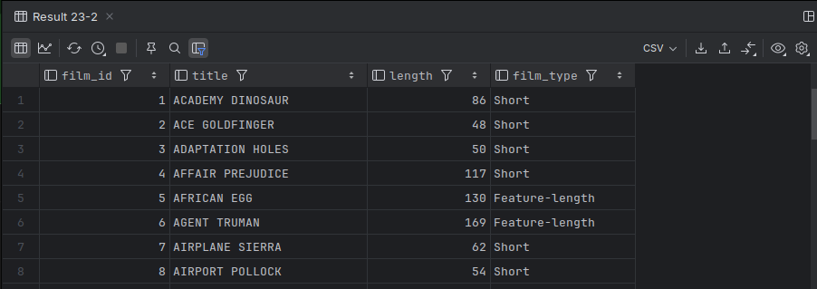

# Condition Logic

- The ability to take one of several paths during program execution.
- Every database's SQL implementation includes the `case` expression, which is useful in many situations, including simple translations.
- When the `case` expression is evaluated, the `when` clauses are evaluated in order from top to bottom.
- The following query includes a `case` expression to generate a value for the `activity_type` column, which returns the string "ACTIVE" or "INACTIVE" depending on the value of the `customer.active` column.

```mysql
USE sakila;

SELECT first_name, last_name, CASE
    WHEN active = 1 THEN 'ACTIVE'
ELSE 'INACTIVE'
END activity_type
FROM customer;
[2025-07-10 23:17:52] 500 rows retrieved starting from 1 in 94 ms (execution: 4 ms, fetching: 90 ms)
```

## Searched `CASE`

- Checks each `WHEN` in order, returns the first matching label.
- `ELSE` is optional; if omitted and no `WHEN` matches, the result is `NULL`.

```mysql
USE sakila;

SELECT film_id, title, length, CASE
    WHEN length >= 180 THEN 'Epic'
    WHEN length >= 120 THEN 'Feature-length'
    ELSE 'Short'
END AS film_type
FROM film;
```



## Example (sub-queries)

- `case` expressions may return any type of expression, including sub-queries.

```mysql
USE sakila;

SELECT
    c.first_name,
    c.last_name,
    CASE
        WHEN active = 0 THEN 0
ELSE
(
    SELECT count(*) FROM rental r
    WHERE r.customer_id = c.customer_id
)
END num_rentals
FROM customer c;
```


