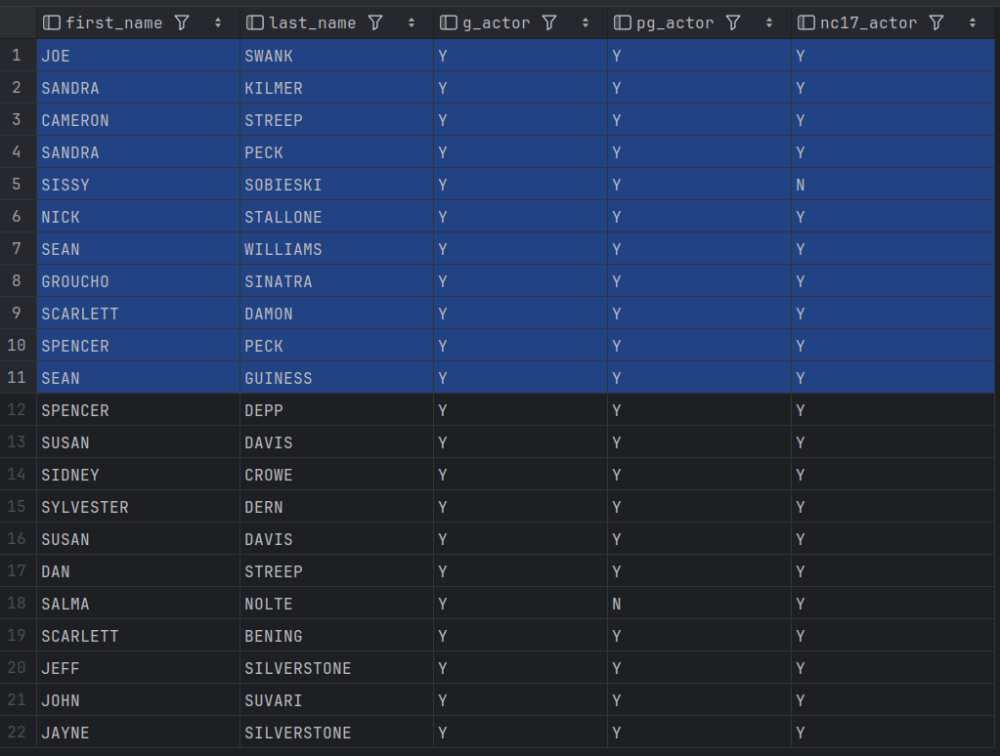
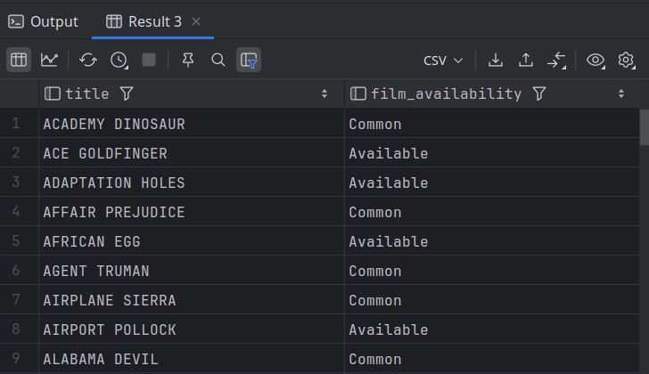

# Checking for Existence

- When we want to determine whether a relationship exists between two entities without regard for the quantity.
- E.g., we might want to know whether an actor has appeared in at least one G-rated film, without regard for the actual number of films.
- The following query uses multiple `case` expressions to generate three output columns, 
  - one to show whether the actor has appeared in G-rated films, 
  - another for PG-rated films,
  - a third for NC-17-rated films.
  - Each `case` expression includes a correlated sub-query against the `film_actor` and `film` tables.
  - Since each `when` clause uses the `exists` operator, the conditions evaluate to `true` as long as the actor has appeared in at least one film with the proper rating.

```mysql
USE sakila;

SELECT a.first_name, a.last_name, CASE
    WHEN EXISTS
(
    SELECT 1 FROM film_actor fa
             INNER JOIN film f
            ON fa.film_id = f.film_id
             WHERE fa.actor_id = a.actor_id
             AND f.rating = 'G'
) THEN 'Y' ELSE 'N' END g_actor, CASE
    WHEN EXISTS
(
    SELECT 1 FROM film_actor fa
             INNER JOIN film f
             ON fa.film_id = f.film_id
             WHERE fa.actor_id = a.actor_id
             AND f.rating = 'PG'
) THEN 'Y' ELSE 'N' END pg_actor, CASE
    WHEN EXISTS
(
    SELECT 1 FROM film_actor fa
             INNER JOIN film f
             ON fa.film_id = f.film_id
             WHERE fa.actor_id = a.actor_id
             AND f.rating = 'NC-17'
) THEN 'Y' ELSE 'N' END nc17_actor
FROM actor a
WHERE a.last_name LIKE 'S%' OR a.first_name LIKE 'S%';
[2025-07-11 19:03:24] 22 rows retrieved starting from 1 in 235 ms (execution: 10 ms, fetching: 225 ms)
```



---

## Example - 2

- In other cases, we may care how many rows are encountered, but only up to a point.
- The following query uses a simple `case` expression to count the number of copies in inventory for each film and then returns either Out of Stock, Scarce, Available, or Common.

```mysql
USE sakila;

SELECT f.title,
       CASE
           (SELECT count(*)
            FROM inventory i
            WHERE i.film_id = f.film_id)
           WHEN 0 THEN 'Out of Stock'
           WHEN 1 THEN 'Scarce'
           WHEN 2 THEN 'Scarce'
           WHEN 3 THEN 'Available'
           WHEN 4 THEN 'Available'
           ELSE 'Common'
           END film_availability
FROM film f;
```

