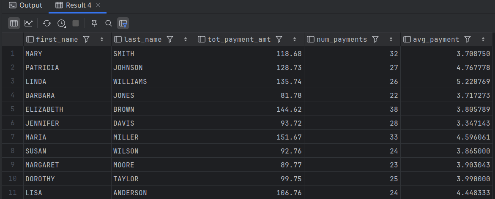

# Division-by-Zero Errors

- MySQL simply sets the result of the calculation to `null`

```bash
mysql> SELECT 100 / 0;
+---------+
| 100 / 0 |
+---------+
|    NULL |
+---------+
1 row in set, 1 warning (0.00 sec)
```

- To safeguard our calculations from encountering errors or even worse from being mysteriously set to `null`, we should wrap all denominators in conditional logic.
- The following query computes the average payment amount for each customer.
  - Since some customers may be new and have yet to rent a film, it's best to include the `case` expression to ensure that the denominator is never zero.

```mysql
USE sakila;

SELECT c.first_name, c.last_name,
       sum(p.amount) tot_payment_amt,
       count(p.amount) num_payments,
       sum(p.amount) /
       CASE WHEN count(p.amount) = 0 THEN 1
ELSE count(p.amount) END avg_payment
FROM customer c
LEFT OUTER JOIN payment p
ON c.customer_id = p.customer_id
GROUP BY c.first_name, c.last_name;
```

