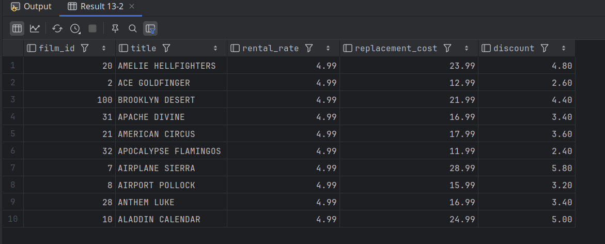

# Conditional Updates

## Two-tier discount on a copy of `film`

- **Make a temp copy** of the `film` table and add a `discount` column:

```mysql
USE sakila;

CREATE TEMPORARY TABLE film_tmp LIKE film;
INSERT INTO film_tmp
SELECT * FROM film LIMIT 100;

ALTER TABLE film_tmp
ADD COLUMN discount DECIMAL(10,2) NOT NULL DEFAULT 0;
```

**Apply a conditional update** using `IF()` to give:

- a **20%** discount if the `rental_rate` is above $4
- otherwise a **10%** discount

```mysql
UPDATE film_tmp
SET discount =
    IF(rental_rate > 4.00,
    replacement_cost * 0.20,
    replacement_cost * 0.10);

SELECT film_id, title, rental_rate, replacement_cost, discount
       FROM film_tmp
ORDER BY rental_rate DESC
LIMIT 10;
```

