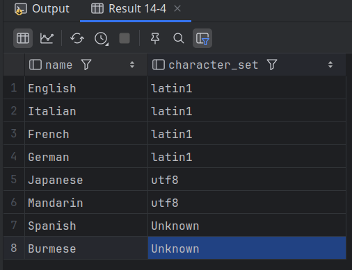
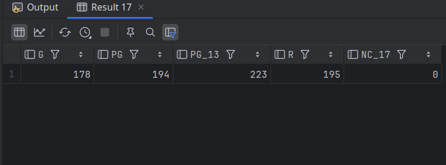

# Exercises

11-1. Rewrite the following query, which uses a simple `case` expression, so that the same results are achieved using a searched `case` expression. Try to use as few `when` clauses as possible. 

```css
SELECT name,
  CASE name
    WHEN 'English' THEN 'latin1'
    WHEN 'Italian' THEN 'latin1'
    WHEN 'French' THEN 'latin1'
    WHEN 'German' THEN 'latin1'
    WHEN 'Japanese' THEN 'utf8'
    WHEN 'Mandarin' THEN 'utf8'
    ELSE 'Unknown'
  END character_set
FROM language;
```

**ANS:**

```mysql
USE sakila;

CREATE TEMPORARY TABLE language_tmp(
    name VARCHAR(50) NOT NULL
);

INSERT INTO language_tmp (name)
VALUES
    ('English'),
    ('Italian'),
    ('French'),
    ('German'),
    ('Japanese'),
    ('Mandarin'),
    ('Spanish'),
    ('Burmese');

SELECT name, CASE
    WHEN name IN ('English', 'Italian', 'French', 'German')
THEN 'latin1'
WHEN name IN ('Japanese', 'Mandarin')
THEN 'utf8'
ELSE 'Unknown'
END character_set
FROM language_tmp;
```



---

11-2. Rewrite the following query so that the result set contains a single row with five columns (one for each rating). Name the five columns `G`, `PG`, `PG_13`, `R`, and `NC_17`.

```bash
mysql> SELECT rating, count(*)
    -> FROM film
    -> GROUP BY rating;
+--------+----------+
| rating | count(*) |
+--------+----------+
| PG     |      194 |
| G      |      178 |
| NC-17  |      210 |
| PG-13  |      223 |
| R      |      195 |
+--------+----------+
5 rows in set (0.00 sec)
```

**ANS:**

```mysql
USE sakila;

SELECT
    SUM(CASE WHEN rating = 'G'
    THEN 1 ELSE 0 END) G,
    SUM(CASE WHEN rating = 'PG'
    THEN 1 ELSE 0 END) PG,
    SUM(CASE WHEN rating = 'PG-13'
    THEN 1 ELSE 0 END) PG_13,
    SUM(CASE WHEN rating = 'R'
    THEN 1 ELSE 0 END) R,
    SUM(CASE WHEN rating = 'NC_17'
    THEN 1 ELSE 0 END) NC_17
FROM film;

```


