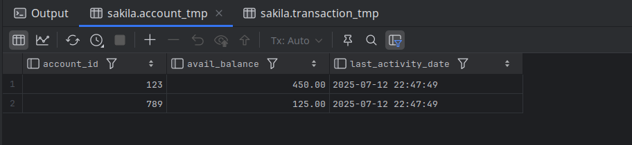
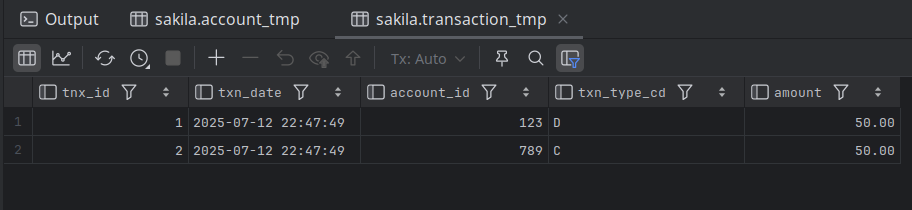

# Exercises

12-1. Generate a unit of work to transfer $50 from account 123 to account 789. You will need to insert two rows into the `transaction` table and update two rows in the `account` table. Use the following table definitions/data:

```css
			Account:
account_id	avail_balance	last_activity_date
----------	-------------	------------------
123				500		2019-07-10 20:53:27
789				75		2019-06-22 15:18:35

			Transaction:
txn_id		txn_date		account_id	txn_type_cd	amount
---------	------------	-----------	-----------	--------
1001		2019-05-15			123			C		500
1002		2019-06-01			789			C
```

Use `txn_type_cd = 'C'` to indicate a credit (addition), and use `txn_type_cd = 'D'` to indicate a debit (subtraction).

**ANS:**

```mysql
USE sakila;

CREATE TEMPORARY TABLE account_tmp(
    account_id INT PRIMARY KEY,
    avail_balance DECIMAL(10,2),
    last_activity_date DATETIME
) ENGINE=InnoDB;

INSERT INTO account_tmp
VALUES
    (123, 500.00, '2019-07-10 20:53:27'),
    (789, 75.00, '2019-07-10 15:53:27');

CREATE TEMPORARY TABLE transaction_tmp(
    tnx_id INT PRIMARY KEY AUTO_INCREMENT,
    txn_date DATETIME NOT NULL,
    account_id INT NOT NULL,
    txn_type_cd CHAR(1) NOT NULL,
    amount DECIMAL(10, 2) NOT NULL
) ENGINE=InnoDB;

-- Begin the unit of work
SET autocommit = 0;
START TRANSACTION;

-- Record the debit from account 123
INSERT INTO transaction_tmp (txn_date, account_id, txn_type_cd, amount)
VALUES
    (NOW(), 123, 'D', 50.00);

-- Record the credit to account 789
INSERT INTO transaction_tmp (txn_date, account_id, txn_type_cd, amount)
VALUES
    (NOW(), 789, 'C', 50.00);

-- Apply the balance changes
UPDATE account_tmp
SET
    avail_balance = avail_balance - 50.00,
    last_activity_date = NOW()
WHERE account_id = 123;

UPDATE account_tmp
SET
    avail_balance = avail_balance + 50.00,
    last_activity_date = NOW()
WHERE account_id = 789;

COMMIT;
SET autocommit = 1;

SELECT * FROM account_tmp;
SELECT * FROM transaction_tmp;
```





