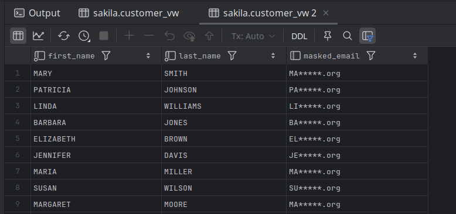

# Views

- A mechanism for querying data.
- Unlike tables, views do not involve data storage.
  - thus no need to worry about views filling up the disk space.
- Create a view by assigning a name to a `select` statement and then storing the query for others to use.
- Other users can then use our view to access data just as though they were querying tables directly (in fact, they may not even know they are using a view).
- Let’s say that we want to partially obscure the email address in the `customer` table.
- Instead of allowing direct access to the `customer` table, we define a view called `customer_vw` and mandate that all non-marketing personnel use it to access customer data.

```mysql
CREATE VIEW customer_vw
(customer_id, first_name, last_name, masked_email, email) AS
SELECT customer_id,first_name,last_name,
       concat(substr(email, 1,2), '*****', substr(email, -4)),
       email
FROM customer;

SELECT first_name, last_name, email
FROM customer_vw;
```

