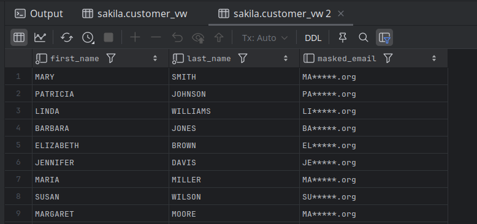

# Views

- A mechanism for querying data.
- Unlike tables, views do not involve data storage.
  - thus no need to worry about views filling up the disk space.
  - View definitions are stored on disk as part of the database’s metadata.
  - The actual query result set is never stored; MySQL recalculates it on each access.
- Views are persistent database objects, accessible to all users with appropriate permissions, and are not tied to individual sessions.
- Create a view by assigning a name to a `select` statement and then storing the query for others to use.
- Other users can then use our view to access data just as though they were querying tables directly (in fact, they may not even know they are using a view).
- Complex joins, aggregations, and filters can be encapsulated in a view, allowing users to reuse this logic without rewriting the SQL each time.
- Views cannot store indexes or triggers.
- Let’s say that we want to partially obscure the email address in the `customer` table.
- Instead of allowing direct access to the `customer` table, we define a view called `customer_vw` and mandate that all non-marketing personnel use it to access customer data.

- In the following query,
  - The first part of the statement lists the view’s column names, which may be different from those of the underlying table. 
  - The second part of the statement is a `select` statement, which must contain one expression for each column in the view. 
  - The `email` column is generated by taking the first two characters of the email address, concatenated with `'*****'`, and then concatenated with the last four characters of the email address.

```mysql
CREATE VIEW customer_vw
(customer_id, first_name, last_name, masked_email, email) AS
SELECT customer_id,first_name,last_name,
       concat(substr(email, 1,2), '*****', substr(email, -4)),
       email
FROM customer;

SELECT first_name, last_name, masked_email
FROM customer_vw;
```

- When the `create view` statement is executed, the database server simply stores the view definition for future use; the query is not executed, and no data is retrieved or stored.



```bash
mysql> desc customer_vw;                                                 +--------------+-------------------+------+-----+---------+-------+      | Field        | Type              | Null | Key | Default | Extra |
+--------------+-------------------+------+-----+---------+-------+      | customer_id  | smallint unsigned | NO   |     | 0       |       |
| first_name   | varchar(45)       | NO   |     | NULL    |       |
| last_name    | varchar(45)       | NO   |     | NULL    |       |
| masked_email | varchar(57)       | YES  |     | NULL    |       |
| email        | varchar(50)       | YES  |     | NULL    |       |
+--------------+-------------------+------+-----+---------+-------+
5 rows in set (0.00 sec)
```

- We are are free to use any clauses of the `select` statement when querying through a view, including `group by`, `having`, and `order by`.

```bash
mysql> SELECT first_name, count(*), min(last_name), max(last_name)
    -> FROM customer_vw
    -> WHERE first_name LIKE 'J%'
    -> GROUP BY first_name
    -> HAVING count(*) > 1
    -> ORDER BY 1;
+------------+----------+----------------+----------------+
| first_name | count(*) | min(last_name) | max(last_name) |
+------------+----------+----------------+----------------+
| JAMIE      |        2 | RICE           | WAUGH          |
| JESSIE     |        2 | BANKS          | MILAM          |
+------------+----------+----------------+----------------+
2 rows in set (0.01 sec)
```

---

## Joining Views to Other Tables

- We can join views to other tables or even to other views within a query.

```bash
mysql> SELECT cv.first_name, cv.last_name, p.amount
    -> FROM customer_vw cv
    -> INNER JOIN payment p
    -> ON cv.customer_id = p.customer_id
    -> WHERE p.amount >= 11;
+------------+-----------+--------+
| first_name | last_name | amount |
+------------+-----------+--------+
| KAREN      | JACKSON   |  11.99 |
| VICTORIA   | GIBSON    |  11.99 |
| VANESSA    | SIMS      |  11.99 |
| ALMA       | AUSTIN    |  11.99 |
| ROSEMARY   | SCHMIDT   |  11.99 |
| TANYA      | GILBERT   |  11.99 |
| RICHARD    | MCCRARY   |  11.99 |
| NICHOLAS   | BARFIELD  |  11.99 |
| KENT       | ARSENAULT |  11.99 |
| TERRANCE   | ROUSH     |  11.99 |
+------------+-----------+--------+
10 rows in set (0.06 sec)
```

