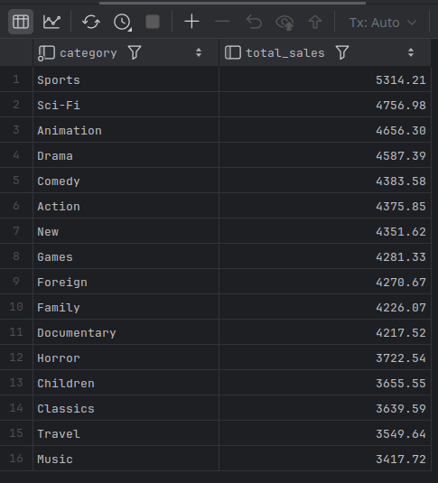
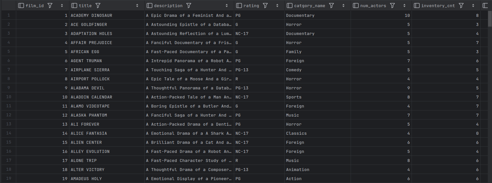

# Why Use Views?

- Besides masking the contents, there are many reasons for using views.

## Data Security

- We may constrain which rows a set of users may access by adding a `where` clause to our view definition.
- The following view definition excludes inactive customers.

```mysql
sakila> CREATE VIEW active_customer_vw
        (customer,id, first_name, last_name, email)
        AS SELECT
               customer_id, first_name, last_name,
               concat(substr(email, 1, 2), '*****', substr(email, -4)),
        email
        FROM customer
        WHERE active = 1
[2025-07-15 20:07:42] completed in 134 ms
```

- If we provide this view to our marketing department, they will be able to avoid sending information to inactive customers.

---

## Data Aggregation

- Reporting applications generally require aggregated data, and views are a great way to make it appear as though data is being pre-aggregated and stored in the database.
- E.g., an application generates a report each month showing the total sales for each film category so that the managers can decide what new films to add to inventory. 
- Rather than allowing the application developers to write queries against the base tables, we could provide them with the following view:

```mysql
CREATE VIEW sales_by_film_category
AS SELECT c.name AS category, SUM(p.amount) AS total_sales
FROM payment AS p
INNER JOIN rental AS r ON p.rental_id = r.rental_id
INNER JOIN inventory AS i ON r.inventory_id = i.inventory_id
INNER JOIN film_category AS f ON i.film_id = f.film_id
INNER JOIN film_category AS fc ON f.film_id = fc.film_id
INNER JOIN category AS c ON fc.category_id = c.category_id
GROUP BY c.name
ORDER BY total_sales DESC;

SELECT * FROM sales_by_film_category;
```



---

## Hiding Complexity

- One reason for deploying views is to shield end users from complexity.
- E.g., a report is created each month showing information about all of the films, along with the film category, the number of actors appearing in the film, the total number of copies in inventory, and the number of rentals for each film. 
- Rather than expecting the report designer to navigate six different tables to gather the necessary data, we could provide a view that looks as follows:
  - Data from the other five tables is generated using scalar subqueries.

```mysql
CREATE VIEW film_stats
AS
    SELECT f.film_id, f.title, f.description, f.rating,
           (SELECT c.name
            FROM category c
            INNER JOIN film_category fc
            ON c.category_id = fc.category_id
            WHERE fc.film_id = f.film_id) catgory_name,
        (
            SELECT count(*)
            FROM film_actor fa
            WHERE fa.film_id = f.film_id
        ) num_actors,
        (
            SELECT count(*)
            FROM inventory i
            WHERE i.film_id = f.film_id
        ) inventory_cnt,
        (
            SELECT count(*)
            FROM inventory i
            INNER JOIN rental r
            ON i.inventory_id = r.inventory_id
            WHERE i.film_id = f.film_id
        ) num_rentals
    FROM film f;

SELECT * FROM film_stats;
```

- If someone uses this view but does *not* reference the `category_name`, `num_actors`, `inventory_cnt`, or `num_rentals` column, then none of the subqueries will be executed.



---

## Joining Partitioned Data

- Some database designs break large tables into multiple pieces in order to improve performance.
- We can create view that queries both tables and combines the results together.
  - That way we can make it look like all payment data is stored in a single table.

```mysql
CREATE VIEW payment_all
(payment_id, customer_id, staff_id, rental_id, amount, payment_date,
    last_update)
AS
    SELECT payment_id, customer_id, staff_id, rental_id, amount,
           payment_date, last_update
FROM payment_historic
UNION ALL
SELECT payment_id, customer_id, staff_id, rental_id,
       amount, payment_date, last_update
FROM payment_current;
```

---