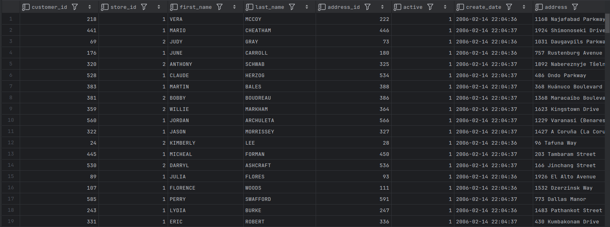

# Updatable Views

- In the case of MySQL, a view is updatable if the following conditions are met:
  - No aggregate functions are used (`max()`, `min()`, `avg()`, etc.).
  - The view does not employ `group by` or `having` clauses.
  - No subqueries exist in the `select` or `from` clause, and any subqueries in the `where` clause do not refer to tables in the `from` clause.
  - The view does not utilize `union`, `union all`, or `distinct`.
  - The `from` clause includes at least one table or updatable view.
  - The `from` clause uses only inner joins if there is more than one table or view.

## Updating Simple Views

```bash
mysql> UPDATE customer_vw
    -> SET last_name = 'SMITH-ALLEN'
    -> WHERE customer_id = 1;
Query OK, 1 row affected (0.09 sec)
Rows matched: 1  Changed: 1  Warnings: 0
```

```bash
mysql> SELECT first_name, last_name, email
    -> FROM customer
    -> WHERE customer_id = 1;
+------------+-------------+-------------------------------+
| first_name | last_name   | email                         |
+------------+-------------+-------------------------------+
| MARY       | SMITH-ALLEN | MARY.SMITH@sakilacustomer.org |
+------------+-------------+-------------------------------+
1 row in set (0.00 sec)
```

- Views that contain derived columns cannot be used

```bash
mysql> INSERT INTO customer_vw
    -> (customer_id, first_name, last_name)
    -> VALUES (99999, 'ROBERT', 'SIMPSON');
ERROR 1471 (HY000): The target table customer_vw of the INSERT is not insertable-into
```

---

## Updating Complex Views

```mysql
CREATE VIEW customer_details
AS
    SELECT c.customer_id,
           c.store_id, c.first_name, c.last_name,
           c.address_id, c.active, c.create_date,
           a.address, ct.city, cn.country, a.postal_code
FROM customer c
INNER JOIN address a
ON c.address_id = a.address_id
INNER JOIN city ct
ON a.city_id = ct.city_id
INNER JOIN country cn
ON ct.country_id = cn.country_id;

SELECT * FROM customer_details;
```



- We can use this view to update data in either the `customer` or `address` table.

```bash
mysql> UPDATE customer_details
    -> SET last_name = 'SMITH-ALLEN', active = 0
    -> WHERE customer_id = 1;
Query OK, 1 row affected (0.07 sec)
Rows matched: 1  Changed: 1  Warnings: 0

mysql> UPDATE customer_details
    -> SET address = '999 Mockingbird Lane'
    -> WHERE customer_id = 1;
Query OK, 1 row affected (0.07 sec)
Rows matched: 1  Changed: 1  Warnings: 0
```

- We are allowed to modify both of the underlying tables separately, but not within a single statement.

```bash
mysql> UPDATE customer_details
    -> SET last_name = 'SMITH-ALLEN',
    -> active = 0,
    -> address = '999 Mockingbird Lane'
    -> WHERE customer_id = 1;
ERROR 1393 (HY000): Can not modify more than one base table through a join view 'sakila.customer_details'
```

- Let’s try to *insert* data into both tables for some new customers (`customer_id = 9998 and 9999`):

```bash
mysql> INSERT INTO customer_details
    -> (customer_id, store_id, first_name, last_name,
    -> address_id, active, create_date)
    -> VALUES (9998, 1, 'BRIAN', 'SALAZAR', 5, 1, now());;
Query OK, 1 row affected (0.17 sec)
```

- This statement, which only populates columns from the `customer` table, works fine.
- What happens if we expand the column list to also include a column from the `address` table.

```bash
mysql> INSERT INTO customer_details
    -> (customer_id, store_id, first_name, last_name,
    -> address_id, active, create_date, address)
    -> VALUES (9999, 2, 'THOMAS', 'BISHOP', 7, 1, now(), '999 Mockingbird Lane');
ERROR 1393 (HY000): Can not modify more than one base table through a join view 'sakila.customer_details'
```

- This version, which includes columns spanning two different tables, raises an exception. 
- In order to insert data through a complex view, we would need to know from where each column is sourced.