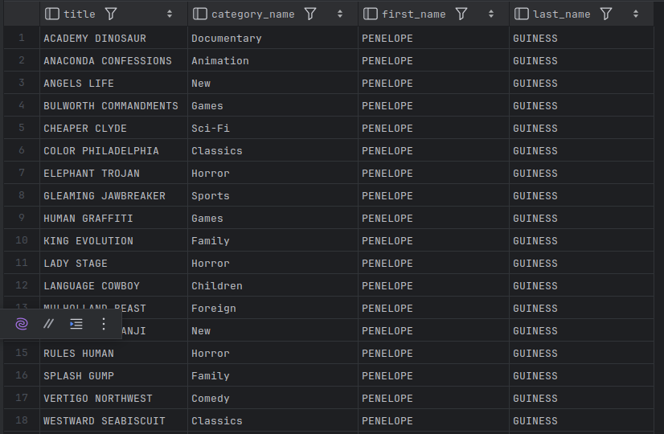
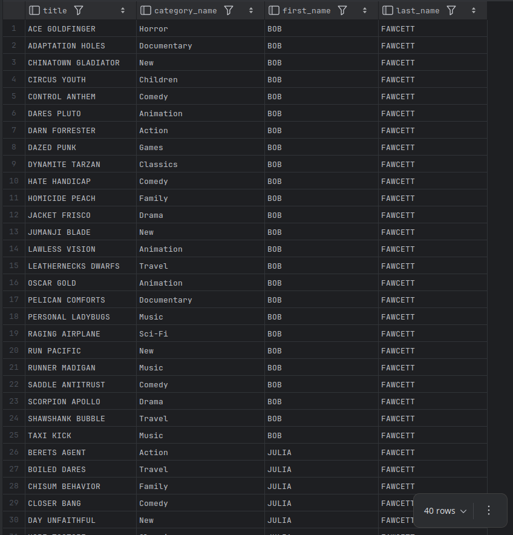
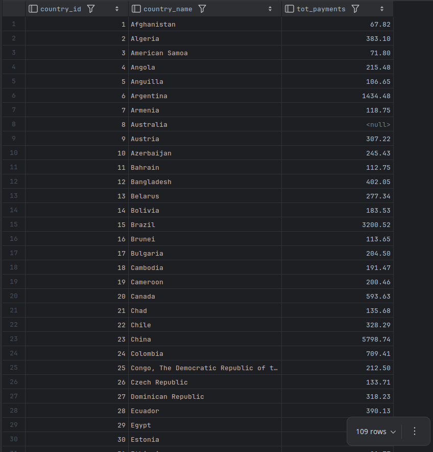

# Exercises

14-1. Create a view definition that can be used by the following query to generate the given results:

```mysql
SELECT title, category_name, first_name, last_name
FROM film_ctgry_actor
WHERE last_name = 'FAWCETT'; 

+---------------------+---------------+------------+-----------+
| title               | category_name | first_name | last_name |
+---------------------+---------------+------------+-----------+
| ACE GOLDFINGER      | Horror        | BOB        | FAWCETT   |
| ADAPTATION HOLES    | Documentary   | BOB        | FAWCETT   |
| CHINATOWN GLADIATOR | New           | BOB        | FAWCETT   |
| CIRCUS YOUTH        | Children      | BOB        | FAWCETT   |
| CONTROL ANTHEM      | Comedy        | BOB        | FAWCETT   |
| DARES PLUTO         | Animation     | BOB        | FAWCETT   |
| DARN FORRESTER      | Action        | BOB        | FAWCETT   |
| DAZED PUNK          | Games         | BOB        | FAWCETT   |
| DYNAMITE TARZAN     | Classics      | BOB        | FAWCETT   |
| HATE HANDICAP       | Comedy        | BOB        | FAWCETT   |
| HOMICIDE PEACH      | Family        | BOB        | FAWCETT   |
| JACKET FRISCO       | Drama         | BOB        | FAWCETT   |
| JUMANJI BLADE       | New           | BOB        | FAWCETT   |
| LAWLESS VISION      | Animation     | BOB        | FAWCETT   |
| LEATHERNECKS DWARFS | Travel        | BOB        | FAWCETT   |
| OSCAR GOLD          | Animation     | BOB        | FAWCETT   |
| PELICAN COMFORTS    | Documentary   | BOB        | FAWCETT   |
| PERSONAL LADYBUGS   | Music         | BOB        | FAWCETT   |
| RAGING AIRPLANE     | Sci-Fi        | BOB        | FAWCETT   |
| RUN PACIFIC         | New           | BOB        | FAWCETT   |
| RUNNER MADIGAN      | Music         | BOB        | FAWCETT   |
| SADDLE ANTITRUST    | Comedy        | BOB        | FAWCETT   |
| SCORPION APOLLO     | Drama         | BOB        | FAWCETT   |
| SHAWSHANK BUBBLE    | Travel        | BOB        | FAWCETT   |
| TAXI KICK           | Music         | BOB        | FAWCETT   |
| BERETS AGENT        | Action        | JULIA      | FAWCETT   |
| BOILED DARES        | Travel        | JULIA      | FAWCETT   |
| CHISUM BEHAVIOR     | Family        | JULIA      | FAWCETT   |
| CLOSER BANG         | Comedy        | JULIA      | FAWCETT   |
| DAY UNFAITHFUL      | New           | JULIA      | FAWCETT   |
| HOPE TOOTSIE        | Classics      | JULIA      | FAWCETT   |
| LUKE MUMMY          | Animation     | JULIA      | FAWCETT   |
| MULAN MOON          | Comedy        | JULIA      | FAWCETT   |
| OPUS ICE            | Foreign       | JULIA      | FAWCETT   |
| POLLOCK DELIVERANCE | Foreign       | JULIA      | FAWCETT   |
| RIDGEMONT SUBMARINE | New           | JULIA      | FAWCETT   |
| SHANGHAI TYCOON     | Travel        | JULIA      | FAWCETT   |
| SHAWSHANK BUBBLE    | Travel        | JULIA      | FAWCETT   |
| THEORY MERMAID      | Animation     | JULIA      | FAWCETT   |
| WAIT CIDER          | Animation     | JULIA      | FAWCETT   |
+---------------------+---------------+------------+-----------+
40 rows in set (0.00 sec)

```

**ANS:**

```mysql
USE sakila;

CREATE VIEW film_ctgry_actor AS
    SELECT
        f.title,
        c.name AS category_name,
        a.first_name,
        a.last_name
FROM film AS f
JOIN film_category AS fc
ON f.film_id = fc.film_id
JOIN category AS c
ON fc.category_id = c.category_id
JOIN film_actor AS fa
ON f.film_id = fa.film_id
JOIN actor AS a
ON fa.actor_id = a.actor_id;

SELECT * FROM film_ctgry_actor;
```



**Verifying the result**

```mysql
SELECT title, category_name, first_name, last_name
FROM film_ctgry_actor
WHERE last_name = 'FAWCETT';
```



---

14-2. The film rental company manager would like to have a report that includes the name of every country, along with the total payments for all customers who live in each country. Generate a view definition that queries the `country` table and uses a scalar subquery to calculate a value for a column named `tot_payments`.

**ANS:**

```mysql
CREATE VIEW country_payment_summary AS
    SELECT
        co.country_id,
        co.country AS country_name,
        (
            SELECT SUM(p.amount)
            FROM payment AS p
            JOIN customer AS c
            ON p.customer_id = c.customer_id
            JOIN address AS a
            ON c.address_id = a.address_id
            JOIN city AS ct
            ON a.city_id = ct.city_id
            WHERE ct.country_id = co.country_id
        ) AS tot_payments
FROM country AS co;

SELECT * FROM country_payment_summary;
```



---

