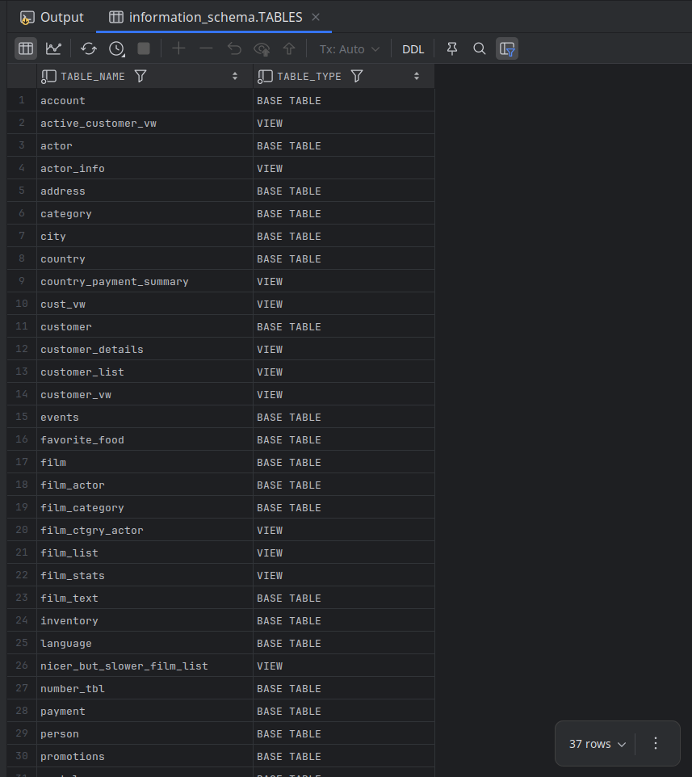
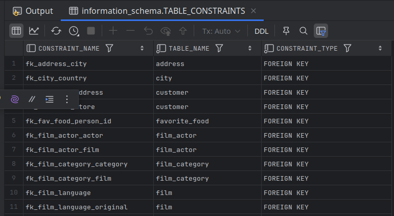

# Data About Data

- Metadata is essentially data about data.
- Every time we create a database object, the database server needs to record various pieces of information.
- SQL Server also includes a special schema called `information_schema` that is provided automatically within each database. 
- Both MySQL and SQL Server provide this interface to conform with the ANSI SQL:2003 standard.

## Information_schema

- All of the objects available within the `information_schema` database (or schema, in the case of SQL Server) are views.
- Unlike the `describe` utility, the views within `information_schema` can be queried and, thus, used programmatically.
- The following query demonstrates how to retrieve the names of all of the tables in the Sakila database.

```mysql
SELECT table_name, table_type
FROM information_schema.tables
WHERE table_schema = 'sakila'
ORDER BY 1;
```



- The `information_schema.tables` view includes both tables and views.
- To exclude the views:

```bash
mysql> SELECT table_name, table_type
    -> FROM information_schema.tables
    -> WHERE table_schema = 'sakila'
    -> AND table_type = 'BASE TABLE'
    -> ORDER BY 1;
+---------------+------------+
| TABLE_NAME    | TABLE_TYPE |
+---------------+------------+
| account       | BASE TABLE |
| actor         | BASE TABLE |
| address       | BASE TABLE |
| category      | BASE TABLE |
| city          | BASE TABLE |
| country       | BASE TABLE |
| customer      | BASE TABLE |
| events        | BASE TABLE |
| favorite_food | BASE TABLE |
| film          | BASE TABLE |
| film_actor    | BASE TABLE |
| film_category | BASE TABLE |
| film_text     | BASE TABLE |
| inventory     | BASE TABLE |
| language      | BASE TABLE |
| number_tbl    | BASE TABLE |
| payment       | BASE TABLE |
| person        | BASE TABLE |
| promotions    | BASE TABLE |
| rental        | BASE TABLE |
| staff         | BASE TABLE |
| store         | BASE TABLE |
| string_tbl    | BASE TABLE |
+---------------+------------+
23 rows in set (0.01 sec)
```

---

## `information_schema.views`

- To view only views, we can query `information_schema.views`.
- Along with the view names, we can retrieve additional information, such as a flag that shows whether a view is updatable.

```bash
mysql> SELECT table_name, is_updatable
    -> FROM information_schema.views
    -> WHERE table_schema = 'sakila'
    -> ORDER BY 1;
+----------------------------+--------------+
| TABLE_NAME                 | IS_UPDATABLE |
+----------------------------+--------------+
| active_customer_vw         | YES          |
| actor_info                 | NO           |
| country_payment_summary    | YES          |
| cust_vw                    | YES          |
| customer_details           | YES          |
| customer_list              | YES          |
| customer_vw                | YES          |
| film_ctgry_actor           | YES          |
| film_list                  | NO           |
| film_stats                 | YES          |
| nicer_but_slower_film_list | NO           |
| sales_by_film_category     | NO           |
| sales_by_store             | NO           |
| staff_list                 | YES          |
+----------------------------+--------------+
14 rows in set (0.00 sec)
```

---

## `information_schema.columns`

- Column information for both tables and views is available via the `columns` view.
- The following query shows column information for the `film` table.
  - The `ordinal_position` column is included merely as a means to retrieve the columns in the order in which they are added to the table.

```bash
mysql> SELECT column_name, data_type,
    -> character_maximum_length char_max_len,
    -> numeric_precision num_prcsn, numeric_scale num_scale
    -> FROM information_schema.columns
    -> WHERE table_schema = 'sakila' AND table_name = 'film'
    -> ORDER BY ordinal_position;
+----------------------+-----------+--------------+-----------+-----------+
| COLUMN_NAME          | DATA_TYPE | char_max_len | num_prcsn | num_scale |
+----------------------+-----------+--------------+-----------+-----------+
| film_id              | smallint  |         NULL |         5 |         0 |
| title                | varchar   |          128 |      NULL |      NULL |
| description          | text      |        65535 |      NULL |      NULL |
| release_year         | year      |         NULL |      NULL |      NULL |
| language_id          | tinyint   |         NULL |         3 |         0 |
| original_language_id | tinyint   |         NULL |         3 |         0 |
| rental_duration      | tinyint   |         NULL |         3 |         0 |
| rental_rate          | decimal   |         NULL |         4 |         2 |
| length               | smallint  |         NULL |         5 |         0 |
| replacement_cost     | decimal   |         NULL |         5 |         2 |
| rating               | enum      |            5 |      NULL |      NULL |
| special_features     | set       |           54 |      NULL |      NULL |
| last_update          | timestamp |         NULL |      NULL |      NULL |
+----------------------+-----------+--------------+-----------+-----------+
13 rows in set (0.00 sec)
```

---

## `information_schema.statistics`

- We can retrieve information about a table's indexes via the `information_schema.statistics` view.

- The following query retrieves information for the indexes built on the `rental` table.

  - `non_unique` – Indicates if the index allows duplicate values (`1` = duplicates allowed, `0` = unique index).

  - `seq_in_index` – The **order of the column** in the index (1 = first column in index, 2 = second, etc.).

  - `ORDER BY 1, 3`: **`1` refers to the first column** in the `SELECT` clause (in this case, `index_name`). **`3` refers to the third column** in the `SELECT` clause (in this case, `seq_in_index`).

  - ##### So `ORDER BY 1,3` means:

    1. **First, sort by `index_name`** (alphabetically).
    2. **If multiple rows have the same `index_name`, sort those rows by `seq_in_index`** (numerically, typically ascending).

```bash
mysql> SELECT index_name, non_unique, seq_in_index, column_name
    -> FROM information_schema.statistics
    -> WHERE table_schema = 'sakila' AND table_name = 'rental'
    -> ORDER BY 1, 3;
+---------------------+------------+--------------+--------------+
| INDEX_NAME          | NON_UNIQUE | SEQ_IN_INDEX | COLUMN_NAME  |
+---------------------+------------+--------------+--------------+
| idx_fk_customer_id  |          1 |            1 | customer_id  |
| idx_fk_inventory_id |          1 |            1 | inventory_id |
| idx_fk_staff_id     |          1 |            1 | staff_id     |
| PRIMARY             |          0 |            1 | rental_id    |
| rental_date         |          0 |            1 | rental_date  |
| rental_date         |          0 |            2 | inventory_id |
| rental_date         |          0 |            3 | customer_id  |
+---------------------+------------+--------------+--------------+
7 rows in set (0.00 sec)
```

---

## `information_schema.table_constraints`

- We can retrieve different types of constraints (foreign key, primary key, unique) that have been created via the `information_schema.table_constraints` view.

```mysql
SELECT constraint_name, table_name, constraint_type
FROM information_schema.TABLE_CONSTRAINTS
WHERE table_schema = 'sakila'
ORDER BY 3, 1;
```

