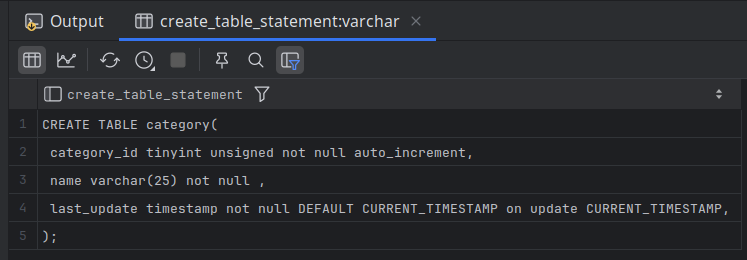

# Working with Metadata

## Schema Generation Scripts

- The following query generate the `create table` statement.
  - The first step is to query the `information_schema.columns` table to retrieve information about the columns in the table.

```mysql
SELECT 'CREATE TABLE category(' create_table_statement
UNION ALL
SELECT cols.txt FROM
    (
        SELECT CONCAT(' ', column_name, ' ', column_type,
            CASE WHEN is_nullable = 'NO' THEN ' not null' ELSE '' END,
            CASE
                WHEN extra IS NOT NULL AND extra LIKE 'DEFAULT_GENERATED%'
                    THEN CONCAT(' DEFAULT ', column_default, SUBSTR(extra, 18))
                WHEN extra IS NOT NULL THEN CONCAT(' ', extra)
                ELSE ''
            END,
            ',') txt
        FROM information_schema.columns
        WHERE table_schema = 'sakila'
        AND table_name = 'category'
        ORDER BY ordinal_position
    ) cols
UNION ALL
SELECT ');'
```



- Now, we just need to add queries against the `table_constraints` and `key_column_usage` views to retrieve information about the primary key constraint.

```mysql
SELECT 'CREATE TABLE category(' create_table_statement
UNION ALL
SELECT cols.txt FROM
    (
        SELECT CONCAT(' ', column_name, ' ', column_type,
            CASE WHEN is_nullable = 'NO' THEN ' not null' ELSE '' END,
            CASE
                WHEN extra IS NOT NULL AND extra LIKE 'DEFAULT_GENERATED%'
                    THEN CONCAT(' DEFAULT ', column_default, SUBSTR(extra, 18))
                WHEN extra IS NOT NULL THEN CONCAT(' ', extra)
                ELSE ''
            END,
            ',') txt
        FROM information_schema.columns
        WHERE table_schema = 'sakila'
        AND table_name = 'category'
        ORDER BY ordinal_position
    ) cols
UNION ALL
SELECT CONCAT('  constraint primary key (')
FROM information_schema.TABLE_CONSTRAINTS
WHERE table_schema = 'sakila' AND
      table_name = 'category'
AND CONSTRAINT_TYPE = 'PRIMARY KEY'
UNION ALL
SELECT cols.txt
FROM
    (SELECT CONCAT(CASE WHEN ordinal_position > 1 THEN '   ,'
            ELSE '   ' END, column_name) txt
     FROM information_schema.KEY_COLUMN_USAGE
     WHERE table_schema = 'sakila' AND table_name = 'category'
     AND constraint_name = 'PRIMARY'
     ORDER BY ordinal_position
    ) cols
UNION ALL
SELECT '  )'
UNION ALL
SELECT ')';
```


- To see whether the statement is properly formed, paste the query output.

```bash
mysql> CREATE TABLE category2 (
    -> category_id tinyint(3) unsigned not null auto_increment,
    -> name varchar(25) not null,
    -> last_update timestamp not null DEFAULT CURRENT_TIMESTAMP
    -> , constraint primary key (
    -> category_id)
    -> );
Query OK, 0 rows affected, 1 warning (1.21 sec)
```

