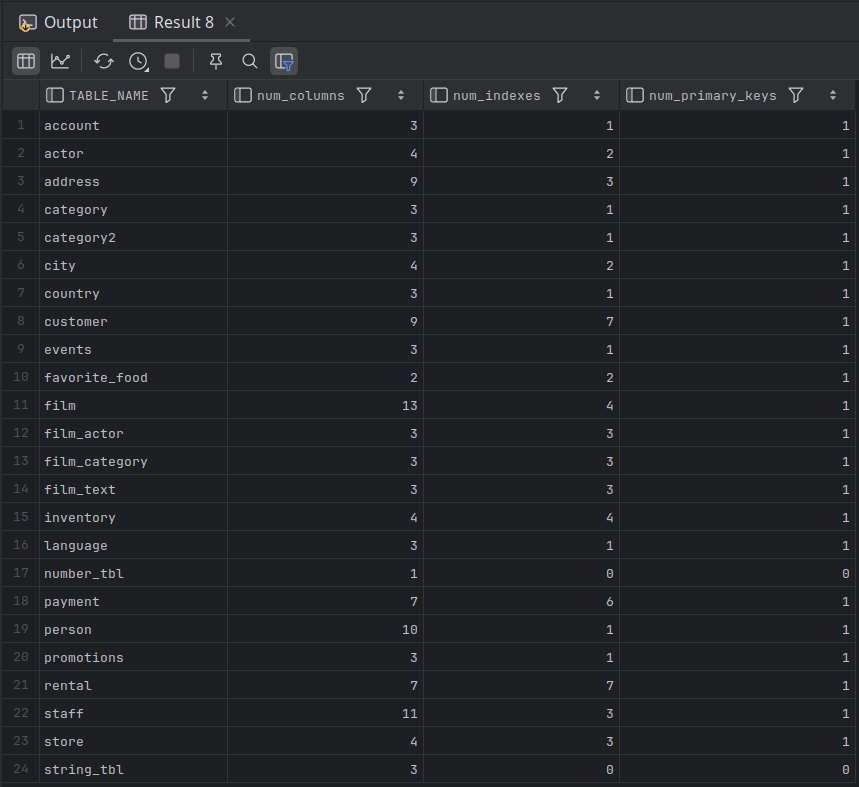

# Deployment Verification

- It's a good idea to run a verification script to ensure that the new schema objects are in place with the appropriate columns, indexes, primary keys, and so forth.
- The following query returns the number of columns, number of indexes, and number of primary key constraints (0 or 1) for each table in the Sakila schema.

```mysql
SELECT tbl.table_name,
       (
            SELECT COUNT(*) FROM information_schema.columns clm
                            WHERE clm.table_schema = tbl.TABLE_SCHEMA
                            AND clm.table_name = tbl.TABLE_NAME
       ) num_columns,
       (
            SELECT COUNT(*) FROM information_schema.STATISTICS sta
                            WHERE sta.TABLE_SCHEMA = tbl.TABLE_SCHEMA
                            AND sta.TABLE_NAME = tbl.TABLE_NAME
       ) num_indexes,
       (
            SELECT COUNT(*) FROM information_schema.TABLE_CONSTRAINTS tc
                            WHERE tc.TABLE_SCHEMA = tbl.TABLE_SCHEMA
                            AND tc.TABLE_NAME = tbl.TABLE_NAME
                            AND tc.CONSTRAINT_TYPE = 'PRIMARY KEY'
       ) num_primary_keys
FROM information_schema.tables tbl
WHERE tbl.TABLE_SCHEMA = 'sakila' AND
      tbl.TABLE_TYPE = 'BASE TABLE'
ORDER BY 1;
```

