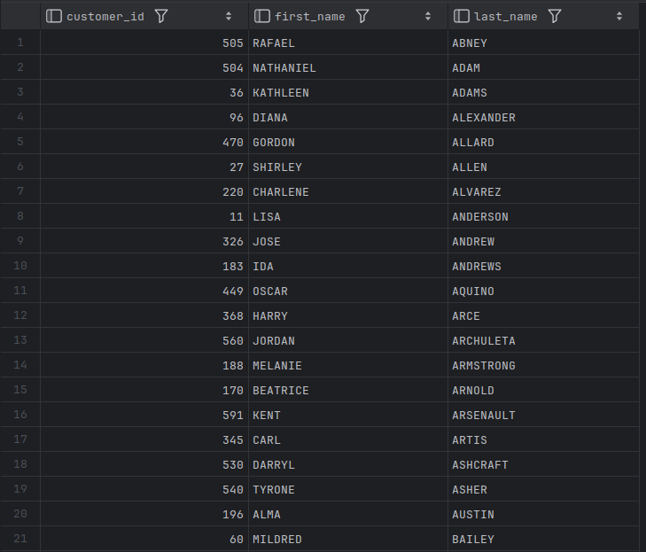
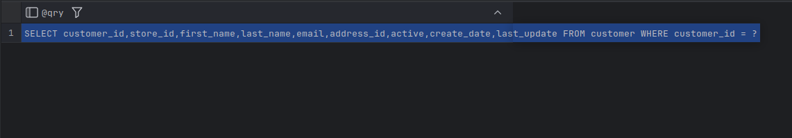
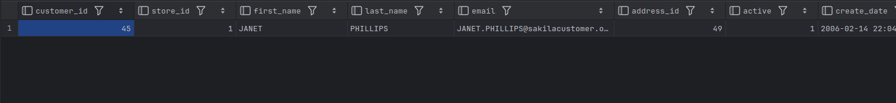

# Dynamic SQL Generation

- Submitting strings to a database engine rather than utilizing its SQL interface is generally known as *dynamic SQL execution*.
- MySQL provides the statements `prepare`, `execute`, and `deallocate` to allow for dynamic SQL execution.
- The `set` statement simply assigns a string to the `qry` variable, which is then submitted to the database engine (for parsing, security checking, and optimization) using the `prepare` statement.
  - After executing the statement by calling `execute`, the statement must be closed using `deallocate prepare`, which frees any database resources (e.g., cursors) that have been utilized during execution.

```bash
SET @qry = 'SELECT customer_id, first_name,
last_name FROM customer';

PREPARE dynsql1 FROM @qry;
```

```mysql
EXECUTE dynsql1;
```



```mysql
DEALLOCATE PREPARE dynsql1;
```

- The following query shows how we could execute a query that includes placeholders so that conditions can be specified at runtime.
  - In this sequence, the query contains a placeholder (the `?` at the end of the statement) so that the customer ID value can be submitted at runtime.
  - The statement is prepared once and then executed twice, once for customer ID 9 and 145 after which the statement is closed.

```mysql
SET @qry = 'SELECT customer_id, first_name, last_name
FROM customer WHERE customer_id = ?';

-- now dynsql2 is a reusable, pre-parsed statement on the server.
PREPARE dynsql2 FROM @qry;

-- set the first parameter value
SET @custid = 9;

EXECUTE dynsql2 USING @custid;
```


```mysql
-- Change the param and re-execute
-- NO need to reprepare
SET @custid = 145;
EXECUTE dynsql2 USING @custid;
```


```mysql
DEALLOCATE PREPARE dynsql2;
```


- The following example generates the same dynamic SQL string as the previous example, but it retrieves the column names from the `information_schema.columns` view.

  - The query pivots the first 9 columns in the `customer` table, builds a query string using the `concat` and `concat_ws` functions.

    - `concat_ws(',', ...)` stitches together all 9 column names with commas - e.g. `first_name`, `last_name`, `email`, ...

    - Wrapped in `'SELECT' ... ' FROM customer WHERE customer_id = ?',` gives a full query template like:

      ```mysql
      SELECT first_name,last_name,email,… FROM customer WHERE customer_id = ?
      ```

      

  - And assigns the string to the `qry` variable.

```mysql
SELECT CONCAT('SELECT ',
       CONCAT_WS(',', cols.col1, cols.col2, cols.col3, cols.col4,
       cols.col5, cols.col6, cols.col7, cols.col8, cols.col9),
       ' FROM customer WHERE customer_id = ?')
INTO @qry
FROM
    (
        SELECT max(CASE WHEN ordinal_position = 1 THEN column_name
               ELSE NULL END) col1,
            max(CASE WHEN ordinal_position = 2 THEN column_name
            ELSE NULL END) col2,
            max(CASE WHEN ordinal_position = 3 THEN column_name
            ELSE NULL END) col3,
            max(CASE WHEN ordinal_position = 4 THEN COLUMN_NAME
            ELSE NULL END) col4,
            max(CASE WHEN ordinal_position = 5 THEN column_name
            ELSE NULL END) col5,
            max(CASE WHEN ordinal_position = 6 THEN column_name
            ELSE NULL END) col6,
            max(CASE WHEN ordinal_position = 7 THEN column_name
            ELSE NULL END) col7,
            max(CASE WHEN ordinal_position = 8 THEN column_name
            ELSE NULL END) col8,
            max(CASE WHEN ordinal_position = 9 THEN column_name
            ELSE NULL END)col9
        FROM information_schema.COLUMNS
        WHERE table_schema = 'sakila' AND table_name = 'customer'
        GROUP BY table_name
    ) cols;

SELECT @qry;
```



```mysql
PREPARE dynsql3 FROM @qry;

SET @custid = 45;

EXECUTE dynsql3 USING @custid;

DEALLOCATE PREPARE dynsql3;
```


