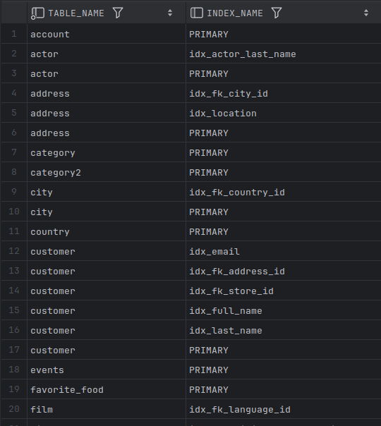
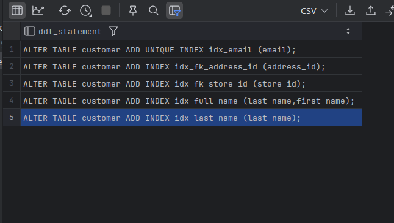

# Exercises

15-1. Write a query that lists all of the indexes in the Sakila schema. Include the table names.

**ANS:**

```mysql
SELECT DISTINCT table_name, index_name
FROM information_schema.STATISTICS
WHERE table_schema = 'sakila';
```



---

15-2. Write a query that generates output that can be used to create all of the indexes on the `sakila.customer` table. Output should be of the form:

```mysql
"ALTER TABLE <table_name> ADD INDEX <index_name> (<column_list>)"
```

**ANS:**

- **`GROUP_CONCAT(... ORDER BY seq_in_index)`** recreates the column list in the correct key order.

```mysql
SELECT CONCAT('ALTER TABLE ', table_name, ' ADD ',
              CASE
                  WHEN non_unique = 0 THEN 'UNIQUE INDEX '
                  ELSE 'INDEX ' END,
              index_name,
              ' (', GROUP_CONCAT(column_name ORDER BY seq_in_index SEPARATOR ','), ');'
       ) AS ddl_statement
FROM information_schema.STATISTICS
WHERE table_schema = 'sakila'
AND table_name = 'customer'
AND index_name <> 'PRIMARY'
GROUP BY table_name, index_name, NON_UNIQUE
ORDER BY table_name, index_name;
```



**ANS - 2:**

```mysql
WITH idx_info AS
         (SELECT s1.table_name,
                 s1.index_name,
                 s1.column_name,
                 s1.seq_in_index,
                 (SELECT max(s2.seq_in_index)
                  FROM information_schema.STATISTICS s2
                  WHERE s2.TABLE_SCHEMA = s1.TABLE_SCHEMA
                    AND s2.TABLE_NAME = s1.TABLE_NAME
                    AND s2.INDEX_NAME = s1.INDEX_NAME) num_columns
          FROM information_schema.STATISTICS s1
          WHERE s1.TABLE_SCHEMA = 'sakila'
            AND s1.TABLE_NAME = 'customer')
SELECT CONCAT(CASE
                  WHEN seq_in_index = 1 THEN
                      CONCAT('ALTER TABLE ', table_name, ' ADD INDEX ', index_name, ' ('
                          , column_name)
                  ELSE CONCAT(', ', column_name) END, CASE
                                                          WHEN seq_in_index = num_columns THEN ');'
                                                          ELSE '' END
       ) index_creation_statement
FROM idx_info
ORDER BY index_name, seq_in_index;
```

