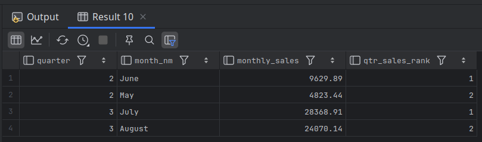

# Localized Sorting

- Along with partitioning the result set into data windows for our analytic fuctions, we may also specify a sort order.
- If we want to define a ranking number for each month, where the value 1 is given to the month having the highest sales, we will need to specify which column (or columns) to use for the ranking.
  - **`RANK() OVER (ORDER BY SUM(amount) DESC)`**  `sales_rank`
    - **Window function** applied **after** the grouping.
    - **No** `PARTITION BY`: the window is the entire set of grouped rows (all months).
    - Orders those rows by `monthly_sales` **descending**, then assigns:
      - `1` to the highest‐sales month,
      - `2` to the next distinct sales value,
      - etc., with gaps if there are ties.

```bash
mysql> SELECT quarter(payment_date) quarter,
    -> monthname(payment_date) month_nm,
    -> sum(amount) monthly_sales,
    -> rank() over (order by sum(amount) desc) sales_rank
    -> FROM payment
    -> WHERE year(payment_date) = 2005
    -> GROUP BY quarter(payment_date), monthname(payment_date)
    -> ORDER BY 1,2;
+---------+----------+---------------+------------+
| quarter | month_nm | monthly_sales | sales_rank |
+---------+----------+---------------+------------+
|       2 | June     |       9629.89 |          3 |
|       2 | May      |       4823.44 |          4 |
|       3 | August   |      24070.14 |          2 |
|       3 | July     |      28368.91 |          1 |
+---------+----------+---------------+------------+
4 rows in set (0.02 sec)
```

---

- In some cases, we will want to use both the `partition by` and `order by` subclauses in the same analytic function call. 
- For example, the previous example can be modified to provide a different set of rankings per quarter, rather than a single ranking across the entire result set:

```mysql
SELECT quarter(payment_date) quarter,
       monthname(payment_date) month_nm,
       sum(amount) monthly_sales,
       rank() over (partition by quarter(payment_date)
           order by sum(amount) desc) qtr_sales_rank
FROM payment
WHERE year(payment_date) = 2005
GROUP BY quarter(payment_date), monthname(payment_date), month(payment_date)
ORDER BY 1;
```

