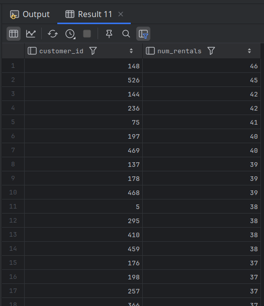
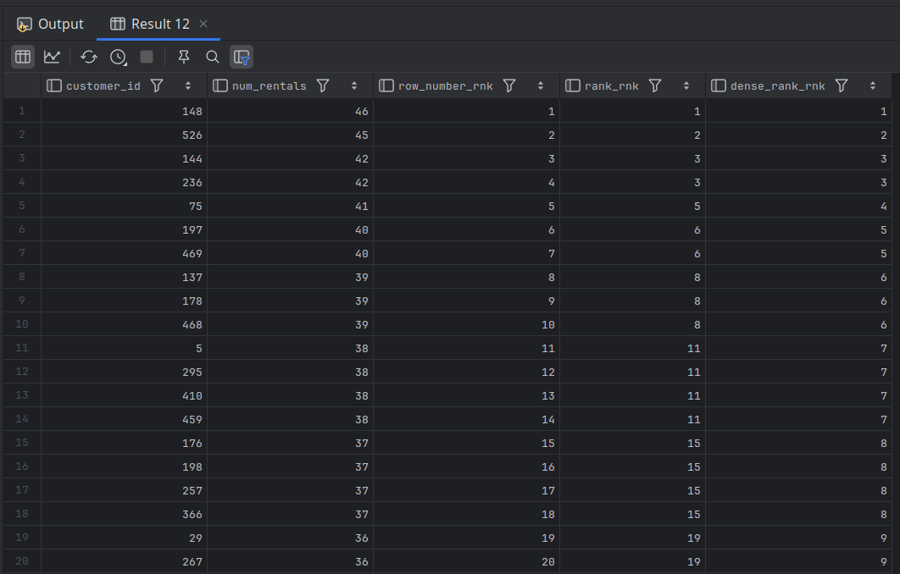

# Ranking

`row_number`:  Returns a unique number for each row, with rankings arbitrarily assigned in case of a tie.

`rank`:  Returns the same ranking in case of a tie, with gaps in the rankings.

`dense_rank`: Returns the same ranking in case of a tie, with no gaps in the rankings.

- The following query determines the number of film rentals for each customer and sorts the results in descending order:

```mysql
SELECT customer_id, count(*) num_rentals
FROM rental
GROUP BY customer_id
ORDER BY 2 desc;
```



- The 3rd and 4th customers in the result set both rented 42 films.
- Should they both receive the same ranking of 3?
- To see how each function handles ties when assigning rankings, the next query adds three more columns, each one employing a different ranking function:

```mysql

SELECT customer_id, count(*) num_rentals, row_number()
        over (order by count(*) desc) row_number_rnk,
    rank() over (order by count(*) desc) rank_rnk,
    dense_rank() over (order by count(*) desc) dense_rank_rnk
FROM rental
GROUP BY customer_id
ORDER BY 2 desc;
```



- The 3rd column uses the `row_number` function to assign a unique ranking to each row, without regard to ties.
- Now in `rank_rnk` 42 is ranked 3 twice.