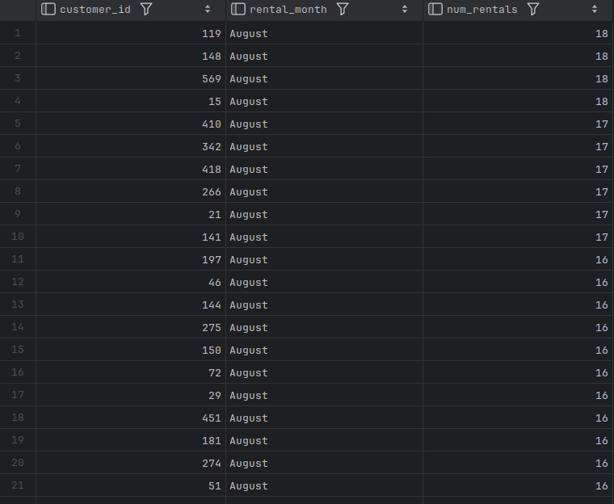
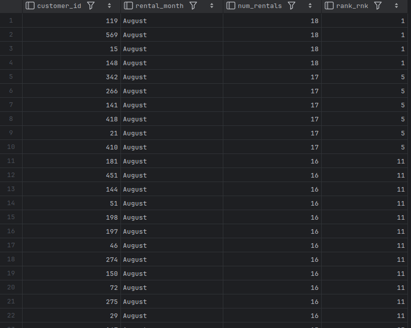
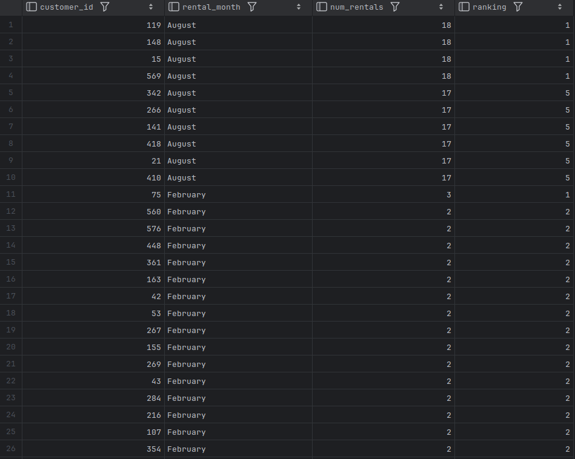

# Generating Multiple Rankings

- Let's say the marketing department decides to offer free film rentals to the top five customers every month. 
- To generate the data, the `rental_month` column can be added to the previous query.

```bash
USE sakila;

SELECT customer_id,
       monthname(rental_date) rental_month,
       count(*) num_rentals
FROM rental
GROUP BY customer_id, monthname(rental_date)
ORDER By 2, 3 desc;
```



- In order to create a new set of rankings for each month, we will need to add something to the `rank` function to describe how to divide the result into different data windows (months, in this case).
- This is done using the `partition by` clause, which is added to the `over` clause.

```mysql
SELECT customer_id,
       monthname(rental_date) rental_month,
       count(*) num_rentals,
       rank() over (partition by monthname(rental_date)
           order by count(*) desc) rank_rnk
FROM rental
GROUP BY customer_id, monthname(rental_date)
ORDER BY 2,3 desc;
```



- In order to generate the desired results for the marketing department (top five customers from each month), 
  - we can simply wrap the previous query in a subquery and add a filter condition to exclude any rows with a ranking higher than five.

```mysql
SELECT customer_id, rental_month, num_rentals, rank_rnk ranking
FROM
    (
        SELECT customer_id, monthname(rental_date) rental_month,
               count(*) num_rentals, rank() over (partition by
                   MONTHNAME(rental_date) order by count(*) desc) rank_rnk
        FROM rental
        GROUP BY customer_id, monthname(rental_date)
    ) cust_rankings
WHERE rank_rnk <= 5
ORDER BY rental_month, num_rentals desc, rank_rnk;
```



- Since analytic functions can be used only in the `SELECT` clause, we will often need to nest queries if we need to do any filtering or grouping based on the results from the analytic function.