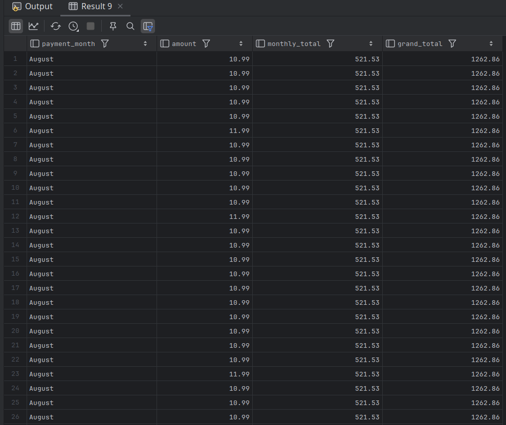

# Reporting Functions

- Along with generating rankings, another common use for analytic functions is to find outliers (e.g., min or max values) or to generate sums or averages across an entire data set.

- For these types of uses, aggregate functions (`min`, `max`, `avg`, `sum`, `count`) will be used 

  - but instead of using them with a `group by` clause, we will pair them with an `over` clause.

  -  The following query generates monthly and grand totals for all payments of $10 or higher:

```mysql
SELECT monthname(payment_date) payment_month,
       amount,
       sum(amount) over (partition by monthname(payment_date))
monthly_total,
    sum(amount) over () grand_total
FROM payment
WHERE amount >= 10
ORDER BY 1;
```



- The `grand_total` column contains the same value ($1,262.86) for every row because the `over` clause is empty, which specifies that the summation be done over the entire result set.
- The `monthly_total` column, however, contains a different value for each month, since there is a `partition by` clause specifying that the result set be split into multiple data windows (one for each month).

---

- While it may seem of little value to include a column such as `grand_total` with the same value for every row, these types of columns can also be used for calculations, as shown in the following query.
  - It calculates the total payments for each month by summing the `amount` column, and then calculates the percentage of the total payments for each month by summing the monthly sums to use as the denominator in the calculation.

```bash
mysql> SELECT monthname(payment_date) payment_month,
    -> sum(amount) month_total,
    -> round(sum(amount) / sum(sum(amount)) over ()
    -> * 100, 2) pct_of_total
    -> FROM payment
    -> GROUP BY monthname(payment_date);
+---------------+-------------+--------------+
| payment_month | month_total | pct_of_total |
+---------------+-------------+--------------+
| May           |     4823.44 |         7.16 |
| June          |     9629.89 |        14.29 |
| July          |    28368.91 |        42.09 |
| August        |    24070.14 |        35.71 |
| February      |      514.18 |         0.76 |
+---------------+-------------+--------------+
5 rows in set (0.03 sec)
```


- Reporting functions may also be used for comparisons, such as the next query, which uses a `case` expression to determine whether a monthly total is the max, min, or somewhere in the middle:

```bash
mysql> SELECT monthname(payment_date) payment_month,
    ->   sum(amount) month_total,
    ->   CASE sum(amount)
    ->     WHEN max(sum(amount)) over () THEN 'Highest'
    ->     WHEN min(sum(amount)) over () THEN 'Lowest'
    ->     ELSE 'Middle'
    ->   END descriptor
    -> FROM payment
    -> GROUP BY monthname(payment_date);
```

- The `descriptor` column acts as a quasi-ranking function, in that it helps identify the top/bottom values across a set of rows.