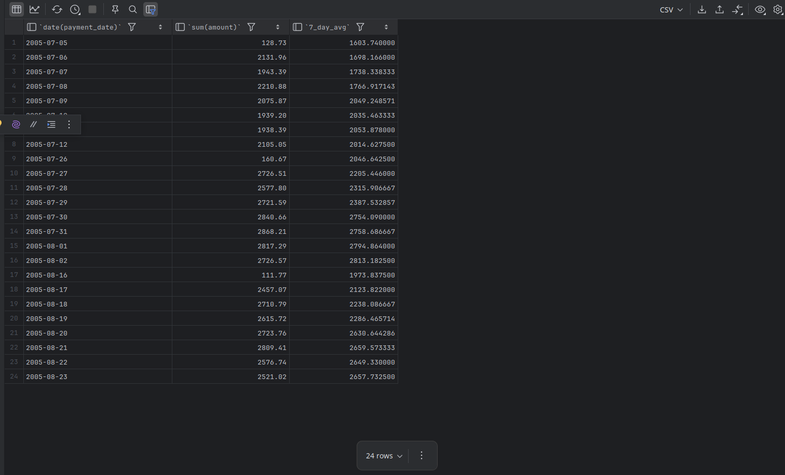

# Window Frames

- Say we want to generate a running total starting from the beginning of the year up to the current row. 
- For these types of calculations, we can include a “frame” subclause to define exactly which rows to include in the data window. 
- Here’s a query that sums payments for each week and includes a reporting function to calculate the rolling sum:
  - The `rolling_sum` column expression includes the `rows unbounded preceding` subclause to define a data window from the beginning of the result set up to and including the current row.

```bash
mysql> SELECT yearweek(payment_date) payment_week,
    -> sum(amount) week_total,
    -> sum(sum(amount))
    -> over (order by yearweek(payment_date)
    -> rows unbounded preceding) rolling_sum
    -> FROM payment
    -> GROUP BY yearweek(payment_date)
    -> ORDER BY 1;
+--------------+------------+-------------+
| payment_week | week_total | rolling_sum |
+--------------+------------+-------------+
|       200521 |    2846.19 |     2846.19 |
|       200522 |    1977.25 |     4823.44 |
|       200524 |    5603.43 |    10426.87 |
|       200525 |    4026.46 |    14453.33 |
|       200527 |    8490.83 |    22944.16 |
|       200528 |    5982.64 |    28926.80 |
|       200530 |   11027.23 |    39954.03 |
|       200531 |    8412.07 |    48366.10 |
|       200533 |   10619.11 |    58985.21 |
|       200534 |    7907.17 |    66892.38 |
|       200607 |     514.18 |    67406.56 |
+--------------+------------+-------------+
11 rows in set (0.03 sec)
```

- Along with rolling sums, we can calculate rolling averages. 
- The following query calculates a three-week rolling average of total payments:
  - `ROWS BETWEEN 1 PRECEDING AND 1 FOLLOWING` : *Start the frame one row before the current week, end it one row after.* Result: each frame contains **three weeks** (previous, current, next).
  - The `rolling_3wk_avg` column defines a data window consisting of the current row, the prior row, and the next row.
  

```bash
mysql> SELECT yearweek(payment_date) payment_week,
    -> sum(amount) week_total,
    -> avg(sum(amount))
    -> over (order by yearweek(payment_date)
    -> rows between 1 preceding and 1 following) rolling_3wk_avg
    -> FROM payment
    -> GROUP BY yearweek(payment_date)
    -> ORDER BY 1;
+--------------+------------+-----------------+
| payment_week | week_total | rolling_3wk_avg |
+--------------+------------+-----------------+
|       200521 |    2846.19 |     2411.720000 |
|       200522 |    1977.25 |     3475.623333 |
|       200524 |    5603.43 |     3869.046667 |
|       200525 |    4026.46 |     6040.240000 |
|       200527 |    8490.83 |     6166.643333 |
|       200528 |    5982.64 |     8500.233333 |
|       200530 |   11027.23 |     8473.980000 |
|       200531 |    8412.07 |    10019.470000 |
|       200533 |   10619.11 |     8979.450000 |
|       200534 |    7907.17 |     6346.820000 |
|       200607 |     514.18 |     4210.675000 |
+--------------+------------+-----------------+
11 rows in set (0.04 sec)
```

- Specifying a number of rows for our data window works fine in many cases, but if there are gaps in our data, we might want to try a different approach.
- In the previous result set, for example, there is data for weeks 200521, 200522, and 200524, but no data for week 200523. 
- If we want to specify a date interval rather than a number of rows, we can specify a *range* for our data window, as shown in the following query:
  - The `7_day_avg` column specifies a range of +/-3 days and will include only those rows whose `payment_date` values fall within that range.

```mysql
SELECT date(payment_date), sum(amount),
       avg(sum(amount)) over (order by date(payment_date)
           range between interval 3 day preceding
           and interval 3 day following) 7_day_avg
FROm payment
WHERE payment_date BETWEEN '2005-07-01' AND '2005-09-01'
GROUP BY date(payment_date)
ORDER BY 1;
```


