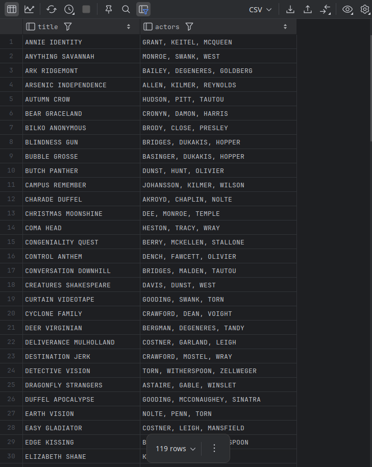

# Column Value Concatenation

- Although not technically an analytic function, there is one more important function to demonstrate since it works with groups of rows within a data window. 
- The `group_concat` function is used to pivot a set of column values into a single delimited string, which is a handy way to denormalize our result set for generating XML or JSON documents. 
- Here’s an example of how this function could be used to generate a comma-delimited list of actors for each film:

```mysql
SELECT f.title,
       group_concat(a.last_name order by a.last_name separator ', ') actors
FROM actor a
INNER JOIN film_actor fa
ON a.actor_id = fa.actor_id
INNER JOIN film f
ON fa.film_id = f.film_id
GROUP BY f.title
HAVING count(*) = 3;
```

