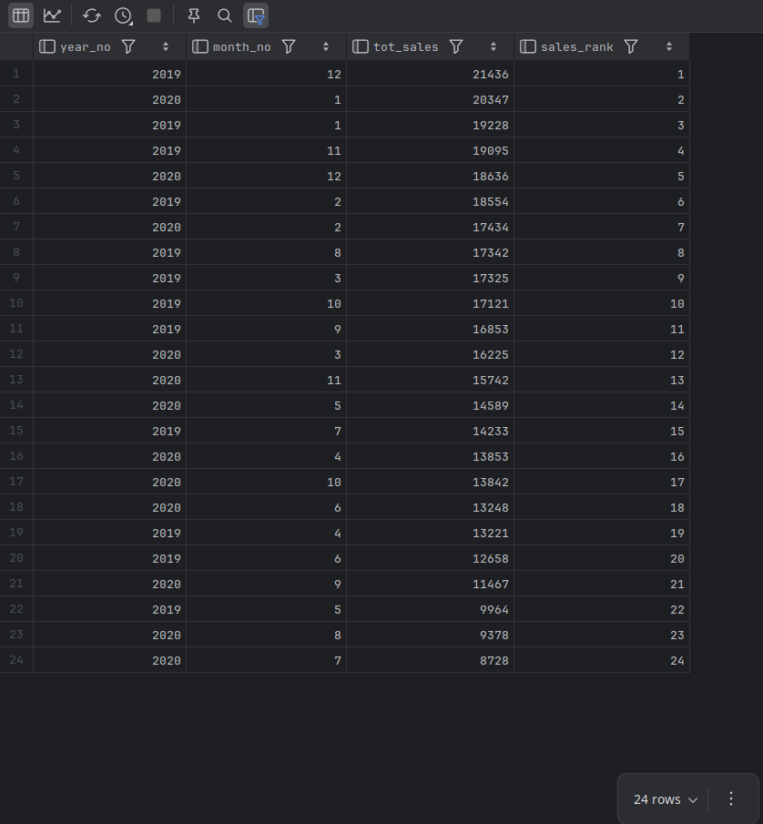
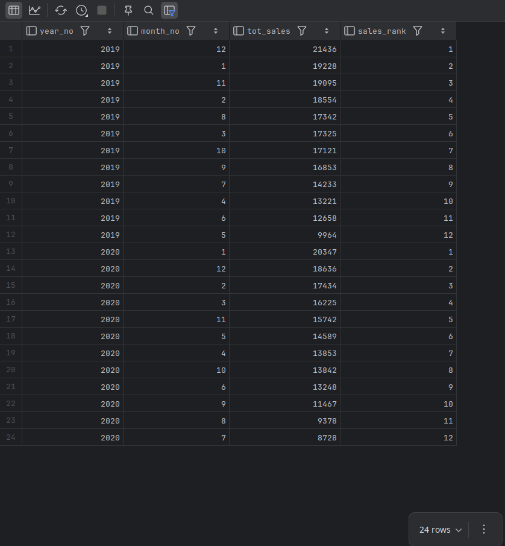
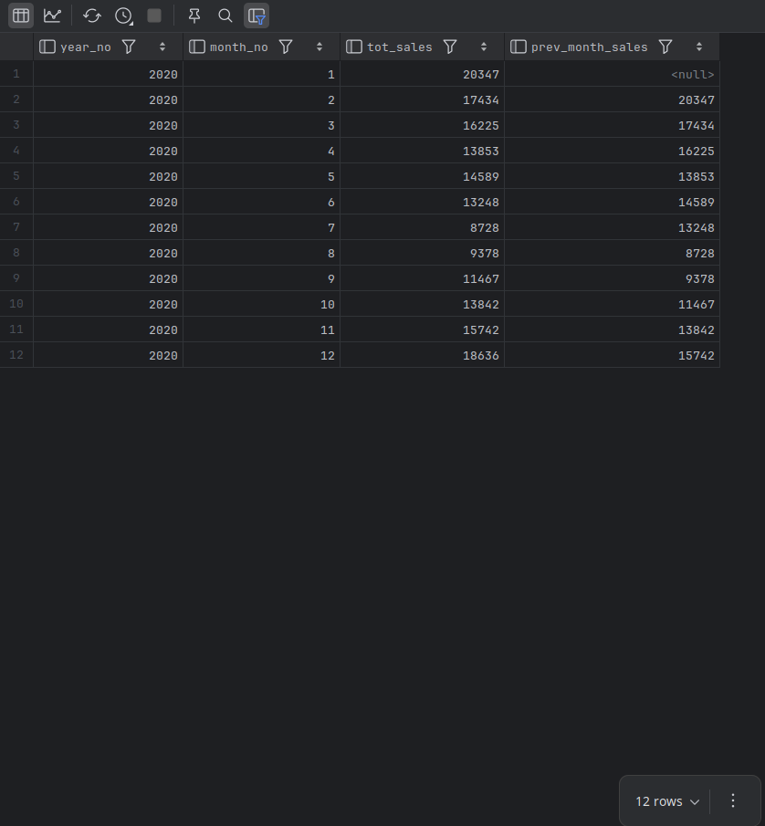

# Exercises

## Table for Exercises 16

```css
Sales_Fact
+---------+----------+-----------+
| year_no | month_no | tot_sales |
+---------+----------+-----------+
|    2019 |        1 |     19228 |
|    2019 |        2 |     18554 |
|    2019 |        3 |     17325 |
|    2019 |        4 |     13221 |
|    2019 |        5 |      9964 |
|    2019 |        6 |     12658 |
|    2019 |        7 |     14233 |
|    2019 |        8 |     17342 |
|    2019 |        9 |     16853 |
|    2019 |       10 |     17121 |
|    2019 |       11 |     19095 |
|    2019 |       12 |     21436 |
|    2020 |        1 |     20347 |
|    2020 |        2 |     17434 |
|    2020 |        3 |     16225 |
|    2020 |        4 |     13853 |
|    2020 |        5 |     14589 |
|    2020 |        6 |     13248 |
|    2020 |        7 |      8728 |
|    2020 |        8 |      9378 |
|    2020 |        9 |     11467 |
|    2020 |       10 |     13842 |
|    2020 |       11 |     15742 |
|    2020 |       12 |     18636 |
+---------+----------+-----------+
24 rows in set (0.00 sec)
```

---

16-1.  Write a query that retrieves every row from `Sales_Fact`, and add a column to generate a ranking based on the `tot_sales` column values. The highest value should receive a ranking of 1, and the lowest a ranking of 24.

**ANS:**

```mysql
CREATE TEMPORARY TABLE IF NOT EXISTS Sales_Fact (
    year_no SMALLINT UNSIGNED NOT NULL,
    month_no TINYINT UNSIGNED NOT NULL CHECK (month_no BETWEEN 1 AND 12),
    tot_sales INT UNSIGNED NOT NULL,
    PRIMARY KEY (year_no, month_no)
) ENGINE = InnoDB;

INSERT INTO Sales_Fact (year_no, month_no, tot_sales)
VALUES
    -- 2019
    (2019,  1, 19228),
    (2019,  2, 18554),
    (2019,  3, 17325),
    (2019,  4, 13221),
    (2019,  5,  9964),
    (2019,  6, 12658),
    (2019,  7, 14233),
    (2019,  8, 17342),
    (2019,  9, 16853),
    (2019, 10, 17121),
    (2019, 11, 19095),
    (2019, 12, 21436),
-- 2020
    (2020,  1, 20347),
    (2020,  2, 17434),
    (2020,  3, 16225),
    (2020,  4, 13853),
    (2020,  5, 14589),
    (2020,  6, 13248),
    (2020,  7,  8728),
    (2020,  8,  9378),
    (2020,  9, 11467),
    (2020, 10, 13842),
    (2020, 11, 15742),
    (2020, 12, 18636);

SELECT * FROM Sales_Fact;

SELECT year_no, month_no, tot_sales,
       RANK() OVER (ORDER BY tot_sales DESC) AS sales_rank
FROM Sales_Fact
ORDER By sales_rank;
```



---

16-2. Modify the query from the previous exercise to generate two sets of rankings from 1 to 12, one for 2019 data and one for 2020.

**ANS:**

```mysql
SELECT year_no, month_no, tot_sales,
       RANK() OVER (PARTITION BY year_no
           ORDER BY tot_sales DESC) AS sales_rank
FROM Sales_Fact
ORDER BY year_no, sales_rank;
```



---

16-3. Write a query that retrieves all 2020 data, and include a column that will contain the `tot_sales` value from the previous month.

**ANS:**

```mysql
SELECT year_no, month_no, tot_sales,
       LAG(tot_sales, 1) OVER (
           PARTITION BY year_no
           ORDER BY month_no
           ) AS prev_month_sales
FROM Sales_Fact
WHERE year_no = 2020
ORDER BY month_no;
```



---

