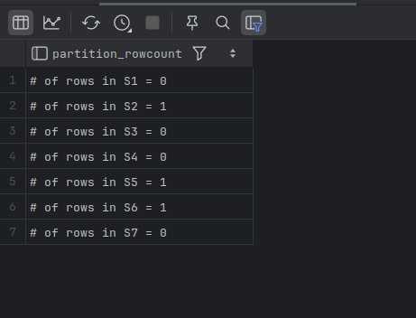

# Partitioning Methods

The three common partitioning methods available across most servers:

| Scheme    | How you tell MySQL to slice the table                        | Typical use cases                                            |
| --------- | ------------------------------------------------------------ | ------------------------------------------------------------ |
| **RANGE** | You define *ranges* on a column or expression—rows whose value falls inside a given range go to that partition. | Time‑series or monotonically growing keys (e.g., log tables, sales by date). |
| **LIST**  | Like RANGE but you enumerate explicit *lists* of discrete values for each partition. | Categorical data with a stable, known set of values (e.g., `country_id`, `store_id`). |
| **HASH**  | MySQL computes a hash of a column/expression and uses the remainder of a modulus to choose the partition. | Evenly spreading rows when values are unpredictable or high‑cardinality (IoT device IDs, user IDs). |

---

## Range Partitioning

- One of the most widely used.
- While range partitioning can be used for several different column types, the most common usage is to break up tables by date ranges. 
- E.g., a table named `sales` could be partitioned using the `sale_date` column such that data for each week is stored in a different partition:
  - The following statement creates six different partitions, one for each of the first five weeks of 2020 and a 6th partition named `s999` to hold any rows beyond week five or year 2020.
  - `yearweek(sale_date)` expression is used as the partitioning function.
  - `sale_date` column serves as the partitioning key.

### Example - 1

```mysql
CREATE TABLE sales(
    sale_id INT NOT NULL,
    cust_id INT NOT NULL,
    store_id INT NOT NULL,
    sale_date DATE NOT NULL,
    amount DECIMAL(9, 2)
)
PARTITION BY RANGE (yearweek(sale_date))
(
    PARTITION s1 VALUES LESS THAN (202002),
    PARTITION s2 VALUES LESS THAN (202003),
    PARTITION s3 VALUES LESS THAN (202004),
    PARTITION s4 VALUES LESS THAN (202005),
    PARTITION s5 VALUES LESS THAN (202006),
    PARTITION s999 VALUES LESS THAN (MAXVALUE)
    );
```

- To see the metadata about our partitioned tables, we can use the `partitions` table in the `information_schema` database.

```bash
mysql> SELECT partition_name, partition_method,
    -> partition_expression
    -> FROM information_schema.partitions
    -> WHERE table_name = 'sales'
    -> ORDER BY partition_ordinal_position;
+----------------+------------------+-------------------------+
| PARTITION_NAME | PARTITION_METHOD | PARTITION_EXPRESSION    |
+----------------+------------------+-------------------------+
| s1             | RANGE            | yearweek(`sale_date`,0) |
| s2             | RANGE            | yearweek(`sale_date`,0) |
| s3             | RANGE            | yearweek(`sale_date`,0) |
| s4             | RANGE            | yearweek(`sale_date`,0) |
| s5             | RANGE            | yearweek(`sale_date`,0) |
| s999           | RANGE            | yearweek(`sale_date`,0) |
+----------------+------------------+-------------------------+
6 rows in set (0.01 sec)
```

- One of the administrative tasks that will need to be performed on the `sales` table involves generating new partitions to hold future data (to keep data from being added to the `maxvalue` partition). 
- Different databases handle this in different ways, but in MySQL we could use the `reorganize partition` clause of the `alter table` command to split the s999 partition into three pieces:

```mysql
ALTER TABLE sales REORGANIZE PARTITION s999 INTO
(
    PARTITION s6 VALUES LESS THAN (202007),
    PARTITION s7 VALUES LESS THAN (202008),
    PARTITION s999 VALUES LESS THAN (MAXVALUE)
    );

SELECT partition_name, partition_method, partition_expression
FROM information_schema.PARTITIONS
WHERE table_name = 'sales'
ORDER BY PARTITION_ORDINAL_POSITION;
```


```mysql
INSERT INTO sales
VALUES
    (1, 1, 1, '2020-01-18', 2765.15),
    (2,3,4, '2020-02-07', 5322.08);

SELECT CONCAT('# of rows in S1 = ', count(*)) partition_rowcount
FROM sales PARTITION (s1) UNION ALL
SELECT CONCAT('# of rows in S2 = ', count(*)) partition_rowcount
FROM sales PARTITION (s2) UNION ALL
SELECT CONCAT('# of rows in S3 = ', count(*)) partition_rowcount
FROM sales PARTITION (s3) UNION ALL
SELECT CONCAT('# of rows in S4 = ', count(*)) partition_rowcount
FROM sales PARTITION (s4) UNION ALL
SELECT CONCAT('# of rows in S5 = ', count(*)) partition_rowcount
FROM sales PARTITION (s5) UNION ALL
SELECT CONCAT('# of rows in S6 = ', count(*)) partition_rowcount
FROM sales PARTITION (s5) UNION ALL
SELECT CONCAT('# of rows in S7 = ', count(*)) partition_rowcount
FROM sales PARTITION (s999);
```



---

### Example - 2

```mysql
CREATE TABLE IF NOT EXISTS sales_fact(
    sale_date DATE NOT NULL,
    amount DECIMAL(10, 2) NOT NULL,
    PRIMARY KEY (sale_date)
)
PARTITION BY RANGE (YEAR(sale_date)) (
    PARTITION p2019 VALUES LESS THAN (2020),
    PARTITION p2020 VALUES LESS THAN (2021),
    PARTITION pmax VALUES LESS THAN MAXVALUE
    );

INSERT INTO sales_fact (sale_date, amount)
VALUES
    ('2018-12-31', 950.00),
    ('2019-06-15', 1200.00),
    ('2020-02-10', 1800.00),
    ('2021-01-04', 2000.00);

SELECT p.PARTITION_NAME, p.TABLE_ROWS
FROM information_schema.PARTITIONS AS p
WHERE p.TABLE_SCHEMA = DATABASE()
AND p.TABLE_NAME = 'sales_fact'
ORDER BY p.PARTITION_NAME;
```

```bash
mysql> SELECT * FROM sales_fact PARTITION (p2019);
+------------+---------+
| sale_date  | amount  |
+------------+---------+
| 2018-12-31 |  950.00 |
| 2019-06-15 | 1200.00 |
+------------+---------+
2 rows in set (0.00 sec)

mysql> SELECT * FROM sales_fact PARTITION (p2020);
+------------+---------+
| sale_date  | amount  |
+------------+---------+
| 2020-02-10 | 1800.00 |
+------------+---------+
1 row in set (0.00 sec)

mysql> SELECT * FROM sales_fact PARTITION (pmax);
+------------+---------+
| sale_date  | amount  |
+------------+---------+
| 2021-01-04 | 2000.00 |
+------------+---------+
1 row in set (0.00 sec)
```

```bash
mysql> SELECT * FROM sales_fact;
+------------+---------+
| sale_date  | amount  |
+------------+---------+
| 2018-12-31 |  950.00 |
| 2019-06-15 | 1200.00 |
| 2020-02-10 | 1800.00 |
| 2021-01-04 | 2000.00 |
+------------+---------+
4 rows in set (0.01 sec)
```

---

