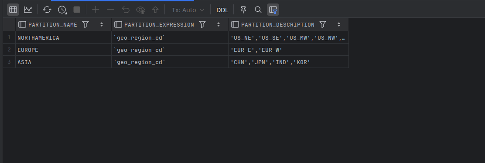
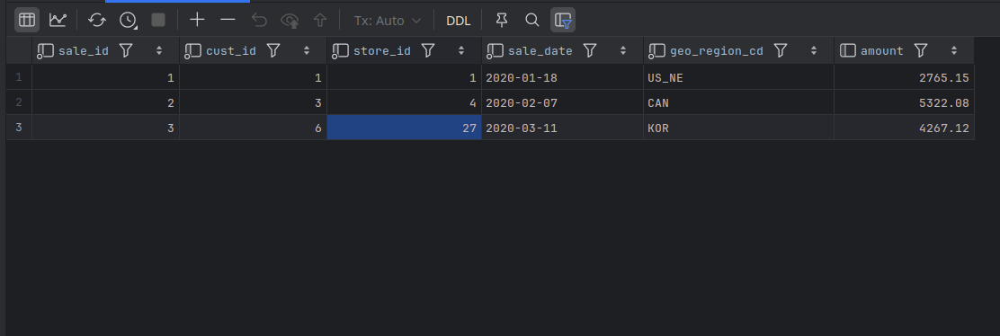
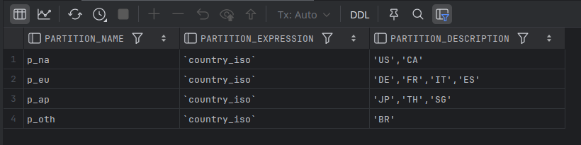

# List Partitioning

- If the column chosen as the partitioning key contains state codes (e.g., CA, TX, VA, etc.), currencies (e.g., USD, EUR, JPY, etc.), or some other enumerated set of values, 
  - we want to utilize list partitioning, which allows you to specify which values will be assigned to each partition.

```mysql
CREATE TABLE sales
(
    sale_id INT NOT NULL,
    cust_id INT NOT NULL,
    store_id INT NOT NULL,
    sale_date DATE NOT NULL,
    geo_region_cd VARCHAR(6) NOT NULL,
    amount DECIMAL(9, 2)
)
PARTITION BY LIST COLUMNS (geo_region_cd)
(
    PARTITION NORTHAMERICA VALUES IN
    ('US_NE', 'US_SE', 'US_MW', 'US_NW', 'US_SW', 'CAN', 'MEX'),
    PARTITION EUROPE VALUES IN ('EUR_E', 'EUR_W'),
    PARTITION ASIA VALUES IN ('CHN', 'JPN', 'IND')
    );
```

```bash
mysql> INSERT INTO sales
    -> VALUES
    -> (1, 1, 1, '2020-01-18', 'US_NE', 2765.15),
    -> (2, 3, 4, '2020-02-07', 'CAN', 5322.08),
    -> (3, 6, 27, '2020-03-11', 'KOR', 4267.12);
ERROR 1526 (HY000): Table has no partition for value from column_list
```

- The error message indicates that one of the geographic region codes was not assigned to a partition. 
- we need to add `asia` partition. 
- This can be fixed using an `alter table` statement:

```bash
mysql> ALTER TABLE sales REORGANIZE PARTITION ASIA INTO
    -> (PARTITION ASIA VALUES IN ('CHN', 'JPN', 'IND', 'KOR'));
Query OK, 0 rows affected (1.39 sec)
Records: 0  Duplicates: 0  Warnings: 0
```

```mysql
SELECT partition_name, partition_expression, partition_description
FROM information_schema.PARTITIONS
WHERE TABLE_NAME = 'sales'
ORDER BY PARTITION_ORDINAL_POSITION;
```



```mysql
INSERT INTO sales
VALUES
    (1, 1, 1, '2020-01-18', 'US_NE', 2765.15),
    (2, 3, 4, '2020-02-07', 'CAN', 5322.08),
    (3, 6, 27, '2020-03-11', 'KOR', 4267.12);

SELECT * FROM sales;
```



---

## Example - 2

```mysql
DROP TABLE IF EXISTS customer_part;

CREATE TABLE customer_part(
    id INT NOT NULL,
    country_iso CHAR(2) NOT NULL,
    name VARCHAR(50),
    PRIMARY KEY (id, country_iso)
)
PARTITION BY LIST COLUMNS (country_iso)(
    PARTITION p_na VALUES IN ('US', 'CA'),
    PARTITION p_eu VALUES IN ('DE', 'FR', 'IT', 'ES'),
    PARTITION p_ap VALUES IN ('JP', 'TH', 'SG'),
    PARTITION p_oth VALUES IN ('BR')
);

INSERT INTO customer_part (id, country_iso, name)
VALUES
    (1, 'US', 'Alice'),
    (2, 'DE', 'Bruno'),
    (3, 'JP', 'Chie'),
    (4, 'BR', 'Diego');

SELECT partition_name, partition_expression,
       partition_description
FROM information_schema.PARTITIONS
WHERE table_schema = DATABASE()
    AND table_name = 'customer_part'
ORDER BY PARTITION_ORDINAL_POSITION;
```



```mysql
SELECT * FROM customer_part PARTITION(p_na);
SELECT * FROM customer_part PARTITION(p_eu);
SELECT * FROM customer_part PARTITION(p_ap);
SELECT * FROM customer_part PARTITION(p_oth);
```

