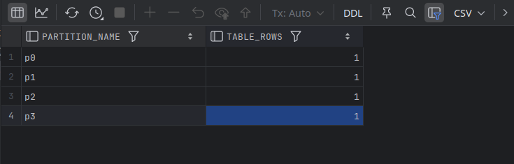

# Hash partitioning

- MySQL applies a built‑in hash function (or our expression) to the key, then takes the result modulo the number of partitions.
- **Use cases**:
  - Uniformly distribute rows when we don’t have natural ranges or lists.
  - Sharding‑style distribution within a single server.
- Pros: Automatic even spread, no future DDL needed.
- Cons: No “pruning” benefit for value-based queries.
- Unlike list partitioning, where the column chosen as the partitioning key should contain only a small number of values, 
  - hash partitioning works best when the partitioning key column contains a large number of distinct values.


---

## Example - 1

- Another version of the `sales` table but with four hash partitions generated by hashing the values in the `cust_id` column:
  - When rows are added to the `sales` table, they will be evenly distributed across the four partitions, `H1`, `H2`, `H3` and `H4`.

```mysql
DROP TABLE IF EXISTS sales;

CREATE TABLE IF NOT EXISTS sales(
    sale_id INT NOT NULL,
    cust_id INT NOT NULL,
    store_id INT NOT NULL,
    sale_date DATE NOT NULL,
    amount DECIMAL(9, 2)
)
PARTITION BY HASH (cust_id)
PARTITIONS 4
(
    PARTITION H1,
    PARTITION H2,
    PARTITION H3,
    PARTITION H4
    );

INSERT INTO sales
VALUES
    (1, 1, 1, '2020-01-18', 1.1),
    (2, 3, 4, '2020-02-07', 1.2),
    (3, 17, 5, '2020-01-19', 1.3),
    (4, 23, 2, '2020-02-08', 1.4),
    (5, 56, 1, '2020-01-20', 1.6),
    (6, 77, 5, '2020-02-09', 1.7),
    (7, 122, 4, '2020-01-21', 1.8),
    (8, 153, 1, '2020-02-10', 1.9),
    (9, 179, 5, '2020-01-22', 2.0),
    (10, 244, 2, '2020-02-11', 2.1),
    (11, 263, 1, '2020-01-23', 2.2),
    (12, 312, 4, '2020-02-12', 2.3),
    (13, 346, 2, '2020-01-24', 2.4),
    (14, 389, 3, '2020-02-13', 2.5),
    (15, 472, 1, '2020-01-25', 2.6),
    (16, 502, 1, '2020-02-14', 2.7)
;
```

```bash
mysql> SELECT concat('# of rows in H1 = ', count(*)) partition_rowcount
    -> FROM sales PARTITION (h1) UNION ALL
    -> SELECT concat('# of rows in H2 = ', count(*)) partition_rowcount
    -> FROM sales PARTITION (h2) UNION ALL
    -> SELECT concat('# of rows in H3 = ', count(*)) partition_rowcount
    -> FROM sales PARTITION (h3) UNION ALL
    -> SELECT concat('# of rows in H4 = ', count(*)) partition_rowcount
    -> FROM sales PARTITION (h4);
+---------------------+
| partition_rowcount  |
+---------------------+
| # of rows in H1 = 4 |
| # of rows in H2 = 5 |
| # of rows in H3 = 3 |
| # of rows in H4 = 4 |
+---------------------+
4 rows in set (0.00 sec)
```

- Given that only 16 rows were inserted, this is a pretty good distribution.
- And as the number of rows increases, each partition should contain close to 25% of the rows as long as there are a reasonably large number of distinct values for the `cust_id` column.

---

## Example - 2

```mysql
DROP TABLE IF EXISTS sensor_reading;
CREATE TABLE IF NOT EXISTS sensor_reading(
    device_id BIGINT NOT NULL,
    reading_ts DATETIME NOT NULL,
    val DOUBLE,
    PRIMARY KEY (device_id, reading_ts)
)
PARTITION BY HASH(device_id)
PARTITIONS 4;


INSERT INTO sensor_reading (device_id, reading_ts, val)
VALUES
    (1000, '2025-07-21 09:00', 21.5), -- 1000 % 4 = 0 -> p0
    (1001, '2025-07-21 09:01', 20.9),   -- 1001 % 4 = 1 → p1
    (1002, '2025-07-21 09:02', 22.1),   -- 1002 % 4 = 2 → p2
    (1003, '2025-07-21 09:03', 21.8)
;   -- 1003 % 4 = 3 → p3

SELECT partition_name, table_rows
FROM information_schema.PARTITIONS
WHERE table_schema = DATABASE()
AND table_name = 'sensor_reading'
ORDER BY PARTITION_NAME;
```



---

