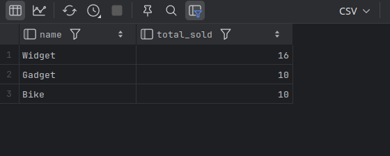

# Advanced SQL Techniques

## Common Table Expressions (CTEs)

```postgresql
INSERT INTO products (id, name, price)
VALUES
    (2, 'Bike', 499.00);


CREATE TABLE sales(
    id SERIAL PRIMARY KEY,
    product_id INT NOT NULL REFERENCES products(id),
    quantity INT NOT NULL CHECK(quantity > 0),
    sale_date DATE NOT NULL DEFAULT CURRENT_DATE
);

INSERT INTO sales (product_id, quantity, sale_date)
VALUES
    (1, 5, CURRENT_DATE - INTERVAL '5 days'),
    (2, 10, CURRENT_DATE - INTERVAL '15 days'),
    (1, 3, CURRENT_DATE - INTERVAL '25 days');

INSERT INTO sales (product_id, quantity, sale_date)
VALUES
    (1,  5, CURRENT_DATE - INTERVAL '5 days'),   -- Widget
    (3, 10, CURRENT_DATE - INTERVAL '15 days'),  -- Gadget
    (1,  3, CURRENT_DATE - INTERVAL '25 days');  -- Widget

SELECT * FROM sales;

WITH recent_sales AS (
    SELECT product_id, SUM(quantity) total_sold
    FROM sales
    WHERE sale_date >= current_date - INTERVAL '30 days'
    GROUP BY product_id
)
SELECT p.name, rs.total_sold
FROM recent_sales rs
JOIN products p ON p.id = rs.product_id
ORDER BY rs.total_sold DESC;
```

