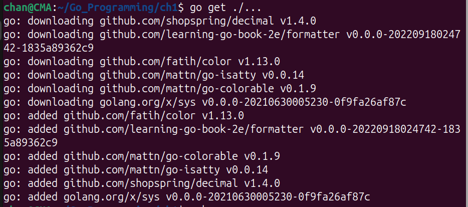

# Importing Third-Party Code 

- Go always build applications from source code into a single binary file.
  - This includes the source code of our module and the source code of all the modules on which our module depends. 

```go
package main

import (
	"fmt"
	"log"
	"os"

	"github.com/learning-go-book-2e/formatter"
	"github.com/shopspring/decimal"
)

func main() {
	if len(os.Args) < 3 {
		fmt.Println("Need two parameters: amount and percent")
		os.Exit(1)
	}
	amount, err := decimal.NewFromString(os.Args[1])
	if err != nil {
		log.Fatal(err)
	}

	percent, err := decimal.NewFromString(os.Args[2])
	if err != nil {
		log.Fatal(err)
	}

	percent = percent.Div(decimal.NewFromInt(100))
	total := amount.Add(amount.Mul(percent)).Round(2)
	fmt.Println(formatter.Space(80, os.Args[1], os.Args[2], total.StringFixed(2)))
}
```

- We imported third-party imports from github.
- If we try to do a build, we will get the following message:

```sh
chan@CMA:~/Go_Programming/ch1$ make
go fmt ./...
main.go
go vet ./...
main.go:8:2: no required module provides package github.com/learning-go-book-2e/formatter; to add it:
	go get github.com/learning-go-book-2e/formatter
main.go:9:2: no required module provides package github.com/shopspring/decimal; to add it:
	go get github.com/shopspring/decimal
```

- We cannot build the program until we add references to the third-party modules to our `go.mod` file. 
- The `go get` command downloads modules and updates the `go.mod` file.



```sh
chan@CMA:~/Go_Programming/ch1$ go get ./...
go: downloading github.com/shopspring/decimal v1.4.0
go: downloading github.com/learning-go-book-2e/formatter v0.0.0-20220918024742-1835a89362c9
go: downloading github.com/fatih/color v1.13.0
go: downloading github.com/mattn/go-isatty v0.0.14
go: downloading github.com/mattn/go-colorable v0.1.9
go: downloading golang.org/x/sys v0.0.0-20210630005230-0f9fa26af87c
go: added github.com/fatih/color v1.13.0
go: added github.com/learning-go-book-2e/formatter v0.0.0-20220918024742-1835a89362c9
go: added github.com/mattn/go-colorable v0.1.9
go: added github.com/mattn/go-isatty v0.0.14
go: added github.com/shopspring/decimal v1.4.0
go: added golang.org/x/sys v0.0.0-20210630005230-0f9fa26af87c
```

- After that, if we look in the `go.mod` file:

`go.mod` 

```go
module main

go 1.22.2

require (
	github.com/learning-go-book-2e/formatter v0.0.0-20220918024742-1835a89362c9
	github.com/shopspring/decimal v1.4.0
)

require (
	github.com/fatih/color v1.13.0 // indirect
	github.com/mattn/go-colorable v0.1.9 // indirect
	github.com/mattn/go-isatty v0.0.14 // indirect
	golang.org/x/sys v0.0.0-20210630005230-0f9fa26af87c // indirect
)
```

- The first `require` lists the modules that we've imported into our module along with the version number. 
- In second `require`, one of these modules is directly used by `formatter`.
- We will also have a `go.sum` file in our folder as well.
  - When committing to own modules to source control, always include up-to-date `go.mod` and `go.sum` files.
- Now if we try to run our program:

```sh
chan@CMA:~/Go_Programming/ch1$ make
go fmt ./...
go vet ./...
go build
chan@CMA:~/Go_Programming/ch1$ ./main
Need two parameters: amount and percent
chan@CMA:~/Go_Programming/ch1$ ./main 200 5
200                                   5                                   210.00
chan@CMA:~/Go_Programming/ch1$ ./main 99.99 7.25
99.99                                 7.25                                107.24

```


- Plus, instead of telling `go get` to scan our source code to discover modules, we can pass the module paths to `go get`. 
- To see this work, roll back the changes to the `go.mod` file and remove the `go.sum` file.

```sh
$ git restore go.mod 
$ rm go.sum
```


- If we use `go get` a second time, the downloading messages won't be displayed.
- Because Go maintains a **module cache** on our local computer.
- Once a version of a module is downloaded, a copy is kept in the cache.
- If we want to delete the module cache, we can use the command `go clean -modcache`.

```sh
chan@CMA:~/Go_Programming/ch1$ go get github.com/learning-go-book-2e/formatter
go: added github.com/fatih/color v1.13.0
go: added github.com/learning-go-book-2e/formatter v0.0.0-20220918024742-1835a89362c9
go: added github.com/mattn/go-colorable v0.1.9
go: added github.com/mattn/go-isatty v0.0.14
go: added golang.org/x/sys v0.0.0-20210630005230-0f9fa26af87c
chan@CMA:~/Go_Programming/ch1$ go get github.com/shopspring/decimal
go: added github.com/shopspring/decimal v1.4.0
```

