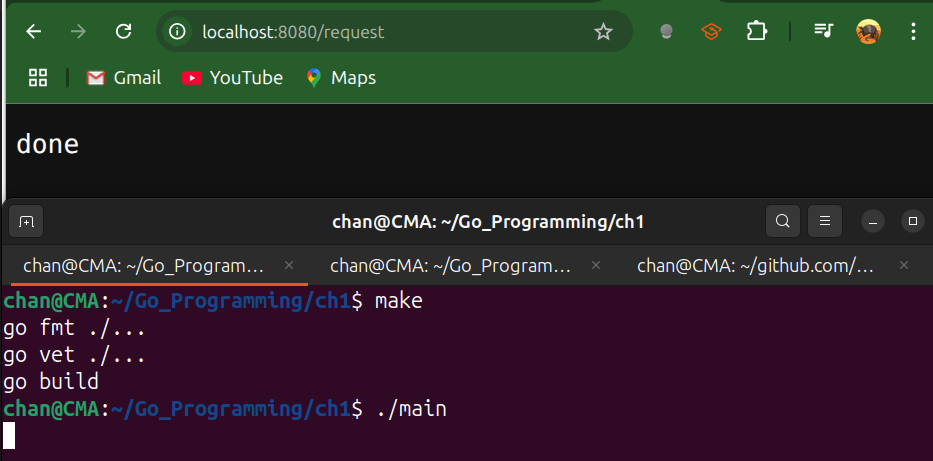

# Implement Backpressure

- Back-pressure means putting the brakes on *producers* (our HTTP handlers) when our *consumer* (the work we’re doing in `doThingThatShouldBeLimited` in the following example)  can’t keep up.
- In other words, we push back on incoming requests so we don’t overwhelm our service.
- Can be implemented with a buffered channel.
- It's counter-intuitive, but systems perform better overall when their components limit the amount of work they are willing to perform.
- We can use a buffered channel and a `select` statement to limit the number of simultaneous requests in a system.

---

## Code Example

- How it works here:
  1. WE create a buffered channel of size 10 `make(chan struct{}, 10)`.
  2. Every call to `Process(f)` tries to write a “token” into that channel.
     - If there’s room, WE grab a slot, run `f()`, then remove the token.
     - If the channel is full, `select` falls through to `default` and we immediately return an error.
  3. On the client side we turn that error into a 429 “Too Many Requests.”
- That rejection or, in a blocking design, the fact that `Process` would block on `pg.ch <- struct{}{}` is our back-pressure. 
  - It forces callers to slow down (or fail fast) rather than piling up unbounded work and crashing our service.

```go
package main

import (
	"errors"
	"net/http"
	"time"
)

// PressureGauge uses a buffered channel as a semaphore to limit
// how many f() calls can run concurrently.
type PressureGauge struct {
	ch chan struct{} // tokens: empty structs use zero memory
}

// New returns a PressureGauge allowing up to limit concurrent calls.
func New(limit int) *PressureGauge {
	return &PressureGauge{
		ch: make(chan struct{}, limit),
	}
}

// Process attempts to acquire a slot, run f(), then release the slot.
// If no slot is available immediately, it returns an error.
func (pg *PressureGauge) Process(f func()) error {
	select {
	// acquire slot (non‐blocking)
	case pg.ch <- struct{}{}:
		// run the user’s work
		f()
        
        // release slot
		<-pg.ch
		return nil
	default:
        // channel is full → too many in-flight calls
		return errors.New("no more capacity")
	}
}

func doThingThatShouldBeLimited() string {
	time.Sleep(2 * time.Second)
	return "done"
}

func main() {
    // allow up to 10 concurrent /request handlers
	pg := New(10)
    
    
	http.HandleFunc("/request", func(w http.ResponseWriter, r *http.Request) {
        // wrap the handler in the pressure gauge
		err := pg.Process(func() {
			w.Write([]byte(doThingThatShouldBeLimited()))
		})
		if err != nil {
			// over capacity → immediate 429
     	w.WriteHeader(http.StatusTooManyRequests)
			w.Write([]byte("Too many requests"))
		}
	})
	http.ListenAndServe(":8080", nil)
}

```



