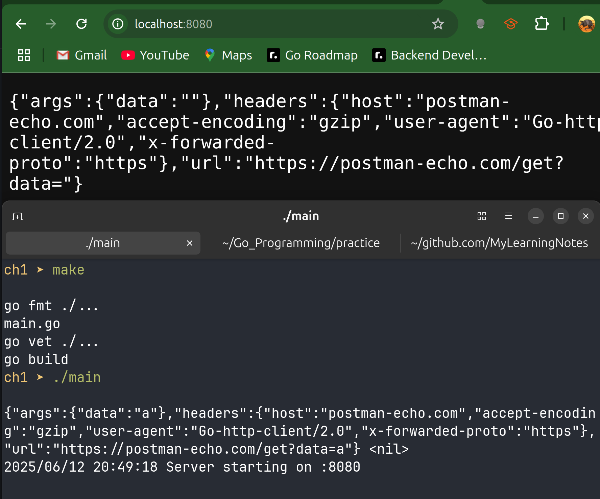

# Pattern for acquiring and passing the context through layers of middleware to the top-level `http.Handler`

- Two context-related methods are on `http.Request`:
  - `Context` returns the `context.Context` associated with the request.
  - `WithContext` takes in a `context.Context` and returns a new `http.Request` with the old request's state combined with the supplied `context.Context`.
- Below is a general pattern:
  1. extract the existing context from the request by using the `Context` method.
  2. After putting values into the context, we create a new request based on the old request and the now-populated context by using the `WithContext` Method.
  3. Finally, we call the handler and pass it our new request and the existing `http.ResponseWriter`.

```go
func Middleware(handler http.Handler) http.Handler{
    return http.HandlerFunc(func(rw http.ResponseWriter, req *http.Request){
        ctx := req.Context()
        // wrap the context with stuff
        req = req.WithContext(ctx)
        handler.ServeHTTP(rw, req)
    })
}
```

- When implementing the handler, extract the context from the request by using the `Context` method and call our business logic with the context as the first parameter.

```go

func handler(rw http.ResponseWriter, req *http.Request){
	ctx := req.Context() 
    err := req.ParseForm()
	if err != nil{
		rw.WriteHeader(http.StatusInternalServerError)
		rw.Write([]byte(err.Error()))
		return 
	}
	data := req.FormValue("data")
	result, err := logic(ctx, data)
	if err != nil {
		rw.WriteHeader(http.StatusInternalServerError)
		rw.Write([]byte(err.Error()))
		return 
	}
	rw.Write([]byte(result))
}
```

---

## Full Code Example

```go
package main

import (
	"context"
	"fmt"
	"io"
	"log"
	"net/http"
	"time"
)

// logic performs the main business logic: it creates a ServiceCaller,
// invokes callAnotherService with the provided context and info,
// and returns the result or error.
func logic(ctx context.Context, info string) (string, error) {
	// create an HTTP client with a timeout
	client := &http.Client{
		Timeout: 5 * time.Second,
	}
	sc := ServiceCaller{client: client}
	return sc.callAnotherService(ctx, info)
}

// Middleware shows what middleware wrappers look like when the place values into a context
func Middleware(handler http.Handler) http.Handler {
	return http.HandlerFunc(func(rw http.ResponseWriter, req *http.Request) {
		// Retrieve the existing context from the request
		ctx := req.Context()
		// Re-associate the context on the request (so we can add values here)
		req = req.WithContext(ctx)
		handler.ServeHTTP(rw, req)
	})
}

// handler shows how to extract a context from an *http.Request and pass it to a function
func handler(rw http.ResponseWriter, req *http.Request) {
	// 1. Grab the context from the incoming request (for timeouts, cancellations, values, etc.).
	ctx := req.Context()

	// 2. ParseForm populates req.Form and req.PostForm by parsing URL query
	//    parameters and POST form data.
	err := req.ParseForm()
	if err != nil {
		rw.WriteHeader(http.StatusInternalServerError)
		rw.Write([]byte(err.Error()))
		return
	}

	// 3. Extract the "data" field from the parsed form values.
	data := req.FormValue("data")

	// 4. Call the business-logic function, passing in the context and extracted data.
	result, err := logic(ctx, data)
	if err != nil {
		rw.WriteHeader(http.StatusInternalServerError)
		rw.Write([]byte(err.Error()))
		return
	}
	rw.Write([]byte(result))
}

// ServiceCaller encapsulates an HTTP client for making outbound requests.
type ServiceCaller struct {
	client *http.Client
}

// callAnotherService makes a GET request to an external service,
// attaching the provided context for cancellation and timeouts.
func (sc ServiceCaller) callAnotherService(ctx context.Context, data string) (string, error) {
	const maxRetries = 3

	url := fmt.Sprintf("https://postman-echo.com/get?data=%s", data)
	var lastErr error
	for attempt := 1; attempt <= maxRetries; attempt++ {
		req, err := http.NewRequestWithContext(ctx, http.MethodGet, url, nil)
		if err != nil {
			return "", nil
		}
		resp, err := sc.client.Do(req)
		if err != nil {
			return "", err
		}
		defer resp.Body.Close()
		switch resp.StatusCode {
		case http.StatusOK:
			// success
			return processResponse(resp.Body)
		case http.StatusServiceUnavailable:
			// 503 -> retry after back-off
			lastErr = fmt.Errorf("service unavailable, attempt %d/%d", attempt, maxRetries)
			time.Sleep(time.Duration(attempt) * 200 * time.Millisecond)
			continue
		default:
			// any other code is fatal
			return "", fmt.Errorf("unexpected status code %d", resp.StatusCode)
		}

	}

	// all retires failed
	return "", lastErr
}

// processResponse reads the entire response body and returns it as a string.
func processResponse(body io.ReadCloser) (string, error) {
	bytes, err := io.ReadAll(body)
	if err != nil {
		return "", err
	}
	return string(bytes), nil
}

func main() {
	// Create a root context for the application
	ctx := context.Background()
	result, err := logic(ctx, "a")
	if err != nil {
		fmt.Println("Error: ", err)
		return
	}
	fmt.Println(result, err)

	mux := http.NewServeMux()
	mux.Handle("/", Middleware(http.HandlerFunc(handler)))

	log.Println("Server starting on :8080")
	if err := http.ListenAndServe(":8080", mux); err != nil {
		log.Fatalf("ListenAndServe failed: %v", err)
	}
}
```



---

