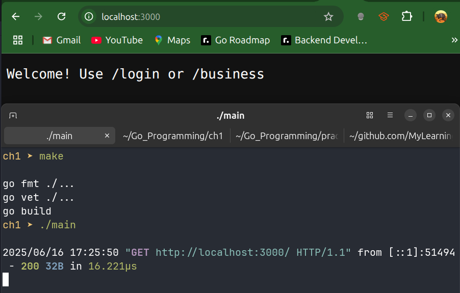
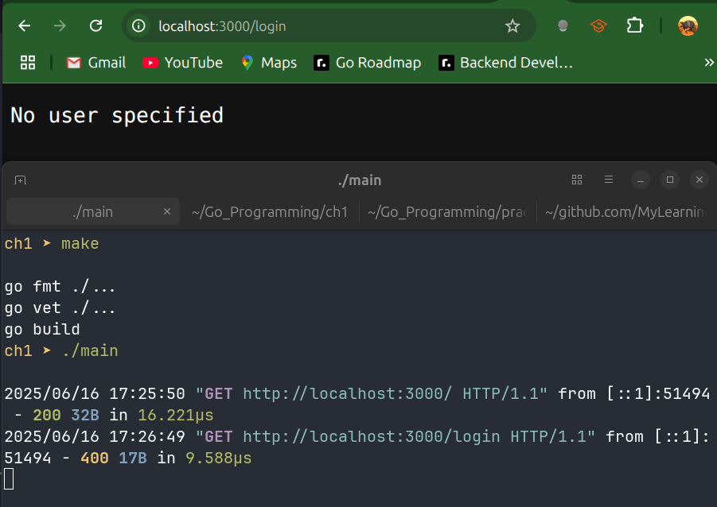
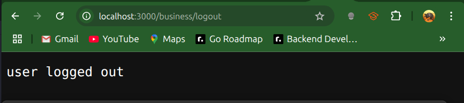
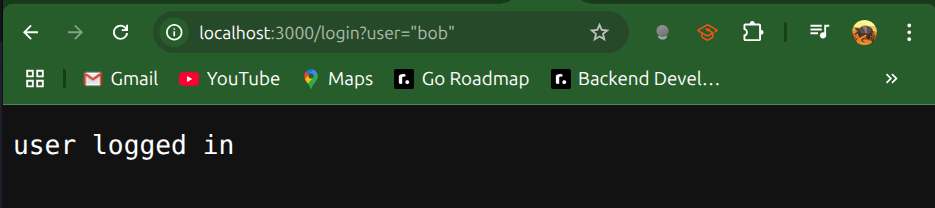
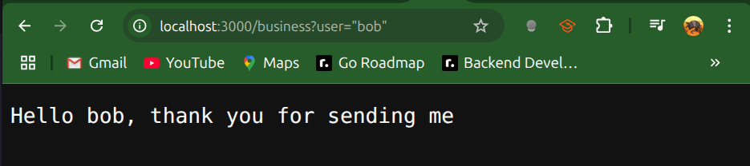
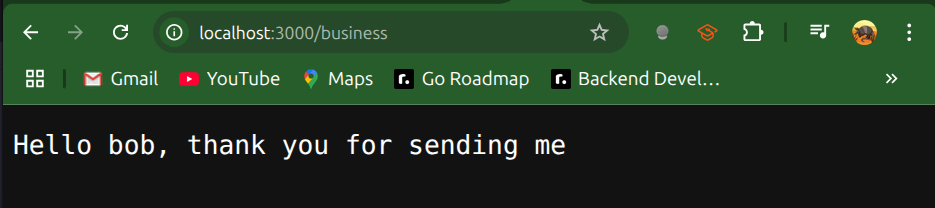

# Program using User Login, Logouts and Business Logic

`identity.go`

```go
package identity

import (
	"context"
	"net/http"
)

// Define a private key type to avoid collisions in context.
// Using an unexported named type ensures no other package
// will accidentally use the same key.
type userKey int

const (
	_   userKey = iota // skip zero value
	key                // actual key for storing "user" in context
)

// ContextWithUser returns a copy of parent ctx with the
// given username stored under our private key.
func ContextWithUser(ctx context.Context, user string) context.Context {
	return context.WithValue(ctx, key, user)
}

// UserFromContext extracts the username from ctx if present.
// Returns the empty string and false if no user was set.
func UserFromContext(ctx context.Context) (string, bool) {
	user, ok := ctx.Value(key).(string)
	if !ok {
		return "", false
	}
	return user, ok
}

// extractUser reads the "identity" cookie from the request.
// A real system would verify a signature or token to prevent spoofing.
func extractUser(req *http.Request) (string, error) {
	userCookie, err := req.Cookie("identity")
	if err != nil {
		return "", err
	}
	return userCookie.Value, nil
}

// Middleware wraps an http.Handler to enforce authentication.
// If extractUser fails, responds with 401 Unauthorized.
// Otherwise it injects the username into the request context
// and calls the next handler.
func Middleware(h http.Handler) http.Handler {
	return http.HandlerFunc(func(rw http.ResponseWriter, req *http.Request) {
		user, err := extractUser(req)
		if err != nil {
			rw.WriteHeader(http.StatusUnauthorized)
			rw.Write([]byte("Unauthorized"))
			return
		}

		// attach user to context
		ctx := req.Context()
		ctx = ContextWithUser(ctx, user)
		req = req.WithContext(ctx)
		h.ServeHTTP(rw, req)
	})
}

// SetUser issues a cookie named "identity" to the client.
// Call this after successful login to persist the username.
func SetUser(user string, rw http.ResponseWriter) {
	http.SetCookie(rw, &http.Cookie{
		Name:  "identity",
		Value: user,
		Path:  "/", // cookie valid for entire site
		// (optional) set Secure, HttpOnly, SameSite flags in production
	})
}

// DeleteUser clears the "identity" cookie by setting MaxAge<0.
// Use this to log out the user.
func DeleteUser(rw http.ResponseWriter) {
	http.SetCookie(rw, &http.Cookie{
		Name:   "identity",
		Value:  "",
		Path:   "/",
		MaxAge: -1, // instructs browser to delete the cookie
	})
}
```

`main.go`

```go
package main

import (
	"context"
	"fmt"
	"main/identity"
	"net/http"
	"strings"

	"github.com/go-chi/chi/v5"
	"github.com/go-chi/chi/v5/middleware"
)

type Logic interface {
	BusinessLogic(ctx context.Context, user string, data string) (string, error)
}

type Controller struct {
	Logic Logic
}

// Login reads the "user" query, then calls identity.SetUser
// (in identity.go) to set an "identity" cookie. This persists
// the username for subsequent requests.
func (c Controller) Login(rw http.ResponseWriter, req *http.Request) {
	userName := req.URL.Query().Get("user")
	if len(strings.TrimSpace(userName)) == 0 {
		rw.WriteHeader(http.StatusBadRequest)
		rw.Write([]byte("No user specified"))
		return
	}
	identity.SetUser(userName, rw)
	rw.WriteHeader(http.StatusOK)
	rw.Write([]byte("user logged in"))
}

// DoLogic extracts the username via identity.UserFromContext,
// which was injected into the request context by identity.Middleware.
func (c Controller) DoLogic(rw http.ResponseWriter, req *http.Request) {
	ctx := req.Context()

	// UserFromContext reads the value stored by Middleware (identity.go)
	user, ok := identity.UserFromContext(ctx)
	if !ok {
		rw.WriteHeader(http.StatusInternalServerError)
		return
	}

	data := req.URL.Query().Get("data")
	result, err := c.Logic.BusinessLogic(ctx, user, data)
	if err != nil {
		rw.WriteHeader(http.StatusInternalServerError)
		rw.Write([]byte(err.Error()))
		return
	}
	rw.Write([]byte(result))
}

// Logout first verifies the user via UserFromContext, then calls
// identity.DeleteUser (from identity.go) to clear the cookie.
func (c Controller) Logout(rw http.ResponseWriter, r *http.Request) {
	ctx := r.Context()
	_, ok := identity.UserFromContext(ctx)
	if !ok {
		rw.WriteHeader(http.StatusInternalServerError)
		return
	}

	identity.DeleteUser(rw)
	rw.WriteHeader(http.StatusOK)
	rw.Write([]byte("user logged out"))
}

type LogicImpl struct{}

func (l LogicImpl) BusinessLogic(ctx context.Context, user string, data string) (string, error) {
	return fmt.Sprintf("Hello %s, thank you for sending me %s", user, data), nil
}

func main() {
	r := chi.NewRouter()
	r.Use(middleware.Logger)

	controller := Controller{
		Logic: LogicImpl{},
	}

	// add a home page
	r.Get("/", func(w http.ResponseWriter, r *http.Request) {
		w.Write([]byte("Welcome! Use /login or /business"))
	})

	// add routes for login and business logic
	r.Get("/login", controller.Login)

	// /business routes are protected by identity.Middleware
    // Middleware extracts the cookie and injects the username into context
	r.Route("/business", func(r chi.Router) {
		r = r.With(identity.Middleware)
		r.Get("/", controller.DoLogic)
		r.Get("/logout", controller.Logout)
	})

	// serve a blank favicon so it won't 404
	r.Handle("/favicon.ico", http.NotFoundHandler())

	http.ListenAndServe(":3000", r)

}

```

`Outputs`












