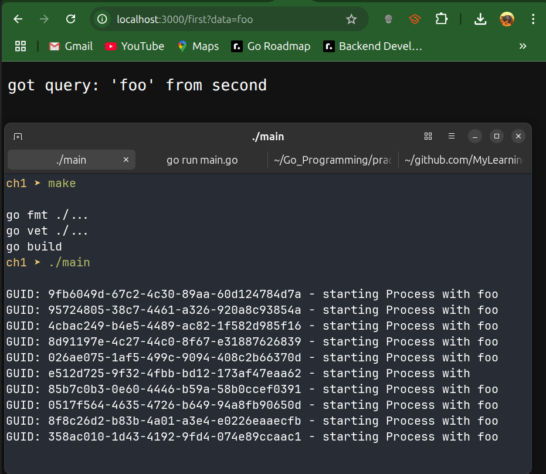
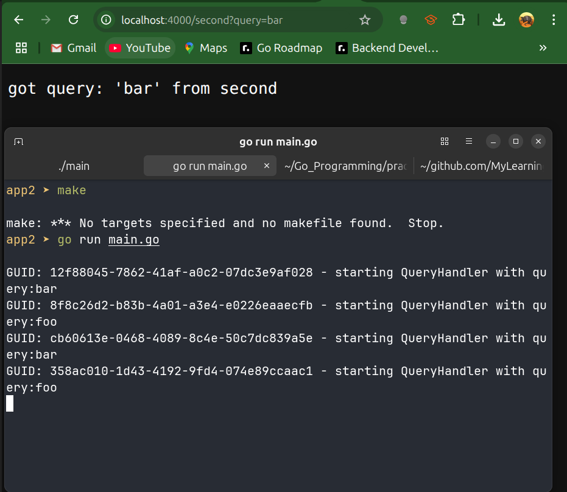

# Context GUID

`tracker/tracker.go`

```go
package tracker

import (
	"context"
	"fmt"
	"net/http"

	"github.com/google/uuid"
)

// guidKey is an unexported type used as the key for storing
// the GUID in a Context. Using a private type avoids collisions.
type guidKey int

// key is the singleton key value for guidKey in contexts.
const key guidKey = 1

// contextWithGUID returns a new Context derived from ctx
// with the given guid stored under our private key.
func contextWithGUID(ctx context.Context, guid string) context.Context {
	return context.WithValue(ctx, key, guid)
}

// guidFromContext attempts to extract a GUID string from ctx.
// It returns the GUID and true if present, or "" and false otherwise.
func guidFromContext(ctx context.Context) (string, bool) {
	g, ok := ctx.Value(key).(string)
	return g, ok
}

// Middleware is an HTTP middleware that ensures each request
// has a trace GUID in its Context. It checks the "X-GUID"
// header; if missing, generates a new UUID. The GUID is then
// stored in the request Context for downstream handlers.
func Middleware(h http.Handler) http.Handler {
	return http.HandlerFunc(func(rw http.ResponseWriter, req *http.Request) {
		ctx := req.Context()

		// If the client provided an X-GUID header, reuse it.
		if guid := req.Header.Get("X-GUID"); guid != "" {
			ctx = contextWithGUID(ctx, guid)
		} else {
			// Otherwise generate a new UUIDv4
			ctx = contextWithGUID(ctx, uuid.New().String())
		}

		// Attach the new Context to the request and call the next handler.
		req = req.WithContext(ctx)
		h.ServeHTTP(rw, req)
	})
}

// Logger is a minimal structured-logging implementation.
// It prints messages prefixed with the GUID from Context, if available.
type Logger struct{}

// Log retrieves the GUID from ctx (if any), prefixes the message
// with "GUID: <id> - " and prints it to stdout.
func (Logger) Log(ctx context.Context, message string) {
	if guid, ok := guidFromContext(ctx); ok {
		message = fmt.Sprintf("GUID: %s - %s", guid, message)
	}
	// do logging
	fmt.Println(message)
}

// Request decorates an outgoing *http.Request by reading the GUID
// from its Context and adding it as the "X-GUID" header, enabling
// trace propagation to downstream services.
func Request(req *http.Request) *http.Request {
	ctx := req.Context()
	if guid, ok := guidFromContext(ctx); ok {
		req.Header.Add("X-GUID", guid)
	}
	return req
}
```

`app2/main.go`

```go
package main

import (
	"context"
	"fmt"
	"main/tracker"
	"net/http"

	"github.com/go-chi/chi/v5"
)

// Logic defines the interface for our second‐service business logic.
type Logic interface {
	QueryHandler(ctx context.Context, query string) (string, error)
}


// Controller holds a Logic implementation and wires it to HTTP handlers.
type Controller struct {
	Logic Logic
}

// Second is the HTTP handler for GET /second.
// It extracts the "query" param, calls the Logic, and writes the result.
func (c Controller) Second(rw http.ResponseWriter, req *http.Request) {
	ctx := req.Context()
	query := req.URL.Query().Get("query")
	result, err := c.Logic.QueryHandler(ctx, query)
	if err != nil {
		rw.WriteHeader(http.StatusInternalServerError)
		rw.Write([]byte(err.Error()))
		return
	}
	rw.Write([]byte(result))
}

// Logger defines a minimal interface for structured logging.
type Logger interface {
	Log(context.Context, string)
}

// LogicImpl is our concrete Logic for the second service.
type LogicImpl struct {
	Logger Logger
	Remote string
}

// QueryHandler implements Logic.QueryHandler.
// It logs the incoming query and returns a formatted response.
func (l LogicImpl) QueryHandler(ctx context.Context, query string) (string, error) {
	l.Logger.Log(ctx, "starting QueryHandler with query:"+query)
	return fmt.Sprintf("got query: '%s' from second", query), nil
}

func main() {
	r := chi.NewRouter()

	// inject & propagate GUID
	r.Use(tracker.Middleware)
	controller := Controller{
		Logic: LogicImpl{
			// concrete logger implementation
			Logger: tracker.Logger{},
		},
	}

	// Register the /second endpoint on port 4000
	r.Get("/second", controller.Second)
	http.ListenAndServe(":4000", r)
}
```

`main.go`

```go
package main

import (
	"context"
	"io"
	"main/tracker"
	"net/http"

	"github.com/go-chi/chi/v5"
)

// Logic defines the interface for our first‐service business logic.
type Logic interface {
	Process(ctx context.Context, data string) (string, error)
}

// Controller holds a Logic implementation and wires it to HTTP handlers.
type Controller struct {
	Logic Logic
}

// First is the HTTP handler for GET /first.
// It extracts the "data" param, calls the Logic, and writes the result.
func (c Controller) First(rw http.ResponseWriter, req *http.Request) {
	ctx := req.Context()
	data := req.URL.Query().Get("data")
	result, err := c.Logic.Process(ctx, data)
	if err != nil {
		rw.WriteHeader(http.StatusInternalServerError)
		rw.Write([]byte(err.Error()))
		return
	}

	// write the proxied response from /second
	rw.Write([]byte(result))
}

// Logger defines a minimal interface for structured logging.
type Logger interface {
	Log(context.Context, string)
}

// RequestDecorator is a function that can modify an *http.Request.
// Used to inject headers (e.g. trace ID) into outbound calls.
type RequestDecorator func(*http.Request) *http.Request

// LogicImpl is our concrete Logic for the first service.
// It uses HTTP to call the second service.
type LogicImpl struct {
	RequestDecorator RequestDecorator
	Logger           Logger
	Remote           string // base URL of the second service
}

// Process implements Logic.Process.
// It logs, builds an HTTP GET to /second, decorates the request,
// executes it, reads the body, and returns it as a string.
func (l LogicImpl) Process(ctx context.Context, data string) (string, error) {
	l.Logger.Log(ctx, "starting Process with "+data)

	// Build the outbound request with context (propagates trace ID, timeouts)
	req, err := http.NewRequestWithContext(ctx, http.MethodGet, l.Remote+"/second?query="+data, nil)
	if err != nil {
		l.Logger.Log(ctx, "error building remote request:"+err.Error())
		return "", err
	}

	// Inject the trace ID header before sending
	req = l.RequestDecorator(req)

	// Call the second service
	resp, err := http.DefaultClient.Do(req)
	if err != nil {
		l.Logger.Log(ctx, "error building remote request:"+err.Error())
		return "", err
	}
	defer resp.Body.Close()

	// Read and return the response body
	out, err := io.ReadAll(resp.Body)
	return string(out), err
}

func main() {
	// inject & propagate GUID
	r := chi.NewRouter()
	r.Use(tracker.Middleware)
	controller := Controller{
		Logic: LogicImpl{
			RequestDecorator: tracker.Request, // adds X-GUID header
			Logger:           tracker.Logger{}, // concrete logger
			Remote:           "http://localhost:4000",
		},
	}
	r.Get("/first", controller.First)
	http.ListenAndServe(":3000", r)
}
```


`Outputs`



