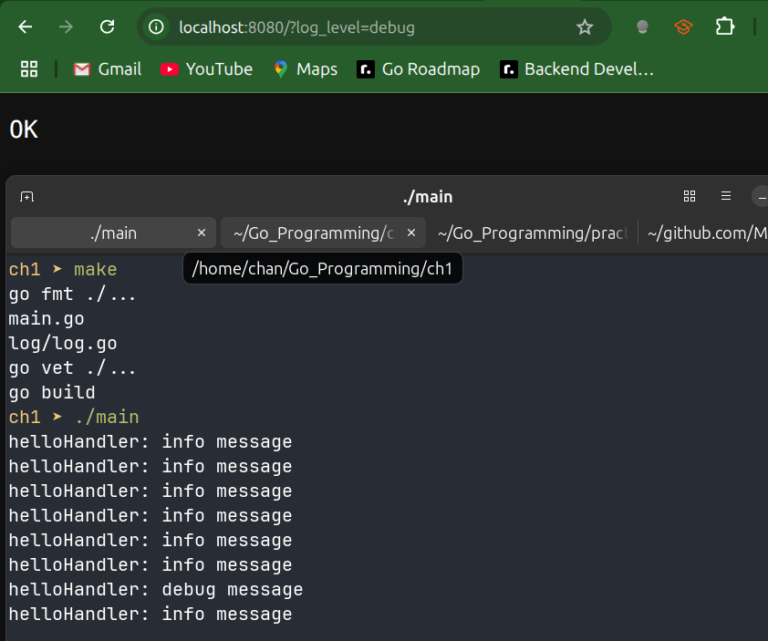

# Exercises

1. Create a middleware-generating function that creates a context with a timeout. The function should have one parameter, which is the number of milliseconds that a request is allowed to run. It should return a `func(http.Handler) http.Handler`.

```go
package main

import (
	"context"
	"fmt"
	"net/http"
	"time"
)

// TimeoutMiddleware returns a middleware that cancels the request's context
// after timeoutMS milliseconds
func TimeoutMiddleware(timeoutMs int) func(http.Handler) http.Handler {
	return func(next http.Handler) http.Handler {
		return http.HandlerFunc(func(w http.ResponseWriter, r *http.Request) {
			// derive a context with timeout from the incoming one
			ctx, cancel := context.WithTimeout(r.Context(), time.Duration(timeoutMs)*time.Millisecond)
			defer cancel()

			// replace the request's context
			r = r.WithContext(ctx)

			// call the next handler
			next.ServeHTTP(w, r)
		})
	}
}

func slowHandler(w http.ResponseWriter, r *http.Request) {
	select {
	case <-time.After(2 * time.Second):
		fmt.Fprintln(w, "finished work")
	case <-r.Context().Done():
		http.Error(w, "request time out", http.StatusGatewayTimeout)
	}
}

func main() {
	mux := http.NewServeMux()

	// wrap slowHandler with a 1500ms timeout
	// TimeoutMiddleware creates middleware that cancels after 1.5s. 
	mux.Handle("/slow", TimeoutMiddleware(1500)(http.HandlerFunc(slowHandler)))

	http.ListenAndServe(":8080", mux)
}
```

```sh
ch1 ➤ curl http://localhost:8080/slow
request time out
```

---

2. Write a program that adds randomly generated numbers between 0 (inclusive) and 100,000,000 (exclusive) together until one of two things happen: the number 1234 is generated or 2 seconds has passed. Print out the  sum, the number of iterations, and the reason for ending (timeout or number reached).

**Note**: As of Go 1.20, there's no reason to call Seed with a random value. 

- Program that call Seed with a known value to get a specific sequence of results should use `New(NewSource(seed))` to obtain a local random generator.

  ```go
  seed := time.Now().UnixNano()
  r := rand.New(rand.NewSource(seed))
  ```

  

## Approach #1 : Using Context

```go
package main

import (
	"context"
	"fmt"
	"math/rand"
	"time"
)

func main() {
	const targetNum = 1234
	const maxValue = 100_000_000

	const timeoutDuration = 2 * time.Second

	ctx, cancel := context.WithTimeout(context.Background(), timeoutDuration)
	defer cancel()

	var sum int64
	var iterations int
	reason := ""

loop:
	for {
		select {
		case <-ctx.Done():
			reason = "timeout"
			break loop
		default:
			iterations++
			randomNum := rand.Intn(maxValue)
			sum += int64(randomNum)
			if randomNum == targetNum {
				reason = "hit 1234"
				break loop
			}
		}
	}

	fmt.Printf("Reason for stopping: %s\n", reason)
	fmt.Printf("Total Sum: %d\n", sum)
	fmt.Printf("Total Iterations: %d\n", iterations)
}
```

```sh
practice ➤ make
go fmt ./...
go vet ./...
go build
practice ➤ ./practice
Reason for stopping: timeout
Total Sum: 6253198221334247
Total Iterations: 125066974
practice ➤ ./practice
Reason for stopping: timeout
Total Sum: 6247496102091288
Total Iterations: 124957712
practice ➤ ./practice
Reason for stopping: hit 1234
Total Sum: 4223276498233365
Total Iterations: 84461413
```


## Approach #2 : Using time methods

```go
package main

import (
	"fmt"
	"math/rand"
	"time"
)

func main() {
	var sum int64
	var iterations int64

	// set a 2s deadline
	deadline := time.Now().Add(2 * time.Second)

	reason := ""

	for {
		// check timeout first
		if time.Now().After(deadline) {
			reason = "timeout"
			break
		}

		// generate a random number between 0 and 100,000,000
		n := rand.Intn(100_000_000)
		sum += sum + int64(n)
		iterations++

		// check if we hit 1234
		if n == 1234 {
			reason = "hit 1234"
			break
		}
	}

	fmt.Printf("Sum: %d\n", sum)
	fmt.Printf("Iterations: %d\n", iterations)
	fmt.Printf("Reason for stopping: %s\n", reason)
}
```

```sh
ch1 ➤ make
go fmt ./...
go vet ./...
go build
ch1 ➤ ./main
Sum: -8217993524433214890
Iterations: 39138458
Reason for stopping: timeout
ch1 ➤ ./main
Sum: 5640425239140848997
Iterations: 39092789
Reason for stopping: timeout
ch1 ➤ ./main
Sum: -8415831653450090824
Iterations: 20837027
Reason for stopping: hit 1234
```

---

3. Assume you have a simple logging function that looks like this:

   ```go
   func Log(ctx context.Context, level level, message string){
       var inLevel Level
       // TODO get a logging level out of the context and assign it to inLevel 
       if level == Debug && inLevel == Debug{
           fmt.Println(message)
       }
       if level == Info && (inLevel == Debug || inLevel == Info){
           fmt.Println(message)
       }
   }
   ```

   Define a type called `Level` whose underlying type is `string`. Define two constants of this type, `Debug` and `Info`, and set them to "debug" and "info" respectively.

   Create functions to store the log level in the context and to extract it.

   Create a middleware function to get the logging level from a query parameter called `log_level`. The value values for `log_level` are debug and info.

   Finally, fill in the `TODO` in `Log` to properly extract the log level from the context. If the log level is not assigned or is not a valid value, nothing should be printed. 

`log.go`

```go
package log

import (
	"context"
	"fmt"
	"net/http"
)

// 1. Level type and constants
type Level string

const (
	Debug Level = "debug"
	Info  Level = "info"
)

// 2. Context key and helpers
type ctxKey struct{}       // unexported type to avoid collisions
var logLevelKey = ctxKey{} // single key value

// --- Functions ---
// WithLogLevel returns a copy of ctx that carries the given level
func WithLogLevel(ctx context.Context, lvl Level) context.Context {
	return context.WithValue(ctx, logLevelKey, lvl)
}

// LogLevelFromContext retrieves the Level from ctx if any and
// validates it against known constants
func LogLevelFromContext(ctx context.Context) (Level, bool) {
	v := ctx.Value(logLevelKey)
	lvl, ok := v.(Level)
	if !ok {
		return "", false
	}
	switch lvl {
	case Debug, Info:
		return lvl, true
	default:
		return "", false
	}
}

// LogLevelMiddleware inspects the URL’s ?log_level= parameter and,
// if valid, injects that Level into the request’s Context.
func LogLevelMiddleware(next http.Handler) http.Handler {
	return http.HandlerFunc(func(w http.ResponseWriter, r *http.Request) {
		switch r.URL.Query().Get("log_level") {
		case string(Debug):
			r = r.WithContext(WithLogLevel(r.Context(), Debug))
		case string(Info):
			r = r.WithContext(WithLogLevel(r.Context(), Info))
		}
		next.ServeHTTP(w, r)
	})
}

// Fill in the TODO in Log(...)
func Log(ctx context.Context, level Level, msg string) {
	inLevel, ok := LogLevelFromContext(ctx)
	if !ok {
		// no valid level in context, nothing to print
		return
	}

	if level == Debug && inLevel == Debug {
		fmt.Println(msg)
	}

	if level == Info && (inLevel == Debug || inLevel == Info) {
		fmt.Println(msg)
	}
}
```


`main.go`

```go
package main

import (
	"main/log"
	"net/http"
)

func helloHandler(w http.ResponseWriter, r *http.Request) {
	log.Log(r.Context(), log.Debug, "helloHandler: debug message")
	log.Log(r.Context(), log.Info, "helloHandler: info message")
	w.Write([]byte("OK"))
}

// --- Main ---
func main() {
	// Create a new ServeMux to handle incoming routes.
	mux := http.NewServeMux()

	// Wrap helloHandler with our LogLevelMiddleware so that
    // ?log_level=debug|info in the URL will control logging.
	mux.Handle("/", log.LogLevelMiddleware(http.HandlerFunc(helloHandler)))
	http.ListenAndServe(":8080", mux)
}
```




---

