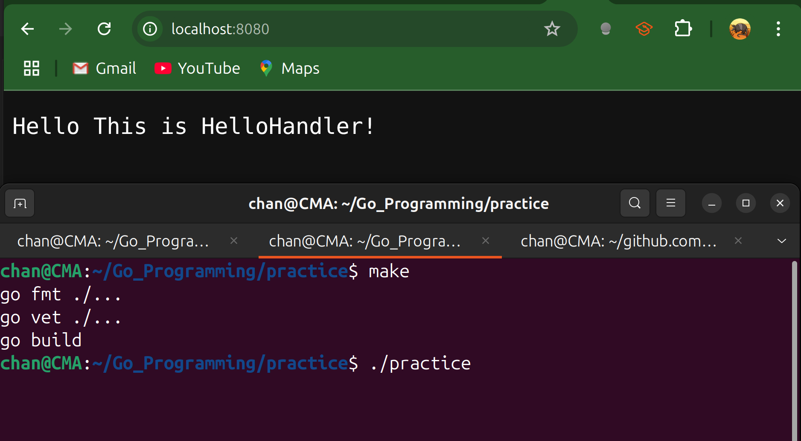

# The Server

- The HTTP Server is built around the concept of an `http.Server` and the `http.Handler` interface.

- Just as the `http.Client` sends HTTP requests, the `http.Server` is responsible for listening for HTTP requests.

- A request to a server is handled by an implementation of the `http.Handler` interface that's assigned to the Handler field.

  ```go
  // this interface defines a single method
  type Handler interface{
      ServeHTTP(http.ResponseWriter, *http.Request)
  }
  ```

- `*http.Request` is the exact same type that's used to send a request to an HTTP server. The `http.ResponseWriter` is an interface with three methods:

  ```go
  type ResponseWriter interface{
      Header() http.Header
      Write([]byte) (int, error)
      WriteHeader(statusCode int)
  }
  ```

- These methods must be called in a specific order.

  - First call `Header` to get an instance of `http.Header` and set any response headers we need.
  - If we don't need to set any headers, we don't need to call it.
  - Next, call `WriteHeader` with the HTTP status code for the response.
  - Finally, call the `Write` method to set the body for the response.

```go
type HelloHandler struct{}

func (hh HelloHandler) ServeHTTP(w http.ResponseWriter, r *http.Request){
    w.Write([]byte("Hello!\n"))
}
```

- We can instantiate a new `http.Server` just like any other struct:

```go
// Addr field specifies the host and port the server listens on 
// If we don't specify them, our server defaults to listening on all hosts on the standard HTTP port, 80. 
// Next, we specify timeouts for the server's reads, writes and idlesby using `time.Duration` values.
// Be sure to set these to properly handle malicious or broken HTTP clients, as the default behavior is to not time out at all.
// Finally, we specify the http.Handler for our server with the Handler field.
s := http.Server{
    Addr: ":8080",
    ReadTimeout: 30 * time.Second,
    WriteTimeout: 90 * time.Second,
    IdleTimeout: 120 * time.Second,
    Handler: HelloHandler{},
}
err := s.ListenAndServe()
if err != nil{
    if err != http.ErrServerClosed{
        panic(err)
    }
}
```

---

## Code Example

```go
package main

import (
	"net/http"
	"time"
)

type HelloHandler struct{}

func (hh HelloHandler) ServeHTTP(w http.ResponseWriter, r *http.Request) {
	w.Write([]byte("Hello This is HelloHandler!\n"))
}

func main() {
	s := http.Server{
		Addr:         ":8080",
		ReadTimeout:  30 * time.Second,
		WriteTimeout: 90 * time.Second,
		IdleTimeout:  120 * time.Second,
		Handler:      HelloHandler{},
	}
	if err := s.ListenAndServe(); err != nil {
		if err != http.ErrServerClosed {
			panic(err)
		}
	}
}
```


