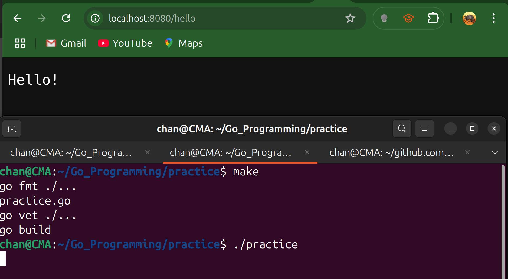
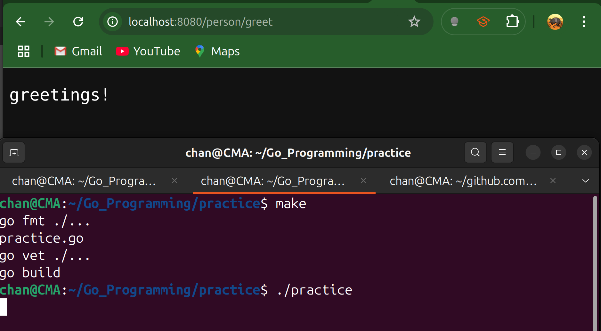
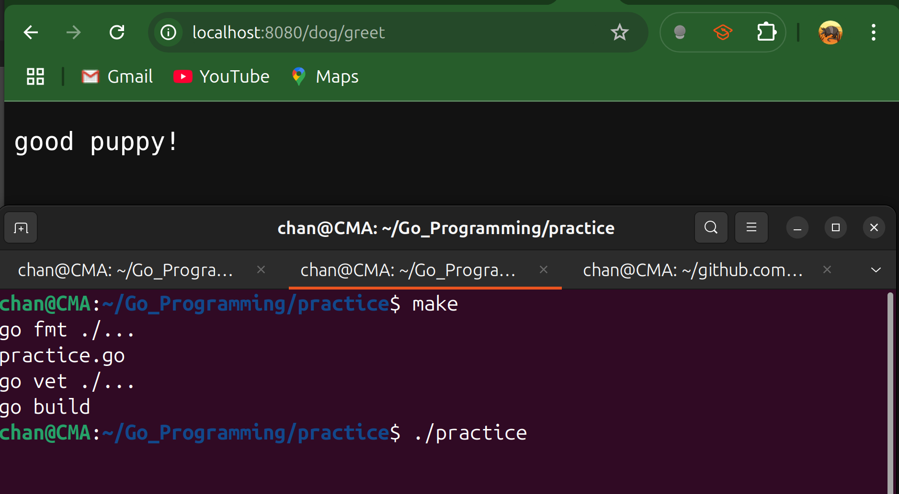
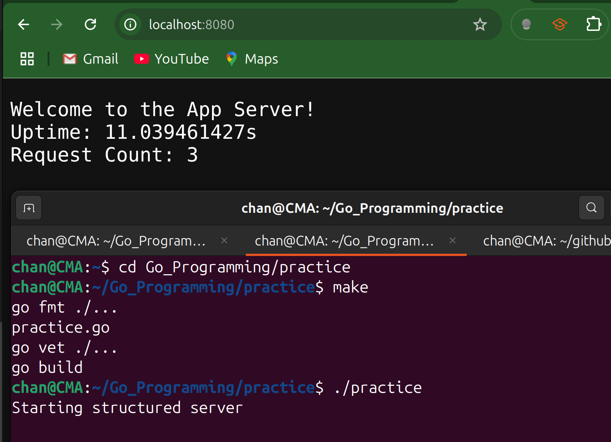

# Server_Mux

- For larger applications, using the global `http.HandleFunc` is discouraged. It's better to create our own `ServeMux` and define handlers as structs. This allows us to:

  - Avoid global state, making our code cleaner and easier to test.
  - Give our handlers dependencies, like a database connection or logger.

- A server that handles only a single request isn't terribly useful, so the Go standard library includes a request router, `*http.ServeMux`.

- Create an instance with the `http.NewServeMux` function. 

- It meets the `http.Handler` interface, so it can be assigned to the `Handler` field in `http.Server`.

- It also includes two methods that allow it to dispatch requests.

  - The first one is called `Handle` and takes in two parameters, a path and an `http.Handler`. If the path matches, the `http.Handler` is invoked. The more common pattern is to use the `HandleFunc` method on `*http.ServeMux`.

    ```go
    mux.HandleFunc("/hello", func(w http.ResponseWriter, r *http.Request)){
        w.Write([]byte("Hello!\n"))
    }
    ```

---

## Code Example #1

- Because `*http.ServeMux` dispatches requests to `http.Handler` instances, and since `*http.ServeMux` implements `http.Handler`, we can create an `*http.ServeMux` instance with multiple related requests and register it with a parent `*http.ServeMux`.

```go
package main

import (
	"net/http"
	"time"
)

func main() {
	// 1) Sub‐router for "person" endpoints
	person := http.NewServeMux()
	person.HandleFunc("/greet", func(w http.ResponseWriter, r *http.Request) {
		// Handles GET /person/greet
		w.Write([]byte("greetings!\n"))
	})

	// 2) Sub‐router for "dog" endpoints
	dog := http.NewServeMux()
	dog.HandleFunc("/greet", func(w http.ResponseWriter, r *http.Request) {
		// Handles GET /dog/greet
		w.Write([]byte("good puppy!\n"))
	})

	// 3) Main router
	mux := http.NewServeMux()
	// Mount the "person" router under /person/, stripping the prefix
	mux.Handle("/person/", http.StripPrefix("/person", person))
	// Mount the "dog" router under /dog/, stripping the prefix
	mux.Handle("/dog/", http.StripPrefix("/dog", dog))

	// 4) Additional standalone endpoint
	mux.HandleFunc("/hello", func(w http.ResponseWriter, r *http.Request) {
		// Handles GET /hello
		w.Write([]byte("Hello!\n"))
	})

	s := http.Server{
		Addr:         ":8080",
		ReadTimeout:  30 * time.Second,
		WriteTimeout: 90 * time.Second,
		IdleTimeout:  120 * time.Second,
		Handler:      mux,
	}

	if err := s.ListenAndServe(); err != nil {
		if err != http.ErrServerClosed {
			panic(err)
		}
	}
}
```

`Output`







---

## Code Example #2 

```go
package main

import (
	"fmt"
	"net/http"
	"time"
)

// AppServer is a struct that will hold our application's state/dependencies,
// like a database connection or logger
type AppServer struct {
	StartTime    time.Time
	RequestCount int
}

// Implement the http.Handler interface for *AppServer
// this makes our struct a handler
func (s *AppServer) ServeHTTP(w http.ResponseWriter, r *http.Request) {
	s.RequestCount++
	uptime := time.Since(s.StartTime)

	w.Header().Set("Content-Type", "text/plain")
	w.WriteHeader(http.StatusOK)

	fmt.Fprintf(w, "Welcome to the App Server!\n")
	fmt.Fprintf(w, "Uptime: %s\n", uptime)
	w.Write([]byte(fmt.Sprintf("Request Count: %d\n", s.RequestCount)))
}

func simpleMsgHandler(w http.ResponseWriter, r *http.Request) {
	fmt.Fprintln(w, "Gophers!")
}

func main() {
	// Create our application state that will be shared across requests for its handler
	serverState := &AppServer{
		StartTime: time.Now(),
	}

	// Create a new ServeMux (router). Better than using the global default.
	mux := http.NewServeMux()

	// Register handlers on our custom mux
	mux.Handle("/", serverState) // struct handler for the root path
	mux.HandleFunc("/message", simpleMsgHandler)

	fmt.Println("Starting structured server")

	// Create a custom http.Server to have more control
	srv := &http.Server{
		Addr:         ":8080",
		Handler:      mux,
		ReadTimeout:  10 * time.Second,
		WriteTimeout: 10 * time.Second,
		IdleTimeout:  30 * time.Second,
	}

	// start the server using our custom configuration
	if err := srv.ListenAndServe(); err != nil {
		if err != http.ErrServerClosed {
			panic(fmt.Sprintf("Server failed: %v", err))
		}
	}
}
```



---

