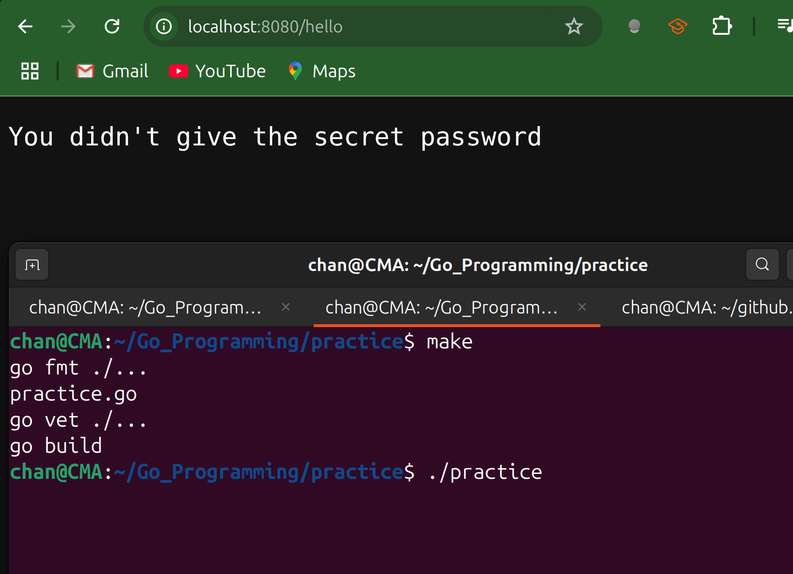
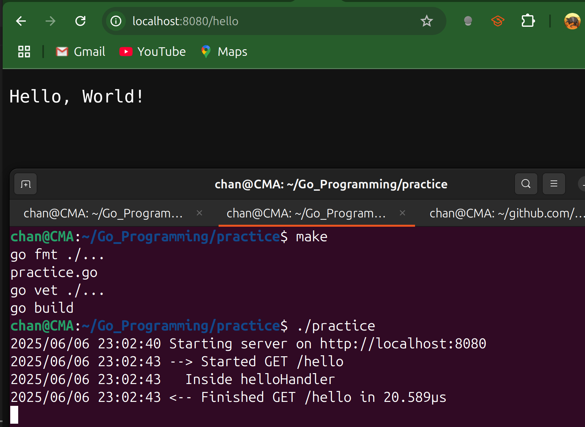

# Middleware

- One of the most common requirements of an HTTP server is to perform a set of actions across multiple handlers,
  - such as checking whether a user is logged in, timing a request or checking a request header.
  - Go handles these with the middleware pattern.
- In web servers, *middleware* sits “between” the incoming request and the final handler. 
- It can inspect or modify the request/response, perform common tasks (logging, authentication, headers, etc.), and then pass control to the next handler in the chain.
- Rather than using a special type, the middleware pattern uses a function that takes in an `http.Handler` instance and returns an `http.Handler`.
- Usually, the returned `http.Handler` is a closure that is converted to an `http.HandlerFunc`.

---

## Code Example

- In this following code:
  - The two middleware implementations demonstrate what middleware does.
  - First we do set up operations or checks.
  - If the checks don't pass, we write the output in the middleware and return.
  - If all is well, we call the handler's `ServeHTTP` method.
  - When that returns, we run cleanup operations. 
  - The `TerribleSecurityProvider` shows how to create configurable middleware.
  - We pass in the configuration information (in this case, the password), and the function returns middleware that uses that configuration information.
  - It returns a closure that returns a closure.

```go
package main

import (
	"log/slog"
	"net/http"
	"time"
)

// RequestTimer wraps an http.Handler and logs how long each request takes.
func RequestTimer(h http.Handler) http.Handler {
	return http.HandlerFunc(func(w http.ResponseWriter, r *http.Request) {
		start := time.Now()
		h.ServeHTTP(w, r) // call the next handler
		dur := time.Since(start) // compute elapsed time

		// log path and duration
		slog.Info("request time", "path", r.URL.Path, "duration", dur)
	})
}

// securityMsg is sent when the secret header is missing or incorrect.
var securityMsg = []byte("You didn't give the secret password\n")

// TerribleSecurityProvider returns middleware that enforces a fixed header value.
func TerribleSecurityProvider(password string) func(http.Handler) http.Handler {
	return func(h http.Handler) http.Handler {
		return http.HandlerFunc(func(w http.ResponseWriter, r *http.Request) {
			if r.Header.Get("X-Secret-Password") != password {
				// missing or wrong password → 401 Unauthorized and write securityMsg
				w.WriteHeader(http.StatusUnauthorized)
				w.Write(securityMsg)
				return
			}
			// correct header → proceed to the wrapped handler
			h.ServeHTTP(w, r)
		})
	}
}

func main() {
	terribleSecurity := TerribleSecurityProvider("GoPher")
	mux := http.NewServeMux()

	// to apply the middleware to just the single route
    // this calls the terribleSecurity closure first
    // then calls the RequestTimer, which then calls our actual request handler
	mux.Handle("/hello", terribleSecurity((RequestTimer(http.HandlerFunc(func(w http.ResponseWriter, r *http.Request) {
		w.Write([]byte("Hello!\n"))
	})))))

	// or to apply the middleware to every route in the mux
	//mux.HandleFunc("/hello", func(w http.
	// ResponseWriter, r *http.Request){
	//	w.Write([]byte("Hello!\n"))
	// })
	//mux = terribleSecurity(RequestTimer(mux))

	s := http.Server{
		Addr:    ":8080",
		Handler: mux,
	}

	err := s.ListenAndServe()
	if err != nil {
		if err != http.ErrServerClosed {
			panic(err)
		}
	}
}
```



---

## Code Example #2

```go
package main

import (
	"log"
	"net/http"
	"time"
)

// loggingMiddleware logs the incoming HTTP request's method, URI, and duration
func loggingMiddleware(next http.Handler) http.Handler {
	// http.HandlerFunc is an adapter that allows us to use an ordinary function
	// as an http.Handler
	return http.HandlerFunc(func(w http.ResponseWriter, r *http.Request) {
		// 1. Logic to execute before the next handler
		start := time.Now()
		log.Printf("--> Started %s %s", r.Method, r.RequestURI)

		// 2. Call the next handler in the chain. (crucial part)
		// 'next' could be another middleware or the final handler
		next.ServeHTTP(w, r)

		// 3. Logic to execute after the next handler has finished.
		log.Printf("<-- Finished %s %s in %v", r.Method, r.RequestURI, time.Since(start))
	})
}

// helloHandler is our final handler that does the core work
func helloHandler(w http.ResponseWriter, r *http.Request) {
	log.Println("  Inside helloHandler")
	w.Write([]byte("Hello, World!"))
}

func main() {
	// Create our handler
	finalHandler := http.HandlerFunc(helloHandler)

	// wrap our final handler with the logging middleware
	http.Handle("/hello", loggingMiddleware(finalHandler))

	log.Println("Starting server on http://localhost:8080")
	err := http.ListenAndServe(":8080", nil)
	if err != nil {
		log.Fatalf("Could not start server: %s\n", err)
	}
}
```


