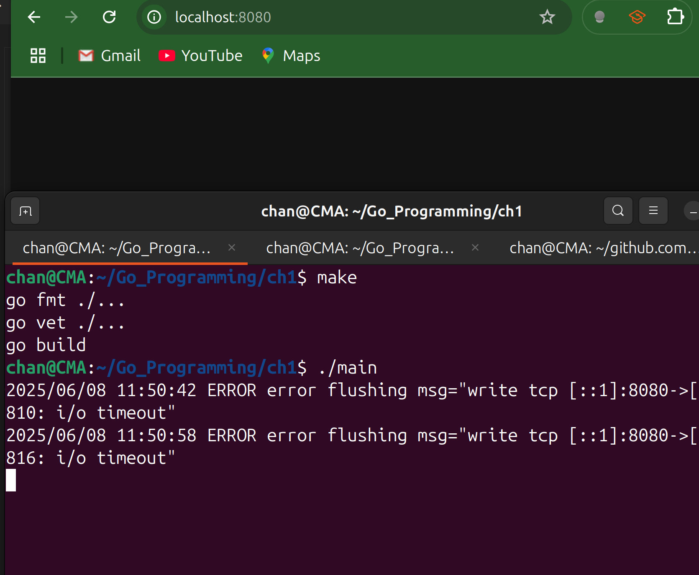

# Response Controller

- Modifying interfaces breaks backward compatibility. 

- To represent new optional functionality for an `http.ResponseWriter` instance, the `http` package contains a couple of interfaces that may be implemented by `http.ResponseWriter` implementations: 
  - `http.Flusher` and `http.Hijacker`.
  - These methods on these interfaces are used to control the output for a response.
  
- `http.Response` Controller demonstrates a way to expose methods that have been added to an existing API.

- In Go 1.20, the `net/http` package introduced a new type, **`http.ResponseController`**, to give handlers finer control over their outgoing responses.  

- We obtain one by wrapping our original `http.ResponseWriter` with:

  ```go
  rc := http.NewResponseController(w)
  ```

- This controller must be created before we write any response and may not be used after our handler returns.

- Because `http.ResponseController` is a concrete type that wraps access to an `http.ResponseWriter` implementation, new methods can be added to it over time without breaking existing implementations.

## Summary

| Feature          | `http.ResponseWriter` (Standard)                             | `*http.ResponseController` (Advanced)                        |
| ---------------- | ------------------------------------------------------------ | ------------------------------------------------------------ |
| **Purpose**      | Basic response writing (headers, status, body)               | Accessing extended, optional features.                       |
| **When to Use**  | For 95% of handlers: returning a complete JSON object, HTML page, etc. | When we need streaming (`Flush`) or fine-grained connection control (`Set...Deadline`). |
| **Creation**     | Provided automatically to our handler                        | Created on-demand via `http.NewResponseController(w)`        |
| **Availability** | All Go versions                                              | Go 1.20 and newer                                            |

---

## Code Example #1

- Flushing is the act of pushing whatever we’ve written so far out over the network instead of letting it sit in Go’s or the TCP stack’s buffers until the handler completes (or the buffer fills)
- When you call `rw.Write(...)`, Go writes into an internal buffer (and in HTTP/2 it may buffer even more).
- `rc.Flush()` tells the server, “Send me all buffered headers + body chunks right now.”  
- Our handler does 10 rounds of work (`doStuff(i)`) and wants to stream each result to the client as soon as it’s ready—otherwise the client wouldn’t see anything until *after* all 10 sleeps finish. 
- Calling `Flush` after each write turns our long-running request into a real “chunked” stream, so the browser (or curl) sees each line in one-second intervals instead of waiting ~10 seconds for the full response.

```go
package main

import (
	"errors"
	"fmt"
	"log/slog"
	"net/http"
	"time"
)

func doStuff(i int) string {
	time.Sleep(1 * time.Second)
	return fmt.Sprintf("%d\n", i)
}

// handler streams incremental results to the client.
// It uses http.NewResponseController to support explicit flushing.
func handler(rw http.ResponseWriter, r *http.Request) {
	rc := http.NewResponseController(rw)
	for i := 0; i < 10; i++ {
		result := doStuff(i)
		_, err := rw.Write([]byte(result))
		if err != nil {
			slog.Error("error writing", "msg", err)
			return
		}
        
        // flush buffered data immediately (if supported)
        
		err = rc.Flush()
		if err != nil && !errors.Is(err, http.ErrNotSupported) {
			slog.Error("error flushing", "msg", err)
			return
		}
	}
}

func main() {
	s := http.Server{
		Addr:         ":8080",
		ReadTimeout:  30 * time.Second,
		WriteTimeout: 12 * time.Second,
		IdleTimeout:  120 * time.Second,
		Handler:      http.HandlerFunc(handler),
	}
	err := s.ListenAndServe()
	if err != nil {
		if !errors.Is(err, http.ErrServerClosed) {
			panic(err)
		}
	}
}
```

- If we don't want to use the default mux, we could also choose to properly wire our own Server.

```go
	mux := http.NewServeMux()
	mux.HandleFunc("/sse", sseHandler)

	srv := &http.Server{
		Addr:    ":8080",
		Handler: mux,
	}
	log.Println("Starting SSE server on http://localhost:8080/sse")

	if err := srv.ListenAndServe(); err != nil {
		if err != http.ErrServerClosed {
			log.Fatalf("Could not start server: %s\n", err)
		}
	}
```


- But if we shorten the `writeTimeout` to 6 seconds, then
- Our handler won't be able to finish writing the entire response within 6 seconds, so it tear down the connection.
- We are writing 10 times in a row, with `time.Sleep(1s)` so it roughly takes 10 seconds to stream the whole body.
- Once we exceed that 6 second window, the next `Flush()` can't complete in time and we get the error.



---

## Code Example #2 

```go
package main

import (
	"fmt"
	"log"
	"net/http"
	"time"
)

// sseHandler streams data to the client every second
func sseHandler(w http.ResponseWriter, r *http.Request) {
	log.Println("Client connected for SSE.")

	// 1. Create a new ResponseController
	// This gives us access to advanced features like Flush()
	rc := http.NewResponseController(w)

	// 2. Set headers for Server-Sent Events
	// Must be done BEFORE writing the status code or body
	w.Header().Set("Content-Type", "text/event-stream")
	w.Header().Set("Cache-Control", "no-cache")
	w.Header().Set("Connection", "keep-alive")

	// 3. SEnd the headers and status code to the client
	w.WriteHeader(http.StatusOK)

	// 4. Start a loop to stream data
	for i := 0; i < 10; i++ {
		fmt.Fprintf(w, "data: This is message #%d\n\n", i+1)

		// 5. Crucial: Flush the data to the client
		// without this, the client won't receive the messages one by one
		if err := rc.Flush(); err != nil {
			// This error usually means the client has disconnected
			log.Printf("Error flushing data: %v. Client likely disconnected.", err)
			break
		}

		// wait for a second before sending the next msg
		time.Sleep(1 * time.Second)
	}
	log.Println("Finished sending messages. Closing connection.")
}

func main() {
	http.HandleFunc("/sse", sseHandler)

	log.Println("Starting SSE server on http://localhost:8080/sse")

	if err := http.ListenAndServe(":8080", nil); err != nil {
		log.Fatalf("Could not start server: %s\n", err)
	}
}
```


---

