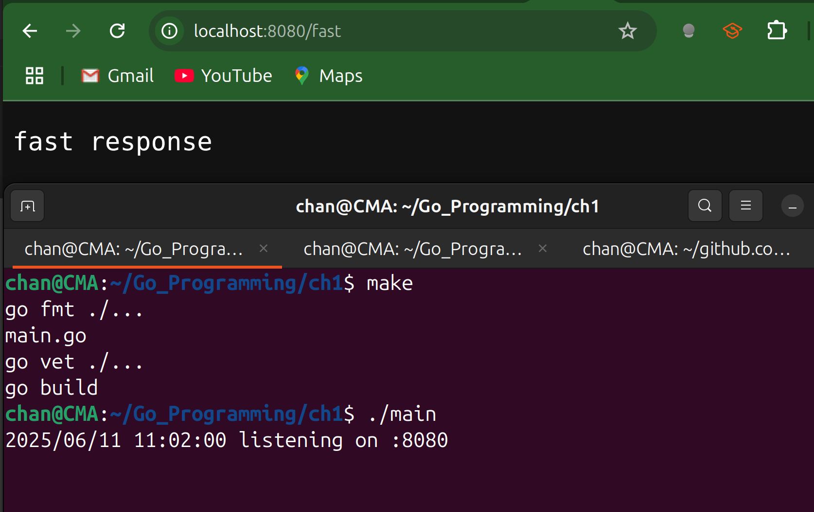
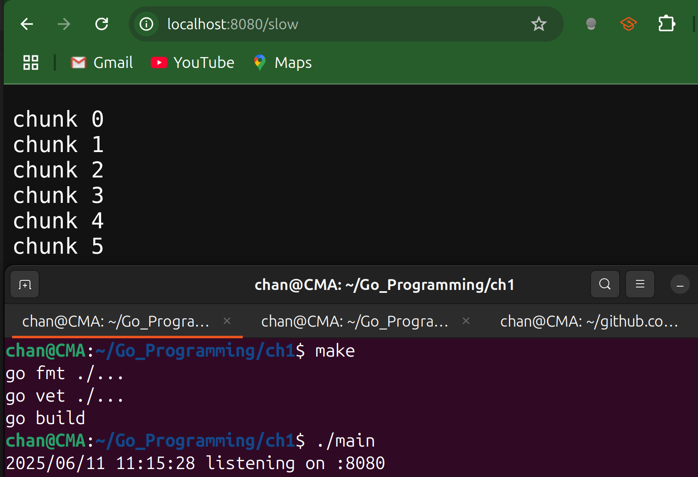

# `SetWriteDeadline` & `SetReadDeadline`

## `SetWriteDeadline`

```go
package main

import (
	"fmt"
	"log"
	"log/slog"
	"net/http"
	"time"
)

func fastHandler(w http.ResponseWriter, r *http.Request) {
	w.Write([]byte("fast response\n"))
}

// slowHandler needs more time to write its response, so we extend the write deadline
// on a per-request basis using http.NewResponseController
func slowHandler(w http.ResponseWriter, r *http.Request) {
	// Wrap the original ResponseWriter in a ResponseController
	rc := http.NewResponseController(w)

	// Extend the write deadline by another 30s (instead of the server's default 5s)
	if err := rc.SetWriteDeadline(time.Now().Add(30 * time.Second)); err != nil {
		// if the underlying ResponseWriter doesn't support per-request deadlines,
		// we will get ErrNotSupported here
		slog.Error("warning: cannot set write deadline", slog.Any("err", err))
	}

	// Simulate a long write (e.g. streaming chunks)
	for i := 0; i <= 5; i++ {
		fmt.Fprintf(w, "chunk %d\n", i)
		if f, ok := w.(http.Flusher); ok {
			f.Flush()
		}
		time.Sleep(1 * time.Second)
	}
}

func main() {
	mux := http.NewServeMux()
	mux.HandleFunc("/fast", fastHandler)
	mux.HandleFunc("/slow", slowHandler)

	srv := &http.Server{
		Addr:         ":8080",
		Handler:      mux,
		ReadTimeout:  5 * time.Second,
		WriteTimeout: 8 * time.Second,
	}
	log.Printf("listening on %s", srv.Addr)
	log.Fatal(srv.ListenAndServe())
}
```





---

## `SetReadDeadline`

- In the following code, we set `ReadTimeout: 5s` on the `http.Server`. Any handler that reads the body must finish within 5 seconds or the connection is closed.
- In `slowEchoHandler` we did use `SetReadDeadline` which replaces the default 5 seconds deadline with 10 seconds just for this request.
  - We can adjust it to any seconds we want, and with that even a very slow client can upload data for up to 30 seconds before timing out.
- We call `io.ReadAll(r.Body)` to consume the entire request.
  - Because we extended the read deadline, `ReadAll` can block up to 30 seconds between reads without the server cutting the connection.

```go
package main

import (
	"fmt"
	"io"
	"log"
	"log/slog"
	"net/http"
	"time"
)

// echoHandler just reads the entire body under the server's default 5s ReadTimeout.
func echoHandler(w http.ResponseWriter, r *http.Request) {
	data, err := io.ReadAll(r.Body)
	if err != nil {
		http.Error(w, "read error: "+err.Error(), http.StatusBadRequest)
		return
	}
	fmt.Fprintf(w, "You sent: (%d bytes): %s\n", len(data), data)
}

// slowEchoHandler allows a much slower upload by bumping the ReadDeadline to 30s.
func slowEchoHandler(w http.ResponseWriter, r *http.Request) {
	rc := http.NewResponseController(w)

	// Give the client 10s to finish sending the request body
	if err := rc.SetReadDeadline(time.Now().Add(10 * time.Second)); err != nil {
		slog.Error("warning cannot set read deadline: %v", slog.Any("error", err))
	}

	// Now read the body
	data, err := io.ReadAll(r.Body)
	if err != nil {
		http.Error(w, "read error: "+err.Error(), http.StatusBadRequest)
		return
	}
	fmt.Fprintf(w, "Slow echo (%d bytes): %s\n", len(data), data)
}
func main() {
	mux := http.NewServeMux()
	mux.HandleFunc("/echo", echoHandler)
	mux.HandleFunc("/slow-echo", slowEchoHandler)

	srv := &http.Server{
		Addr:        ":8080",
		Handler:     mux,
		ReadTimeout: 5 * time.Second,
	}

	log.Printf("listening on %s", srv.Addr)
	log.Fatal(srv.ListenAndServe())
}
```

```sh
chan@CMA:~/Go_Programming/ch1$ curl -X POST -d 'hello, world' http://localhost:8080/echo
You sent: (12 bytes): hello, world
chan@CMA:~/Go_Programming/ch1$ curl -X POST -d 'hello, world' http://localhost:8080/slow-echo
Slow echo (12 bytes): hello, world
chan@CMA:~/Go_Programming/ch1$ curl -X POST -d 'hello, slow-echo' http://localhost:8080/slow-echo
Slow echo (16 bytes): hello, slow-echo

```


---

