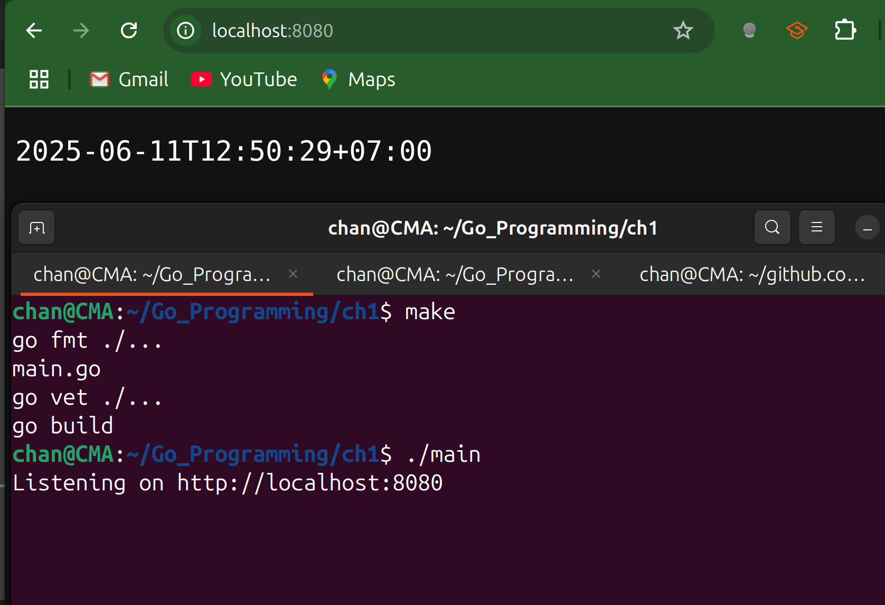
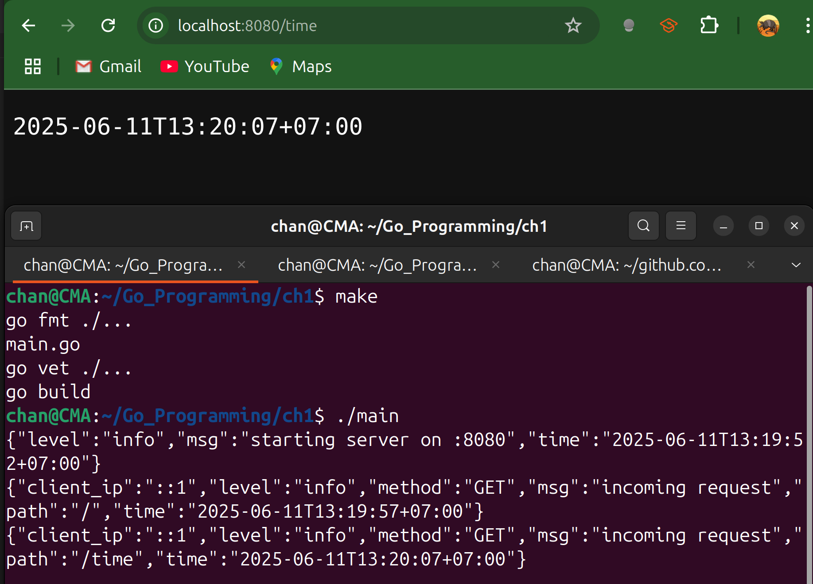
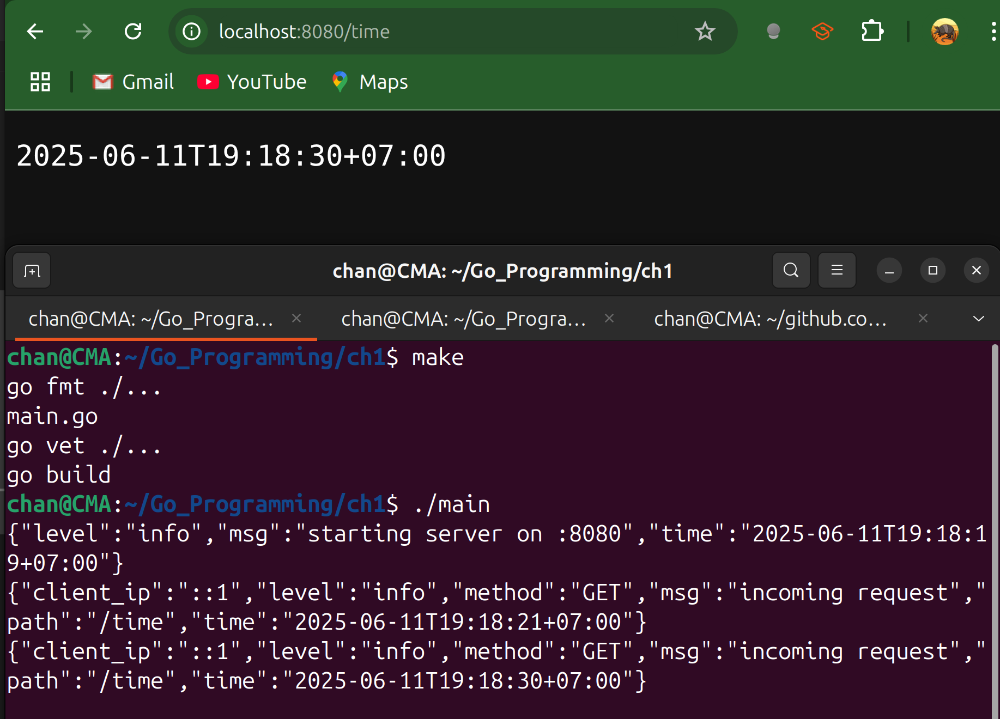

# Exercises

1. Write a small web server that returns the current time in RFC 3339 format when you send it a `GET` command. You can use a third-party module if you'd like.

**Recall Notes:**

- **Headers must be set before the first call to `Write`** or `Fprintln`, because once we write the body, Go automatically flushes headers with whatever status code it has at that moment.
- HTTP is a typed protocol. The client needs to know how to interpret the body.
  - Setting `Content-Type: text/plain;charset=utf-8` tells browsers and tools "This is plain UTF-8 text", so they won't guess or assume binary data. 

- Calling `w.WriteHeader()` sends that exact HTTP status (e.g. `200 OK` or `405 Method Not Allowed`).
  - If we never call `WriteHeader`, Go will default to `200 OK` on the first write, but it's clearer to be explicit, especially when we need non-200 codes.


```go
package main

import (
	"fmt"
	"log/slog"
	"net/http"
	"time"
)

// timeHandler handles GET /time requests by returning the current timestamp.
func timeHandler(w http.ResponseWriter, r *http.Request) {
	if r.Method != http.MethodGet{
		w.Header().Set("Allow", http.MethodGet)
		http.Error(w, "Method Not Allowed", http.StatusMethodNotAllowed)
		return 
	}
	now := time.Now().Format(time.RFC3339)
	w.Header().Set("Content-Type", "text/plain;charset=utf-8")
	w.WriteHeader(http.StatusOK)
	fmt.Fprintln(w, now)
}

func main() {
	http.HandleFunc("/", timeHandler)
	fmt.Println("Listening on http://localhost:8080")
	if err := http.ListenAndServe(":8080", nil); err != nil {
		slog.Error("Server error", slog.Any("error", err))
	}
}
```



---

2. Write a small middleware component that uses JSON structured logging to log the IP address of each incoming request to your web server.

**Recall Notes:**

- If we want to use a 3rd-party module, we can say `go get github.com/xxx/v5` to import.

```go
package main

import (
	"fmt"
	"net"
	"net/http"
	"time"

	"github.com/sirupsen/logrus"
)

// timeHandler handles GET /time requests by returning the current timestamp.
func timeHandler(w http.ResponseWriter, r *http.Request) {
	// Only allow GET; otherwise respond 405 Method Not Allowed
	if r.Method != http.MethodGet {
		w.Header().Set("Allow", http.MethodGet)
		http.Error(w, "Method Not Allowed", http.StatusMethodNotAllowed)
		return
	}

	// Format the current time as an RFC3339 string
	now := time.Now().Format(time.RFC3339)

	// Set response headers and status code
	w.Header().Set("Content-Type", "text/plain;charset=utf-8")
	w.WriteHeader(http.StatusOK)

	// Write the timestamp (with newline) to the response body
	fmt.Fprintln(w, now)
}

// loggingMiddleware wraps an http.Handler, logging each request's client IP
// as a JSON record before calling the next handler.
func loggingMiddleware(logger *logrus.Logger, next http.Handler) http.Handler {
	return http.HandlerFunc(func(w http.ResponseWriter, r *http.Request) {
		// Extract the IP (without port) from RemoteAddr
		ip, _, err := net.SplitHostPort(r.RemoteAddr)
		if err != nil {
			ip = r.RemoteAddr
		}

		// Log a JSON object: {time, level, msg, client_ip, method, path}
		logger.WithFields(logrus.Fields{
			"client_ip": ip,
			"method":    r.Method,
			"path":      r.URL.Path,
		}).Info("incoming request")
		next.ServeHTTP(w, r)

	})
}

func main() {
	// 1. Setup Logrus for JSON-formatted output
	logger := logrus.New()
	logger.SetFormatter(&logrus.JSONFormatter{
		TimestampFormat: time.RFC3339,
	})
	logger.SetLevel(logrus.InfoLevel)

	// 2. Build our mux and register the /time endpoint
	mux := http.NewServeMux()
	mux.HandleFunc("/time", timeHandler)

	// 3. Wrap the mux in our logging middleware
	loggedMux := loggingMiddleware(logger, mux)

	// 4. Start the server
	addr := ":8080"
	logger.Infof("starting server on %s", addr)
	if err := http.ListenAndServe(addr, loggedMux); err != nil {
		logger.Fatalf("server error: %v", err)
	}
}
```



---

3. Add the ability to turn the time as JSON. Use the `Accept` header to control whether JSON or text is returned (default to text). The JSON should be structured as follows:

   ```json
   {
       "day_of_week": "Monday",
       "day_of_month": 10,
       "month": "April",
       "year": 2023,
       "hour": 20, 
       "minute": 15,
       "second": 20
   }
   ```

   

```go
package main

import (
	"encoding/json"
	"fmt"
	"net"
	"net/http"
	"strings"
	"time"

	"github.com/sirupsen/logrus"
)

type TimeResponse struct {
	DayOfWeek  string `json:"day_of_week"`
	DayOfMonth int    `json:"day_of_month"`
	Month      string `json:"month"`
	Year       int    `json:"year"`
	Hour       int    `json:"hour"`
	Minute     int    `json:"minute"`
	Second     int    `json:"second"`
}

// timeHandler returns either plain-text RFC3339 or structured JSON
// depending on whether the request's Accept header contains "application/json"
func timeHandler(w http.ResponseWriter, r *http.Request) {
	now := time.Now()

	accept := r.Header.Get("Accept")
	wantsJSON := strings.Contains(accept, "application/json")
	if wantsJSON {
		resp := TimeResponse{
			DayOfWeek:  now.Weekday().String(),
			DayOfMonth: now.Day(),
			Month:      now.Month().String(),
			Year:       now.Year(),
			Hour:       now.Hour(),
			Minute:     now.Minute(),
			Second:     now.Second(),
		}
		w.Header().Set("Content-Type", "application/json; charset=utf-8")

		// indent just for readability
		enc := json.NewEncoder(w)
		enc.SetIndent("", "  ")
		if err := enc.Encode(resp); err != nil {
			http.Error(w, "encoding error"+err.Error(), http.StatusInternalServerError)
		}
	} else {
		// fallback to plain text RFC3339
        // if we say "plain/text", the browser downloads the content
		w.Header().Set("Content-Type", "text/plain; charset=utf-8")
		w.WriteHeader(http.StatusOK)
		fmt.Fprintln(w, now.Format(time.RFC3339))
	}

}

// loggingMiddleware logs each request in JSON, including client IP, method, and path.
func loggingMiddleware(logger *logrus.Logger, next http.Handler) http.Handler {
	return http.HandlerFunc(func(w http.ResponseWriter, r *http.Request) {
		// Get the client IP address
		ip, _, err := net.SplitHostPort(r.RemoteAddr)
		if err != nil {
			ip = r.RemoteAddr // fallback to full address if SplitHostPort fails
		}
		logger.WithFields(logrus.Fields{
			"client_ip": ip,
			"method":    r.Method,
			"path":      r.URL.Path,
		}).Info("incoming request")
		next.ServeHTTP(w, r)
	})
}
func main() {
	// JSON logger
	logger := logrus.New()

	logger.SetFormatter(&logrus.JSONFormatter{
		TimestampFormat: time.RFC3339,
	})
	logger.SetLevel(logrus.InfoLevel)

	mux := http.NewServeMux()
	mux.HandleFunc("/time", timeHandler)
	handler := loggingMiddleware(logger, mux)

	addr := ":8080"
	logger.Infof("starting server on %s", addr)
	if err := http.ListenAndServe(addr, handler); err != nil {
		logger.Fatalf("server error: %v", err)
	}
}
```



